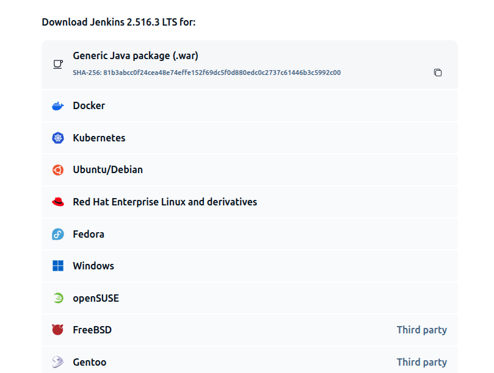
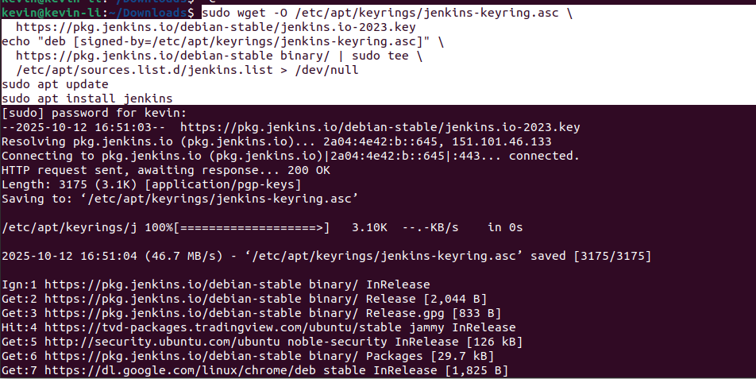
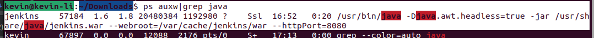
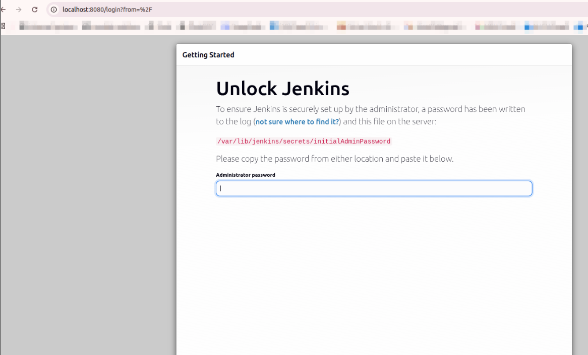
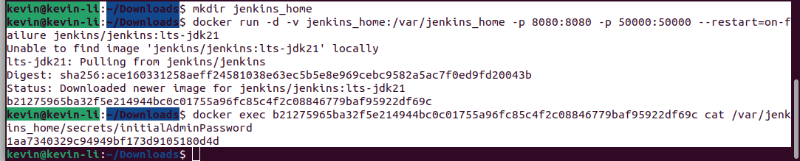
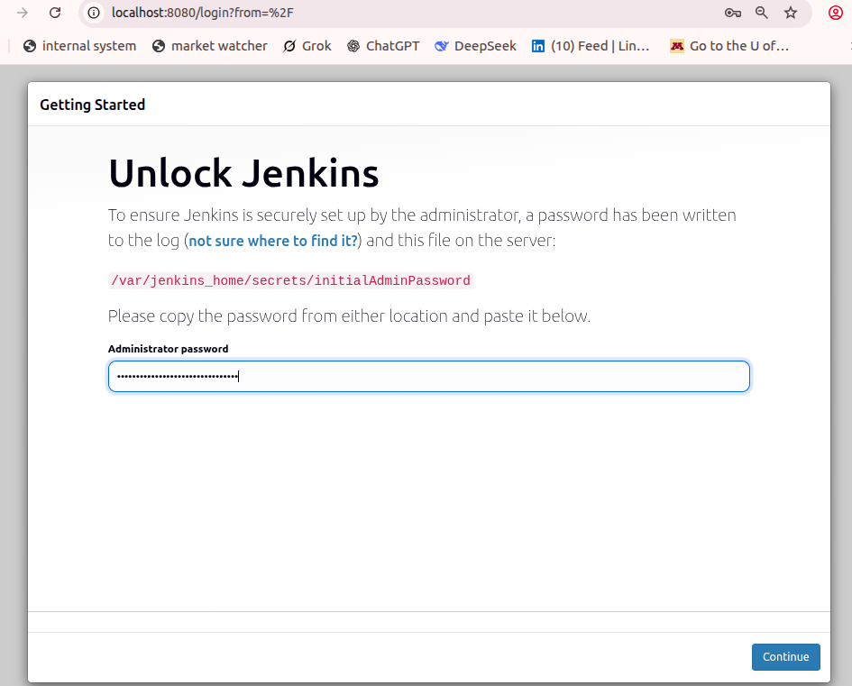
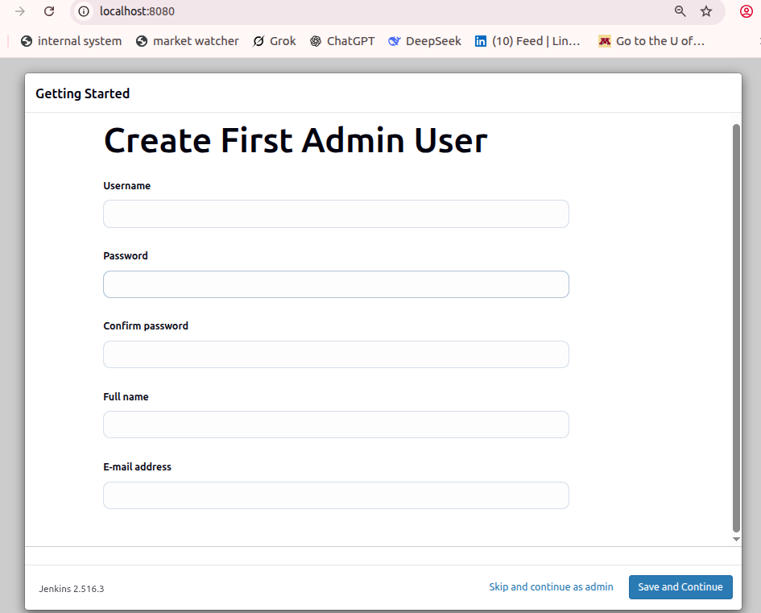
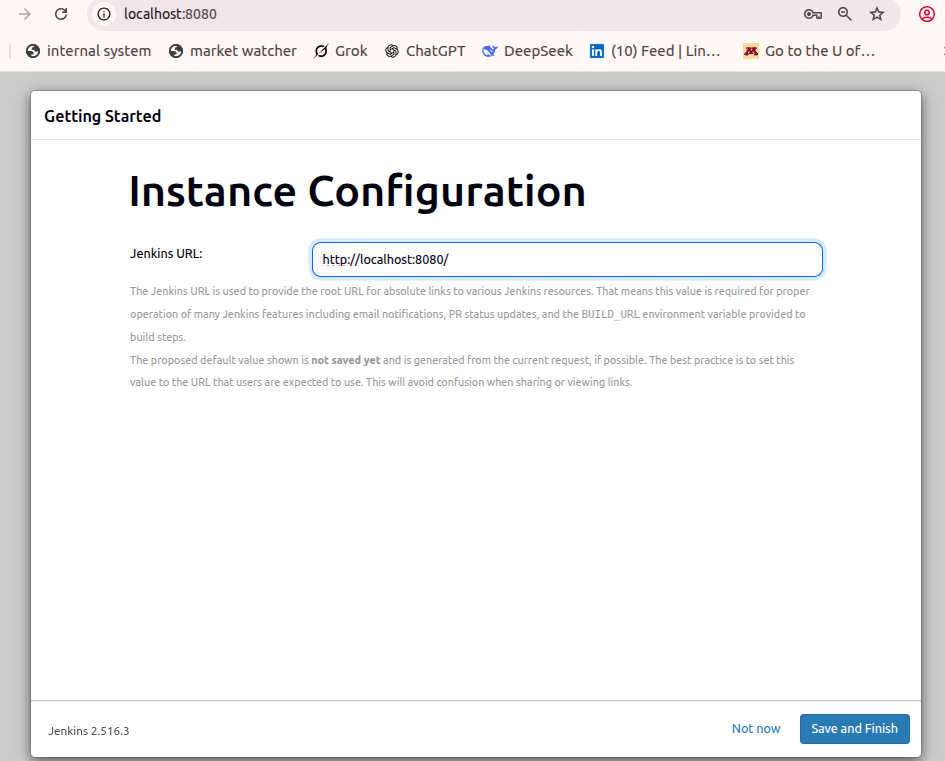
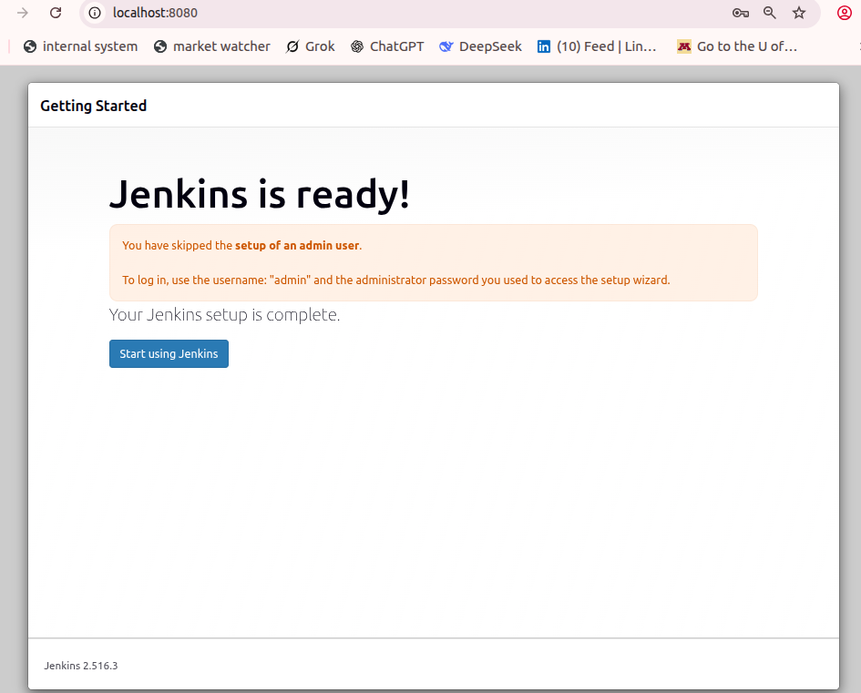
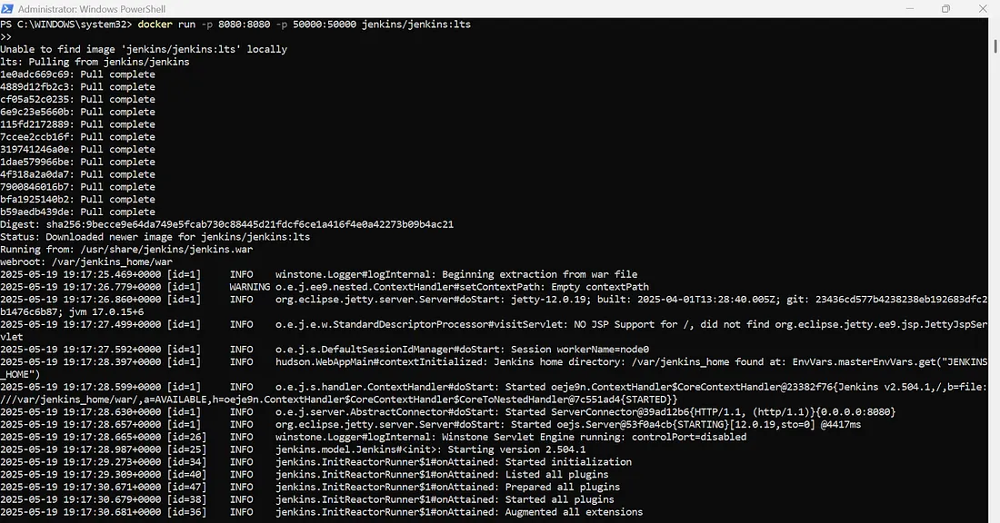

# Introduction to Jenkins

## Installing Jenkins

### WAR file installation

>Note: War file is like a zip file.

The Jenkins WAR file was downloaded and executed locally. Please go to the following site to download,

https://www.jenkins.io/download/

We would like to stick to `LTS` (long-term support),



On different platforms the installations are all different, for instance, I provide the installation in Ubuntu like below.

```
sudo apt update
sudo apt install fontconfig openjdk-21-jre
java -version
openjdk version "21.0.3" 2024-04-16
OpenJDK Runtime Environment (build 21.0.3+11-Debian-2)
OpenJDK 64-Bit Server VM (build 21.0.3+11-Debian-2, mixed mode, sharing)
```

>Note: If you are using windows, please use the windows installation guide.
> If you are using M chip Mac, please use podman to replace docker to avoid platform issues.
> 

* Long Term Support release

```commandline
sudo wget -O /etc/apt/keyrings/jenkins-keyring.asc \
  https://pkg.jenkins.io/debian-stable/jenkins.io-2023.key
echo "deb [signed-by=/etc/apt/keyrings/jenkins-keyring.asc]" \
  https://pkg.jenkins.io/debian-stable binary/ | sudo tee \
  /etc/apt/sources.list.d/jenkins.list > /dev/null
sudo apt update
sudo apt install jenkins
```



## How to start Jenkin

Please follow instruction in the following tutorial page,

https://www.jenkins.io/doc/book/installing/linux/#debianubuntu

>Note: Due to the volatile content, we would like to stick to the most up2date information in the official document, 
> thus I do not provide anything on my own.



and when we start it in the browser it shows something like the following,



### Start Jenkins

You can enable the Jenkins service to start at boot with the command:

`sudo systemctl enable jenkins`
You can start the Jenkins service with the command:

`sudo systemctl start jenkins`
You can check the status of the Jenkins service using the command:

`sudo systemctl status jenkins`
If everything has been set up correctly, you should see an output like this:

Loaded: loaded (/lib/systemd/system/jenkins.service; enabled; vendor preset: enabled)
Active: active (running) since Tue 2018-11-13 16:19:01 +03; 4min 57s ago

### Docker Solution

Documentation: https://github.com/jenkinsci/docker/blob/master/README.md

* The command to run Jenkins was.

`docker run -p 8080:8080 -p 50000:50000 --restart=on-failure -v jenkins_home:/var/jenkins_home jenkins/jenkins:lts-jdk21`



For instance, I did the following to get the password,

```cmd
kevin@kevin-li:~/Downloads$ mkdir jenkins_home
kevin@kevin-li:~/Downloads$ docker run -d -v jenkins_home:/var/jenkins_home -p 8080:8080 -p 50000:50000 --restart=on-failure jenkins/jenkins:lts-jdk21
Unable to find image 'jenkins/jenkins:lts-jdk21' locally
lts-jdk21: Pulling from jenkins/jenkins
Digest: sha256:ace160331258aeff24581038e63ec5b5e8e969cebc9582a5ac7f0ed9fd20043b
Status: Downloaded newer image for jenkins/jenkins:lts-jdk21
b21275965ba32f5e214944bc0c01755a96fc85c4f2c08846779baf95922df69c
kevin@kevin-li:~/Downloads$ docker exec b21275965ba32f5e214944bc0c01755a96fc85c4f2c08846779baf95922df69c cat /var/jenkins_home/secrets/initialAdminPassword
1aa7340329c94949bf173d9105180d4d
```



After setting the password that appeared in the logs see above commands, you will see the next screen,


Next screen,



Click "continue as admin" and do not create the first admin, 



Click "Save and Finish", and next screen,



Let us click on the left right,



After pulling the image and starting the Jenkins server, I accessed Jenkins through the browser using the localhost URL.


After finishing the initial setup, I created my first Jenkins job, which was a freestyle project that simply echoed a message.

“Hello from Jenkins!”


The console output confirmed success. This was my first working Jenkins job!

## Resources


Jenkins: <https://www.jenkins.io/doc>

Docker Hub Jenkins Image: <https://hub.docker.com/r/jenkins/jenkins>

Sample Project: <https://github.com/jenkins-docs/simple-java-maven-app>

GitHub Repo: <https://github.com/iiamolu/simple-java-maven-app>

---