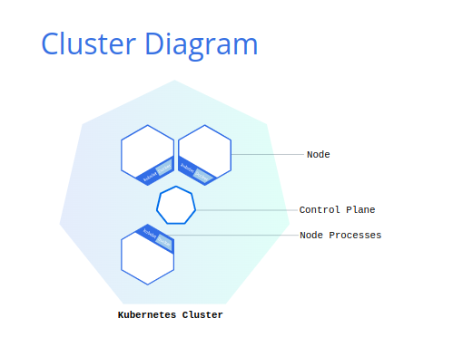

# Kubernetes Basics

## Kubernetes

A Kubernetes cluster can be deployed on either physical or virtual machines. To get started with Kubernetes development, you can use Minikube.

## Minikube

In this tutorial we will use command line k8s tool `minikube`. Minikube is a lightweight Kubernetes implementation that creates a VM on your local machine and deploys a simple cluster containing only one node. Minikube is available for Linux, macOS, and Windows systems. The Minikube CLI provides basic bootstrapping operations for working with your cluster, including start, stop, status, and delete.

`minikube` is local Kubernetes, focusing on making it easy to learn and develop for Kubernetes.

All you need is Docker (or similarly compatible) container or a Virtual Machine environment,

What you’ll need

- 2 CPUs or more
- 2GB of free memory
- 20GB of free disk space
- Internet connection
- Container or virtual machine manager, such as: Docker, QEMU, Hyperkit, Hyper-V, KVM, Parallels, Podman, VirtualBox, or VMware Fusion/Workstation

## Minikube Installation

Minikube is the K8s server managing software and it manages the cluster.

Here is the website for installing the `minikube`.

https://minikube.sigs.k8s.io/docs/start/?arch=%2Flinux%2Fx86-64%2Fstable%2Fbinary+download

For instance, for linux/unix machine, we can do something similar to the following,

```shell
curl -LO https://storage.googleapis.com/minikube/releases/latest/minikube-linux-amd64
sudo install minikube-linux-amd64 /usr/local/bin/minikube && rm minikube-linux-amd64
```

But we highly recommend you use the link above for the most up2date instruction.

## kubectl Installation

kubectl is actually the tool to do the deployment and manage the pods.

Here are some links to install it for different platforms,

* https://kubernetes.io/docs/tasks/tools/install-kubectl-linux/ (linux)
* https://kubernetes.io/docs/tasks/tools/install-kubectl-macos/ (mac)
* https://kubernetes.io/docs/tasks/tools/install-kubectl-windows/ (windows)

## Goal of Study in this article


## Start the server

- `minikube start`

## Status

- `minikube status`

## Dashboard

- `minikube dashboard`

## Deployment

- Kubernetes coordinates a highly available cluster of computers that are connected to work as a single unit.
- Kubernetes automates the distribution and scheduling of application containers across a cluster in a more efficient way.

A Kubernetes cluster consists of two types of resources:



- The Control Plane coordinates the cluster
- Nodes are the workers that run applications

## Pod, Node, Deployment and Service

- pod: can contain one or more containers.
- node: is a vm or a physical machine. A node can run multiple pods but normally just one.
- deployment: checks on the health of your Pod and restarts the Pod's Container if it terminates.
- Service: Logical group of pods.

  By default, the Pod is only accessible by its internal IP address within the Kubernetes cluster. To make the hello-node Container accessible from outside the Kubernetes virtual network, you have to expose the Pod as a Kubernetes Service.

**A helloword image deployment**

- Create a Deployment

  - `kubectl create deployment hello-node --image=registry.k8s.io/e2e-test-images/agnhost:2.39 -- /agnhost netexec --http-port=8080`

- View the Deployment

  - `kubectl get deployments`

- View the Pod

  - `kubectl get pods`

- View cluster events

  - `kubectl get events`

- View the kubectl configuration

  - `kubectl config view`

- View application logs for a container in a pod (replace pod name with the one you got from kubectl get pods).

  - `kubectl logs hello-node-5f76cf6ccf-br9b5`

- Create a service

  - Expose the Pod to the public internet using the kubectl expose command:
  - `kubectl expose deployment hello-node --type=LoadBalancer --port=8080`

The --type=LoadBalancer flag indicates that you want to expose your Service outside of the cluster.

- View a service

  - `kubectl get services`

- Start service

  - `minikube service hello-node`

## Manage Add-ons

- show addons

`minikube addons list`

Output,

```
addon-manager: enabled
dashboard: enabled
default-storageclass: enabled
efk: disabled
freshpod: disabled
gvisor: disabled
helm-tiller: disabled
ingress: disabled
ingress-dns: disabled
logviewer: disabled
metrics-server: disabled
nvidia-driver-installer: disabled
nvidia-gpu-device-plugin: disabled
registry: disabled
registry-creds: disabled
storage-provisioner: enabled
storage-provisioner-gluster: disabled
```

- Enable an addon, for example, metrics-server:

  - `minikube addons enable metrics-server`

- View the Pod and Service you created by installing that addon:

  - `kubectl get pod,svc -n kube-system`

- Check the output from metrics-server:

  - `kubectl top pods`

- Disable metrics-server:

  - `minikube addons disable metrics-server`

## Clean up

- `kubectl delete service hello-node`

- `kubectl delete deployment hello-node`

- `minikube stop`

Optionally, delete the Minikube VM:

- `minikube delete`

## Troubleshooting and deep cleaning

- `minikube delete --all --purge`

- `docker system prune`

## Revisit

- https://kubernetes.io/docs/tutorials/kubernetes-basics/explore/explore-intro/
- https://kubernetes.io/docs/tutorials/kubernetes-basics/expose/expose-intro/
- https://kubernetes.io/docs/tutorials/kubernetes-basics/update/

## Scale your app

- https://kubernetes.io/docs/tutorials/kubernetes-basics/scale/scale-intro/

## Update your app

- https://kubernetes.io/docs/tutorials/kubernetes-basics/update/update-intro/

## Ref

- https://minikube.sigs.k8s.io/docs/start/
- https://kubernetes.io/docs/tutorials/hello-minikube/
