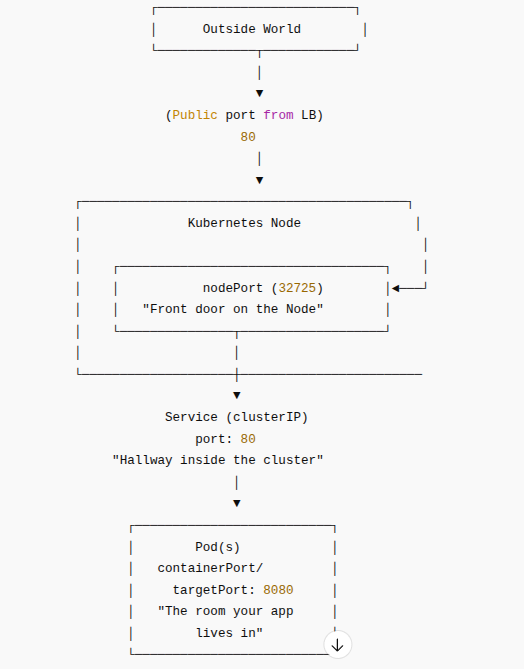

# K8S Load Balancer

* Goal

* This is a built-in load balancer and we specify it in the `kubectl expose type`.
* Understand ports, nodePort and targetPort. Sometimes there is a `containerPort`.
* Specify external IP for the loasd balancer as that is the entry for outside client to access.

 You expose a fixed external port by creating a Service of type LoadBalancer and specifying the port mapping there.

## port and targetPort

```commandline
apiVersion: v1
kind: Service
metadata:
  name: hello-world-lb
spec:
  type: LoadBalancer
  selector:
    app.kubernetes.io/name: load-balancer-example
  ports:
    - name: http
      port: 80          # <-- external port you want
      targetPort: 8080  # <-- container port from your Deployment
```

### Explanations

 * port → The external port your LoadBalancer will listen on (fixed port you choose).
 * targetPort → The port in your pod (containerPort: 8080).
 * selector → Must match the Deployment labels so traffic hits the right pods.

>If you want a different fixed external port (e.g., 30000), change port: 30000.


## Example of Deployment + LoadBalancer Service  with a fixed external port (YAML)

We  can also  control the nodePort for internal mapping. Deployment plus a LoadBalancer Service with a fixed external port. Nothing fancy, just clean and ready to apply:

```commandline
apiVersion: apps/v1
kind: Deployment
metadata:
  labels:
    app.kubernetes.io/name: load-balancer-example
  name: hello-world
spec:
  replicas: 5
  selector:
    matchLabels:
      app.kubernetes.io/name: load-balancer-example
  template:
    metadata:
      labels:
        app.kubernetes.io/name: load-balancer-example
    spec:
      containers:
      - image: gcr.io/google-samples/hello-app:2.0
        name: hello-world
        ports:
        - containerPort: 8080
---
apiVersion: v1
kind: Service
metadata:
  name: hello-world-lb
spec:
  type: LoadBalancer
  selector:
    app.kubernetes.io/name: load-balancer-example
  ports:
    - name: http
      port: 80          # fixed external LB port
      targetPort: 8080  # pod containerPort
```

## nodePort

If you want to also force a specific nodePort (sometimes needed for bare metal or specific cloud behavior), just tell me the port range and I’ll wire it in.

*What exact nodePort do you want?*

(Valid range is usually 30000–32767, unless your cluster was customized.)

```commandline
apiVersion: apps/v1
kind: Deployment
metadata:
  labels:
    app.kubernetes.io/name: load-balancer-example
  name: hello-world
spec:
  replicas: 5
  selector:
    matchLabels:
      app.kubernetes.io/name: load-balancer-example
  template:
    metadata:
      labels:
        app.kubernetes.io/name: load-balancer-example
    spec:
      containers:
      - image: gcr.io/google-samples/hello-app:2.0
        name: hello-world
        ports:
        - containerPort: 8080
---
apiVersion: v1
kind: Service
metadata:
  name: hello-world-lb
spec:
  type: LoadBalancer
  selector:
    app.kubernetes.io/name: load-balancer-example
  ports:
    - name: http
      port: 80          # External LB port
      targetPort: 8080  # Container port
      nodePort: 32725   # Fixed nodePort you requested
```

### targetPort vs nodePort

**targetPort**

Inside the pod.
Think of targetPort as the door inside the container that your app is actually listening on.
Your container is like:
“Hey, I’m running on port 8080. Send stuff here.”
So the Service points its traffic to that door → targetPort: 8080.

**nodePort**

On the node (the machine).
nodePort is the door on every Kubernetes worker node that forwards traffic into the cluster.
It’s like Kubernetes saying:
“I’ll open door 32725 on every node, and anything that hits that door gets forwarded to the Service.”
    • Range is usually 30000–32767.
    • Only used with Service types NodePort or LoadBalancer.
Even with a LoadBalancer, the LB usually points to the nodePort behind the scenes.


**Easy mental picture**

* Imagine a fancy hotel:
    * nodePort = the hotel’s front door. Anyone outside can use it to enter the hotel.
    * port (Service port) = the hallway inside the hotel.
    * targetPort = the room number where your app actually lives.

* Traffic flow:

`client → nodePort (on the node) → Service port → targetPort (inside the pod)`

#### Quick read:

* nodePort = the front door of every node
* port = the hallway inside the cluster
* targetPort = the room inside the pod where the app is actually listening



## Specify Static IP for your Load Balancer

When you create a Service like this:

`type: LoadBalancer`

Kubernetes itself does NOT provide the external IP.

The flow looks like this:
    1. You create a LoadBalancer Service.
    2. Kubernetes asks the cloud provider for a load balancer.
    3. The cloud provider allocates an external IP.
    4. That external IP gets attached to your Service under .status.loadBalancer.ingress.

### How to assign a specific external IP (static IP)

Cloud providers let you reserve a static IP and make Kubernetes use it.

```commandline
apiVersion: v1
kind: Service
metadata:
  name: hello-world-lb
spec:
  type: LoadBalancer
  loadBalancerIP: YOUR_RESERVED_IP_HERE
  selector:
    app.kubernetes.io/name: load-balancer-example
  ports:
    - port: 80
      targetPort: 8080
      nodePort: 32725
```

Now the LB will map exactly to that external IP.

Example:

`loadBalancerIP: 192.168.1.240`

### How to check the external IP
Just run:

`kubectl get svc hello-world-lb`

You’ll see something like:

```commandline
NAME             TYPE           EXTERNAL-IP      PORT(S)
hello-world-lb   LoadBalancer   35.201.18.42     80:32725/TCP
That 35.201.18.42 is the external IP mapped to your LB.
```

### Optional for GCP

Example for GCP (since your image is gcr.io):

    1. Reserve a static IP:

`gcloud compute addresses create my-static-ip --region us-central1`


    2. Get the IP:

```gcloud compute addresses describe my-static-ip --region us-central1 \
  --format="get(address)"
```

>  For open cloud cluster is running (GKE, EKS, AKS, Minikube, k3s, bare metal), you would need their static IP.