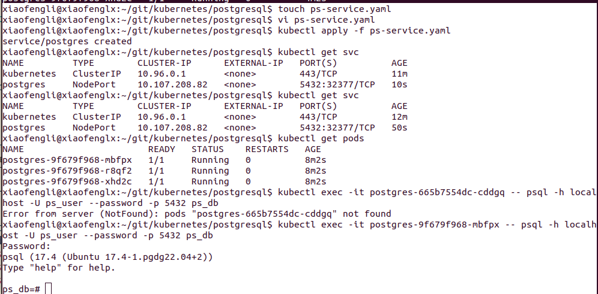
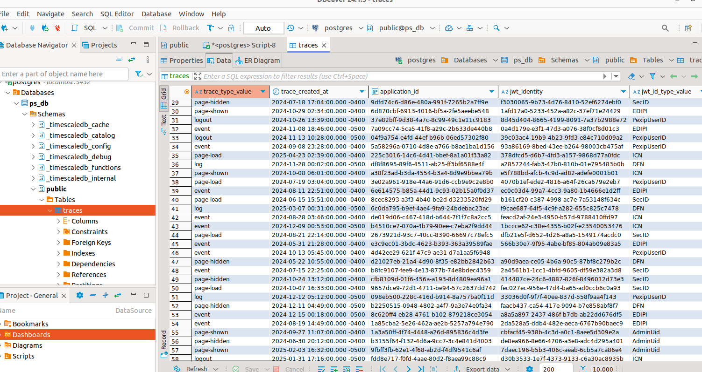
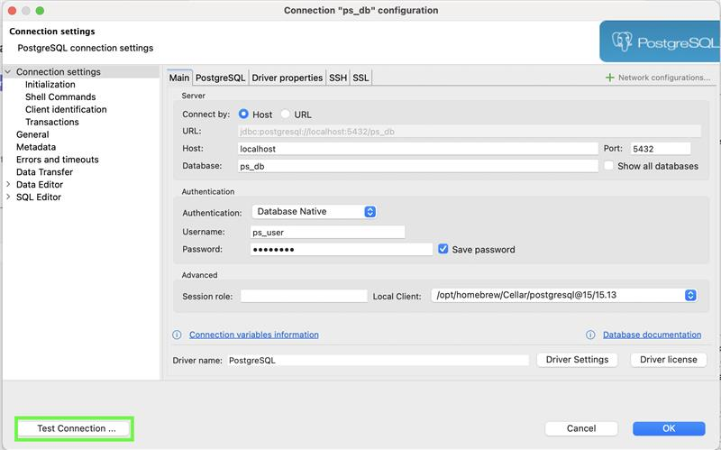

# Time Series Database

## Introduction

Deploying a PostgreSQL database on a Kubernetes cluster has become a popular approach for managing scalable, resilient, and dynamic database environments. Kubernetes has container orchestration capabilities that offer a robust framework for deploying and managing applications, including databases like PostgreSQL, in a distributed environment. This integration provides significant scalability, resilience, and efficient resource utilization advantages. By leveraging Kubernetes features such as scalability, automated deployment, and self-healing capabilities, users can ensure the seamless operation of their PostgreSQL databases in a containerized environment.

## Create a ConfigMap to Store Database Details

```shell
touch postgres-configmap.yaml
vim postgres-configmap.yaml
```

Add the following configuration. Define the default database name, user, and password.

```shell
apiVersion: v1
kind: ConfigMap
metadata:
  name: postgres-secret
  labels:
    app: postgres
data:
  POSTGRES_DB: ps_db
  POSTGRES_USER: ps_user
  POSTGRES_PASSWORD: password
```

* apiVersion: v1 specifies the Kubernetes API version used for this ConfigMap.

* kind: ConfigMap defines the Kubernetes resource type.

* **metadata**: the **name** field specifies the name of the ConfigMap, set as “postgres-secret.” Additionally, labels are applied to the ConfigMap to help identify and organize resources. The data section contains the configuration data as key-value pairs.

Save and close the file, then apply the ConfigMap configuration to the Kubernetes.

`kubectl apply -f postgres-configmap.yaml`

You can verify the ConfigMap deployment using the following command.

`kubectl get configmap`

Output.

```shell
NAME               DATA   AGE
kube-root-ca.crt   1      116s
postgres-secret    3      12s
```

## Create PV and PVC

PersistentVolume (PV) and PersistentVolumeClaim (PVC) are Kubernetes resources that provide and claim persistent storage in a cluster. A PersistentVolume provides storage resources in the cluster, while a PersistentVolumeClaim allows pods to request specific storage resources.

```shell
touch psql-pv.yaml
```

Add the following configuration.

```shell
apiVersion: v1
kind: PersistentVolume
metadata:
  name: postgres-volume
  labels:
    type: local
    app: postgres
spec:
  storageClassName: manual
  capacity:
    storage: 10Gi
  accessModes:
    - ReadWriteMany
  hostPath:
    path: /data/postgresql
```

Here is the explanation of each component:

  * **storageClassName:** manual specifies the StorageClass for this PersistentVolume. The StorageClass named “manual” indicates that provisioning of the storage is done manually.

  * **Capacity** specifies the desired capacity of the PersistentVolume.

  * **accessModes** defines the access modes that the PersistentVolume supports. In this case, it is set to ReadWriteMany, allowing multiple Pods to read and write to the volume simultaneously.

  * **hostPath** is the volume type created directly on the node’s filesystem. It is a directory on the host machine’s filesystem (path: “/data/postgresql”) that will be used as the storage location for the PersistentVolume. This path refers to a location on the host where the data for the PersistentVolume will be stored.

Save the file, then apply the above configuration to the Kubernetes.

`kubectl apply -f psql-pv.yaml`

Next, create a YAML for PersistentVolumeClaim.

`touch psql-claim.yaml`

and,

`vim psql-claim.yaml`

Add the following configurations.

```shell
apiVersion: v1
kind: PersistentVolumeClaim
metadata:
  name: postgres-volume-claim
  labels:
    app: postgres
spec:
  storageClassName: manual
  accessModes:
    - ReadWriteMany
  resources:
    requests:
      storage: 10Gi
```

Let’s break down the components:

  * **kind:** PersistentVolumeClaim indicates that this YAML defines a PersistentVolumeClaim resource.

  * **storageClassName:** manual specifies the desired StorageClass for this PersistentVolumeClaim.

  * **accessModes** specifies the access mode required by the PersistentVolumeClaim.

  * **Resources** define the requested resources for the PersistentVolumeClaim:

  * The **requests** section specifies the amount of storage requested.

Save the file, then apply the configuration to the Kubernetes.

`kubectl apply -f psql-claim.yaml`

Now, use the following command to list all the PersistentVolumes created in your Kubernetes cluster:

`kubectl get pv`

This command will display details about each PersistentVolume, including its name, capacity, access modes, status, reclaim policy, and storage class.

```shell
NAME              CAPACITY   ACCESS MODES   RECLAIM POLICY   STATUS   CLAIM                           STORAGECLASS   REASON   AGE

postgres-volume   10Gi       RWX            Retain           Bound    default/postgres-volume-claim   manual                  34s
```

To list all the PersistentVolumeClaims in the cluster, use the following command:

`kubectl get pvc`

This command will show information about the PersistentVolumeClaims, including their names, statuses, requested storage, bound volumes, and their corresponding PersistentVolume if they are bound.

```shell
NAME                    STATUS   VOLUME            CAPACITY   ACCESS MODES   STORAGECLASS   AGE

postgres-volume-claim   Bound    postgres-volume   10Gi       RWX            manual         22s
```

## Create a Deployment

Creating a PostgreSQL deployment in Kubernetes involves defining a Deployment manifest to orchestrate the PostgreSQL pods.

Create a YAML file ps-deployment.yaml to define the PostgreSQL Deployment.

`touch ps-deployment.yaml` and,

`vi ps-deployment.yaml`

Add the following content.

```shell
apiVersion: apps/v1
kind: Deployment
metadata:
  name: postgres
spec:
  replicas: 3
  selector:
    matchLabels:
      app: postgres
  template:
    metadata:
      labels:
        app: postgres
    spec:
      containers:
        - name: timescaledb
          image: 'timescale/timescaledb-ha:pg17'
          imagePullPolicy: IfNotPresent
          ports:
            - containerPort: 5432
          envFrom:
            - configMapRef:
                name: postgres-secret
          volumeMounts:
            - mountPath: /var/lib/postgresql/data
              name: postgresdata
      volumes:
        - name: postgresdata
          persistentVolumeClaim:
            claimName: postgres-volume-claim
```

Here is a brief explanation of each parameter:

  * **replicas**: 3 specifies the desired number of replicas.

  * **selector**: specifies how the Deployment identifies which Pods it manages.

  * **template**: defines the Pod template used for creating new Pods controlled by this Deployment. Under metadata, the labels field assigns labels to the Pods created from this template, with app: postgres.

  * **containers**: specify the containers within the Pod.

  * **name:** postgres is the name assigned to the container.

  * **image:** postgres:14 specifies the Docker image for the PostgreSQL database.

  * **imagePullPolicy:** “IfNotPresent” specifies the policy for pulling the container image.

  * **ports:** specify the ports that the container exposes.

  * **envFrom:** allows the container to load environment variables from a ConfigMap.

  * **volumeMounts:** allows mounting volumes into the container.

  * **volumes:** define the volumes that can be mounted into the Pod.

  * **name:** postgresdata specifies the name of the volume.

  * **persistentVolumeClaim:** refers to a PersistentVolumeClaim named “postgres-volume-claim”. This claim is likely used to provide persistent storage to the PostgreSQL container so that data is retained across Pod restarts or rescheduling.

Save and close the file, then apply the deployment.

`kubectl apply -f ps-deployment.yaml`

To check the status of the created deployment:

`kubectl get deployments`

The following output confirms that the PostgreSQL Deployment has been successfully created.

```shell
NAME       READY   UP-TO-DATE   AVAILABLE   AGE
postgres   3/3     3            3           17s
```

To check the running pods, run the following command.

`kubectl get pods`

You will see the running pods in the following output.

```shell
NAME                        READY   STATUS    RESTARTS      AGE
postgres-665b7554dc-cddgq   1/1     Running   0             28s
postgres-665b7554dc-kh4tr   1/1     Running   0             28s
postgres-665b7554dc-mgprp   1/1     Running   1 (11s ago)   28s
```

## Create a Service for PostgreSQL

In Kubernetes, a Service is used to define a logical set of Pods that enable other Pods within the cluster to communicate with a set of Pods without needing to know the specific IP addresses of those Pods.

Let’s create a service manifest file to expose PostgreSQL internally within the Kubernetes cluster:

`touch ps-service.yaml`

Add the following configuration.

```shell
apiVersion: v1
kind: Service
metadata:
  name: postgres
  labels:
    app: postgres
spec:
  type: NodePort
  ports:
    - port: 5432
  selector:
    app: postgres
```

Save the file, then apply this YAML configuration to Kubernetes.

`kubectl apply -f ps-service.yaml`

Once the service is created, other applications or services within the Kubernetes cluster can communicate with the PostgreSQL database using the Postgres name and port 5432 as the entry point.

You can verify the service deployment using the following command.

`kubectl get svc`

Output.

```shell
NAME         TYPE        CLUSTER-IP      EXTERNAL-IP   PORT(S)          AGE
kubernetes   ClusterIP   10.96.0.1       <none>        443/TCP          6m6s
postgres     NodePort    10.98.119.102   <none>        5432:30344/TCP   6s
```

## Connect to PostgreSQL via kubectl

First, list the available Pods in your namespace to find the PostgreSQL Pod:

`kubectl get pods`

You will see the running pods in the following output.

```shell
NAME                        READY   STATUS    RESTARTS      AGE
postgres-665b7554dc-cddgq   1/1     Running   0             28s
postgres-665b7554dc-kh4tr   1/1     Running   0             28s
postgres-665b7554dc-mgprp   1/1     Running   1 (11s ago)   28s
```

Locate the name of the PostgreSQL Pod from the output.

Once you have identified the PostgreSQL Pod, use the kubectl exec command to connect the PostgreSQL pod.

`kubectl exec -it postgres-665b7554dc-cddgq -- psql -h localhost -U ps_user --password -p 5432 ps_db`

  **postgres-665b7554dc-cddgq:** This is the pod’s name where the PostgreSQL container is running.
  **ps_user:** Specifies the username that will be used to connect to the PostgreSQL database.
  **–password:** Prompts for the password interactively.
  **ps_db:** Specifies the database name to connect to once authenticated with the provided user.

You will be asked to provide a password for Postgres users. After the successful authentication, you will get into the Postgres shell.

```shell
Password:
psql (14.10 (Debian 14.10-1.pgdg120+1))
Type "help" for help.
ps_db=#
```

See the following image,



Check timescaledb extensions,


Create the db with a creation of schema,


Next, verify the PostgreSQL connection using the following command.

`ps_db=# \conninfo`

You will see the following output.

`You are connected to database "ps_db" as user "ps_user" on host "localhost" (address "::1") at port "5432".`

You can exit from the PostgreSQL shell using the following command.

`exit`

## Connect to the PostgreSQL via Dbeaver

* Dbeaver is a GUI based-software. It is usually very convenient to see operations on a GUI-based software. We have to install it to perform this lab.

Here is a link to install a Dbeaver depending on your operating system,

- https://dbeaver.io/download/

>Hint: Please remember that we only need the community version which is the free version.

* We will need a port forwarding.

### Port-forwarding


`xiaofengli@xiaofenglx:~/git/pulse-database$ kubectl port-forward svc/postgres 5432:5432`

### Connection from DBeaver



Fill out the following,



```shell
Host: localhost
Port: 5432
Database: ps_db
Username: ps_user
Password: password
```

### Import Data

* Create DDL. (Find a db schema online using Postgresql syntax)
* Create some data using chatGPT and import the csv.


## Scale PostgreSQL Deployment

Scaling a PostgreSQL deployment in Kubernetes involves adjusting the number of replicas in the Deployment or StatefulSet that manages the PostgreSQL Pods.

`kubectl get pods -l app=postgres`

Output.

```shell
postgres-665b7554dc-cddgq   1/1     Running   0              2m12s
postgres-665b7554dc-kh4tr   1/1     Running   0              2m12s
postgres-665b7554dc-mgprp   1/1     Running   1 (115s ago)   2m12s
```

To scale the PostgreSQL deployment to 5 replicas, use the kubectl scale command:

`kubectl scale deployment --replicas=5 postgres`

Next, recheck the status of your deployment to ensure that the scaling operation was successful:

`kubectl get pods -l app=postgres`

You will see that the number of pods increased to 5:

```shell
NAME                        READY   STATUS    RESTARTS        AGE
postgres-665b7554dc-cddgq   1/1     Running   0               3m56s
postgres-665b7554dc-ftxbl   1/1     Running   0               10s
postgres-665b7554dc-g2nh6   1/1     Running   0               10s
postgres-665b7554dc-kh4tr   1/1     Running   0               3m56s
postgres-665b7554dc-mgprp   1/1     Running   1 (3m39s ago)   3m56s
```

## Backup and Restore PostgreSQL Database

You can back up a PostgreSQL database running in a Kubernetes Pod using the kubectl exec command in conjunction with the pg_dump tool directly within the Pod.

First, List all Pods to find the name of your PostgreSQL Pod:

```shell
kubectl get pods
```

Next, use the kubectl exec command to run the pg_dump command inside the PostgreSQL Pod:

```shell
kubectl exec -it postgres-665b7554dc-cddgq -- pg_dump -U ps_user -d ps_db > db_backup.sql
```

This command dumps the database and redirects the output to a file named db_backup.sql in the local directory.

### Restore

To restore the database back to the Kubernetes pod, you will need the SQL dump file and the use of the psql command to execute the restore process.

First, use the kubectl cp command to copy the SQL dump file from your local machine into the PostgreSQL Pod:

`kubectl cp db_backup.sql postgres-665b7554dc-cddgq:/tmp/db_backup.sql`

Next, connect to the PostgreSQL pod using the following command.

`kubectl exec -it postgres-665b7554dc-cddgq -- /bin/bash`

Next, run the psql command to restore the backup from the dump file.

`psql -U ps_user -d ps_db -f /tmp/db_backup.sql`

### Ref

- https://aws.plainenglish.io/deploy-docker-image-to-aws-ec2-in-5-minutes-4cd7518feacc

- https://refine.dev/blog/postgres-on-kubernetes/

- https://medium.com/@martin.hodges/adding-a-postgres-high-availability-database-to-your-kubernetes-cluster-634ea5d6e4a1

- https://dev.to/mihailtd/simplify-postgresql-deployments-with-kubernetes-gitops-with-crunchy-data-operator-4hca

- https://portworx.com/postgres-kubernetes/

- https://kubedb.com/articles/how-to-deploy-postgres-via-kubernetes-postgresql-operator/

- https://postgres-operator.readthedocs.io/en/latest/quickstart/

- https://www.sumologic.com/blog/kubernetes-deploy-postgres/

- https://askubuntu.com/questions/1519408/installing-packages-within-running-postgresql-container-in-kubernetes-cluster

- https://www.digitalocean.com/community/tutorials/how-to-deploy-postgres-to-kubernetes-cluster

- https://kubernetes.io/docs/tasks/tools/install-kubectl/#install-kubectl-on-linux

- https://www.digitalocean.com/products/kubernetes

- https://docs.digitalocean.com/products/kubernetes/getting-started/quickstart/

- https://phoenixnap.com/kb/postgresql-kubernetes
