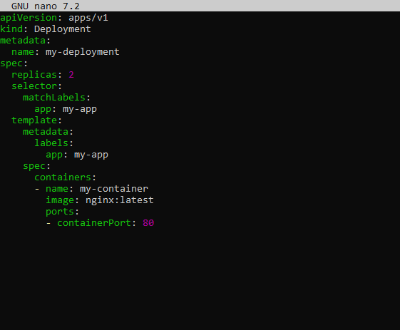

# NGINX Deployment

Here's a basic Kubernetes (k8s) Deployment YAML file to create a pod running a simple container. This example deploys an Nginx container.

### `deployment.yaml`
```yaml
apiVersion: apps/v1
kind: Deployment
metadata:
  name: my-deployment
spec:
  replicas: 2
  selector:
    matchLabels:
      app: my-app
  template:
    metadata:
      labels:
        app: my-app
    spec:
      containers:
      - name: my-container
        image: nginx:latest
        ports:
        - containerPort: 80
```


### Explanation:
- **replicas: 2** → Creates two pods for high availability.
- **selector.matchLabels** → Ensures that the deployment manages the right pods.
- **template.metadata.labels** → Labels the pod for selection.
- **containers.name** → The container is named `my-container`.
- **image** → Uses the latest `nginx` image.
- **containerPort** → Exposes port `80`.

### Apply the Deployment:
```sh
kubectl apply -f deployment.yaml
```


### Verify Deployment:
```sh
kubectl get deployments
kubectl get pods
kubectl describe deployment my-deployment
```


Let me know if you need modifications, such as environment variables, volume mounts, or resource limits.