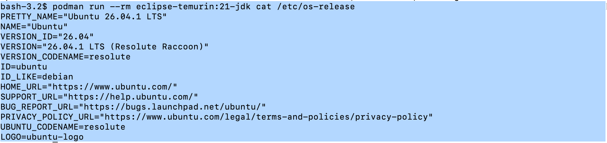
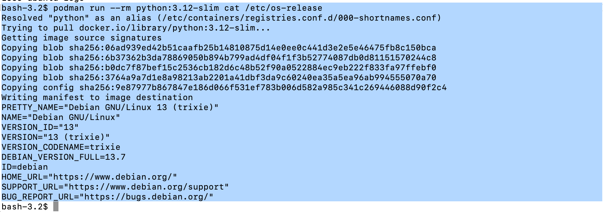

# Podman In-class Lab2

In this lab, we will build our own container images on top of a base Ubuntu Linux image using `Dockerfile`s, then build the images with Podman.

## Part 1: A Dockerfile using a base Ubuntu image

This `Dockerfile` starts `FROM` a base `ubuntu` image and installs `OpenJDK 21` and `Python 3.12` on top of it.

Create a file named `Dockerfile.javapython`:

```dockerfile
FROM ubuntu:24.04

ENV DEBIAN_FRONTEND=noninteractive

RUN apt-get update && \
    apt-get install -y --no-install-recommends \
        software-properties-common \
        curl \
        ca-certificates \
        gnupg && \
    add-apt-repository ppa:deadsnakes/ppa && \
    apt-get update && \
    apt-get install -y --no-install-recommends \
        openjdk-21-jdk \
        python3.12 \
        python3.12-venv \
        python3-pip && \
    apt-get clean && \
    rm -rf /var/lib/apt/lists/*

ENV JAVA_HOME=/usr/lib/jvm/java-21-openjdk-amd64
ENV PATH=$JAVA_HOME/bin:$PATH

CMD ["/bin/bash"]
```

Build the image with Podman:

```commandline
$ podman build -t javapython:21-3.12 -f Dockerfile.javapython .
```

Verify both runtimes are installed:

```commandline
$ podman run --rm javapython:21-3.12 java -version

$ podman run --rm javapython:21-3.12 python3.12 --version
```

## Part 2: A Dockerfile that combines ready-to-use image layers

Instead of installing everything from scratch, we can reuse official, ready-to-use images and copy their layers into a single final image using a multi-stage build.

> **Note:** The two base images used below are built on different Linux distributions under the hood. Run the following to check each image's `/etc/os-release`:
>
> ```commandline
> set -e
> docker pull python:3.12-slim
> printf '%s\n' '--- eclipse-temurin:21-jdk /etc/os-release ---'
> docker run --rm eclipse-temurin:21-jdk cat /etc/os-release
> printf '%s\n' '--- python:3.12-slim /etc/os-release ---'
> docker run --rm python:3.12-slim cat /etc/os-release
> ```
>
> This shows:
> - `eclipse-temurin:21-jdk` → Ubuntu (e.g. `24.04`/`26.04` LTS depending on the tag's build date)
> - `python:3.12-slim` → Debian (e.g. `bookworm`/`trixie` depending on the tag's build date)
>
> This is exactly why Part 2 copies only the `/opt/java/openjdk` and `/usr/local` layers out of those images onto a plain `ubuntu:24.04` base, instead of using either image directly as the final `FROM` - it avoids ending up with a mixed/inconsistent distro and keeps the final image's package manager (`apt`) consistent with its base OS.

Create a file named `Dockerfile.combined`:

```dockerfile
# Stage 1: reuse the official OpenJDK 21 image just for its JDK installation
FROM eclipse-temurin:21-jdk AS java-layer

# Stage 2: reuse the official Python 3.12 image just for its Python installation
FROM python:3.12-slim AS python-layer

# Final stage: combine both layers on top of a plain Ubuntu base
FROM ubuntu:24.04

COPY --from=java-layer /opt/java/openjdk /opt/java/openjdk
COPY --from=python-layer /usr/local /usr/local

ENV JAVA_HOME=/opt/java/openjdk
ENV PATH=$JAVA_HOME/bin:$PATH

CMD ["/bin/bash"]
```

Build the combined image with Podman:

```commandline
$ podman build -t javapython-combined:21-3.12 -f Dockerfile.combined .
```

Verify both runtimes again:

```commandline
$ podman run --rm javapython-combined:21-3.12 java -version

$ podman run --rm javapython-combined:21-3.12 python3 --version
```

## Discussion

Without exec into each image, we can also inspect each image individually like below:





- Part 1 builds everything using `apt` on top of a bare Ubuntu base, giving you full control over versions and package sources.
- Part 2 avoids reinstalling anything: it just copies the already-built runtime layers out of two official, ready-to-use images (`eclipse-temurin` and `python`) into one final image, which is typically faster to build and smaller/more reliable than reinstalling from package managers.

## Ref

- https://docs.podman.io/en/latest/Commands.html
- https://hub.docker.com/_/eclipse-temurin
- https://hub.docker.com/_/python
