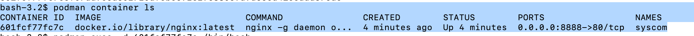
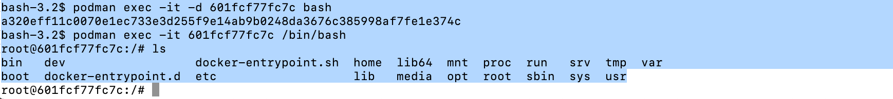

# Podman In-class Lab

```commandline
$ podman pull docker.io/library/httpd

$ podman pull docker.io/library/nginx

$ podman image ls
```

Try to grab the image and download them from the docker registry.


Then create two different directories to host your web app data. 

`mkdir syscom sysorg`

In this case, I'll work with two simple HTTPD webpages:

I'll create two index.html files, one for the sysadmin.com app and the other for the sysadmin.org app:

```shell
$ cat << EOF > ./syscom/index.html
<html>
  <header>
    <title>SysAdmin.com</title>
  </header>
  <body>
    <p>This is the SysAdmin website hosted on the .com domain</p>
  </body>
</html>
EOF

$ cat << EOF > ./sysorg/index.html
<html>
  <header>
    <title>SysAdmin.org</title>
  </header>
  <body>
    <p>This is the SysAdmin website hosted on the .org domain</p>
  </body>
</html>
EOF
```

After that, in your linux, you should see something similar to the following,


This is all I need. Now I can run my HTTPD containers hosting these two different webpages in different domains:

```commandline
$ podman run --name=syscom -p 8080:80 -v $HOME/syscom:/usr/local/apache2/htdocs:Z -d docker.io/library/httpd

$ podman run --name=sysorg -p 8081:80 -v $HOME/sysorg:/usr/local/apache2/htdocs:Z -d docker.io/library/httpd
```

Then check the containers that were running,

```shell
$ podman ps
CONTAINER ID  IMAGE                           COMMAND           CREATED         STATUS         PORTS                 NAMES
4b4c00f0faa5  docker.io/library/httpd:latest  httpd-foreground  15 seconds ago  Up 14 seconds  0.0.0.0:8080->80/tcp  syscom
ff1d8bae380a  docker.io/library/httpd:latest  httpd-foreground  9 seconds ago   Up 8 seconds   0.0.0.0:8081->80/tcp  sysorg
```

In the screen, you should see something similar,


Next, you could either open `localhost:8080` to check the website is up, or you can use `curl` tool to check the website is running using commandline.

Now, in ubuntu you can use `apt` package manager to install it,


Then check the site with curl,


## How to `exec` into your pod

First you go and grab the container id,

```shell
bash-3.2$ podman container ls
CONTAINER ID  IMAGE                           COMMAND           CREATED        STATUS        PORTS                 NAMES
d671f1ea5059  docker.io/library/httpd:latest  httpd-foreground  4 minutes ago  Up 4 minutes  0.0.0.0:8080->80/tcp  syscom
```

We run the following commands to ssh/enter into the container linux,

```shell
bash-3.2$ podman exec -it d671f1ea5059 /bin/bash
root@d671f1ea5059:/usr/local/apache2# 
```

Now I am inside of the linux pod of the httpd,

```shell
root@d671f1ea5059:/usr/local/apache2# ls
\bin  build  cgi-bin  conf  error  htdocs  icons  include  logs	modules
root@d671f1ea5059:/usr/local/apache2#
```

## Deploy using NGINX

## Troubleshooting

cd into the container itself,





## Ref

- https://www.redhat.com/en/blog/podman-nginx-multidomain-applications