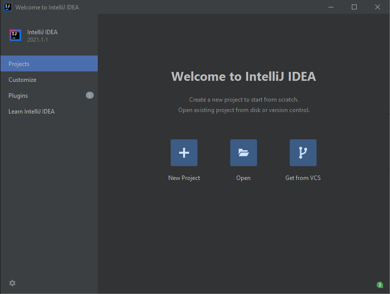
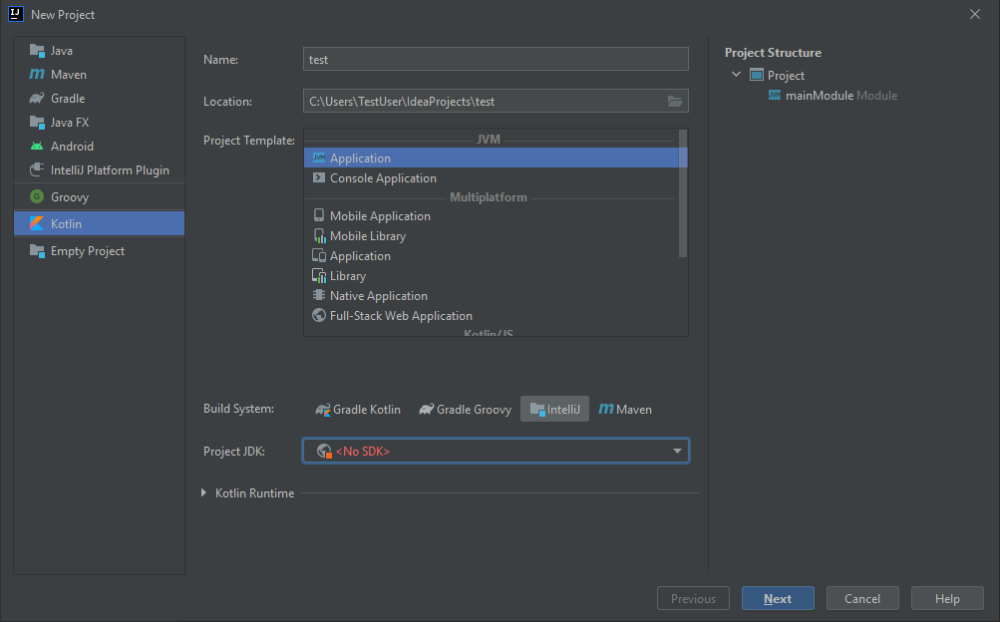
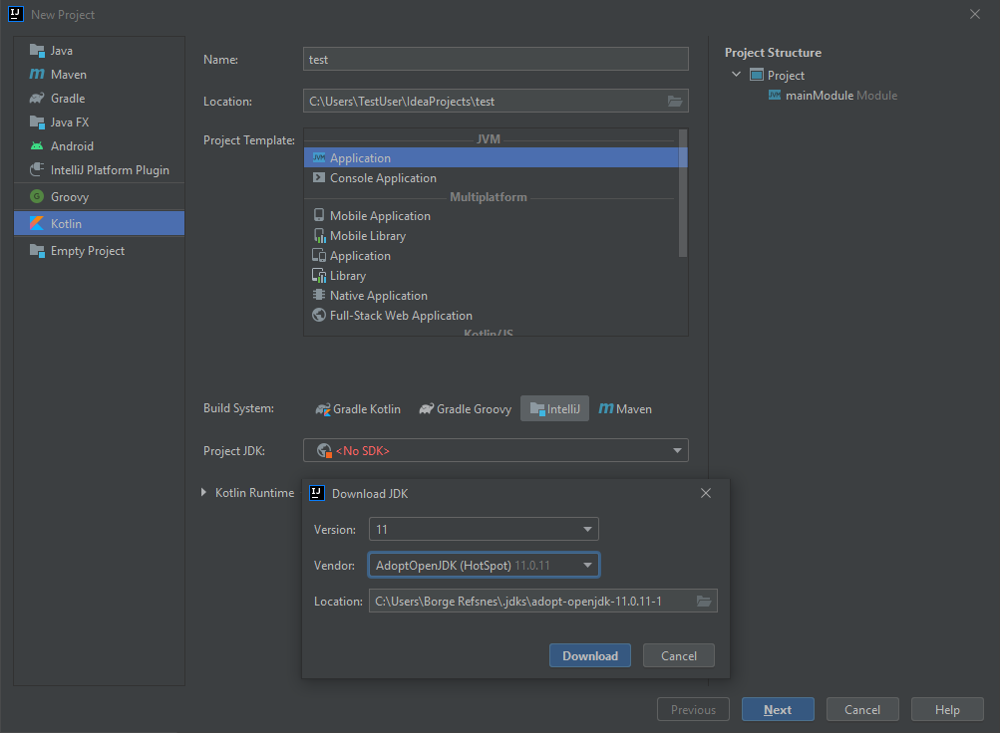
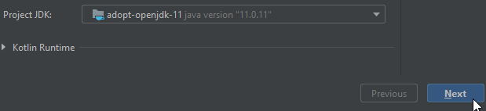
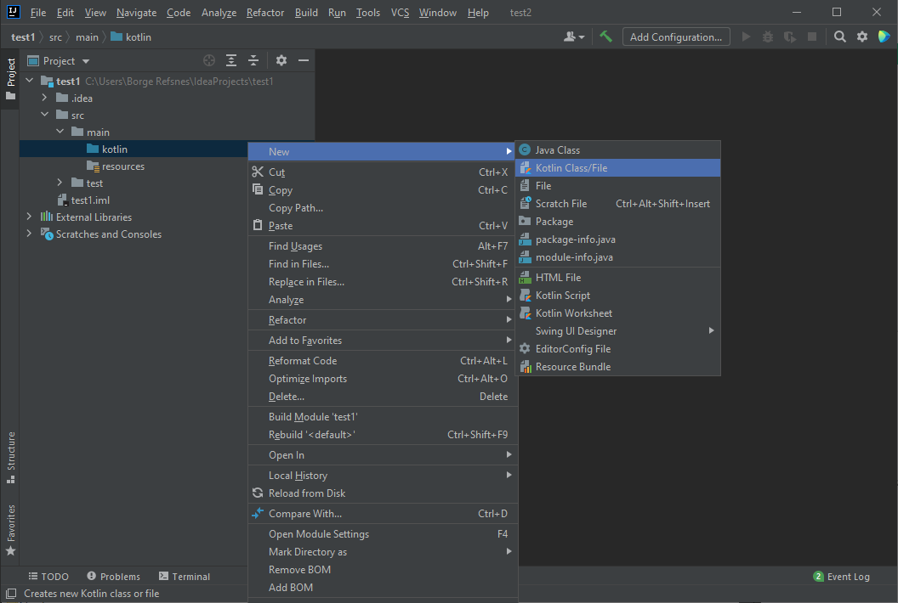
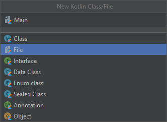
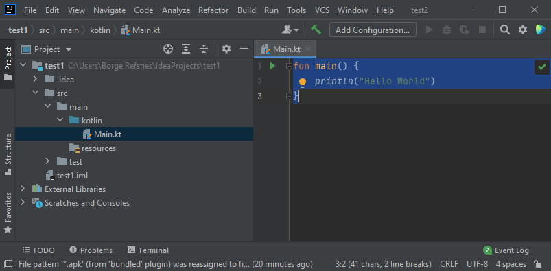
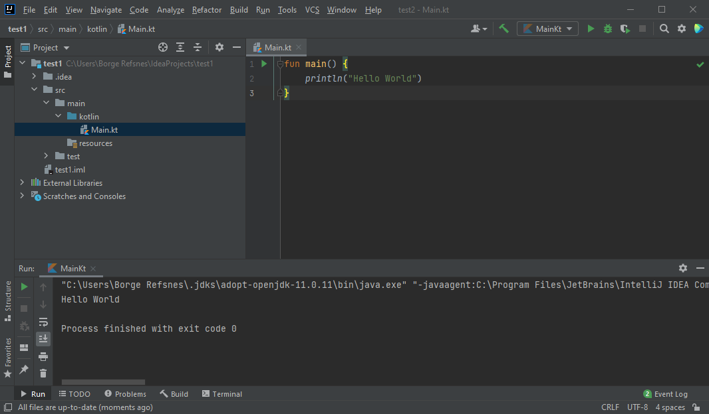

# Kotlin Language

* Kotlin is a modern, trending programming language that was released in 2016 by JetBrains.

* Kotlin is easy to learn, especially if you already know Java (it is 100% compatible with Java).

* Kotlin is used to develop Android apps, server side apps, and much more.

* You could use intelliJ for development, will use IntelliJ (developed by the same people that created Kotlin) from https://www.jetbrains.com/idea/download/.

## Project Setup

Within a brand new IntelliJ project, we can install JDK and set up kotlin environment without doing a lot of seperate JDK installation.

Once IntelliJ is downloaded and installed, click on the New Project button to get started with IntelliJ:

Then click on "Kotlin" in the left side menu, and enter a name for your project:

Next, we need to install something called JDK (Java Development Kit) to get our Kotlin project up and going. Click on the "Project JDK" menu, select "Download JDK" and select a version and vendor (e.g. AdoptOpenJDK 11) and click on the "Download" button:

When the JDK is downloaded and installed, choose it from the select menu and then click on the "Next" button and at last "Finish":

Now we can start working with our Kotlin project. Do not worry about all of the different buttons and functions in IntelliJ. For now, just open the src (source) folder, and follow the same steps as in the image below, to create a kotlin file:

Select the "File" option and add a name to your Kotlin file, for example "Main":

You have now created your first Kotlin file (Main.kt). Let's add some Kotlin code to it, and run the program to see how it works. Inside the Main.kt file, add the following code:

Next, IntelliJ will build your project, and run the Kotlin file. The output will look something like this:

## Ref

- https://www.w3schools.com/KOTLIN/index.php

- https://kotlinlang.org/docs/getting-started.html