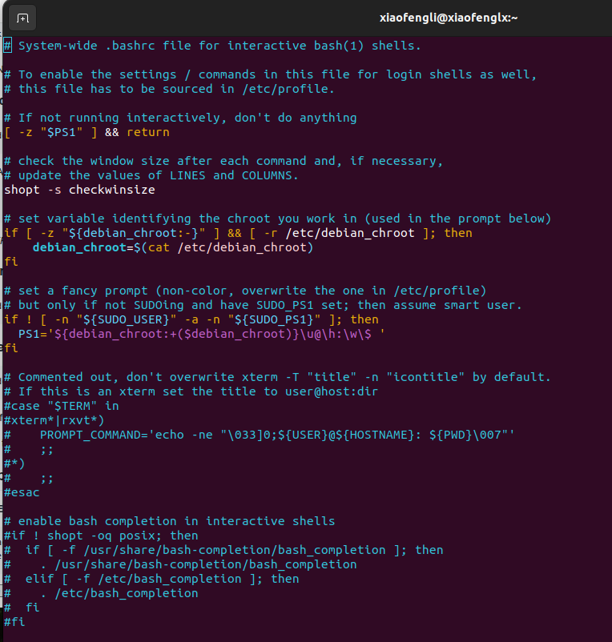

# Linux Profiles

## /etc/skel

User's session is controlled by profile files. These files are located in /etc/skel. When you create a new user script files from this directory are copied in user's home directory. There is only exceptions when user is created with –M switch or user home directoy is already exist.

In such a situations you need to copy these file manually. These file are hidden and can be seen by –a switch with ls commands.

`$ls –a `

## .bash_profile

This script file instructs user session to check .bashrc file for user aliases and functions. Further its set user command path . if you want add your own directory to your command path. Edit this file. For example user vinita wants her home directory should be check while excuting commands she can add this line in her .bash_profile files.

```shell
$vi .bash_profile
PATH=$PATH:$HOME/BIN:/home/xiaofengli
```

## .bashrc

This file is used to controls user variable and other profile during his login session. If you want to execute any command automatically on user logon set that command in this file. For example if user vinita wants to clear screen immediately after her login. She need to add clear command at end of this file.

```shell
 $vi .bashrc
 # add your command only in the end of file
 clear
```

With this file you can play a funny trick with your friends. Create a user and set exit command in his .bashrc files. Now ask your friends to login with this user. exit command will logout the user as soon as user will login and user will never will be able to login.

## .bash_logout


## How these work

```shell
xiaofengli@xiaofenglx:/etc/profile.d$ ls ~/.bash*
/home/xiaofengli/.bash_history	/home/xiaofengli/.bash_logout  /home/xiaofengli/.bash_profile  /home/xiaofengli/.bashrc
```

```shell
xiaofengli@xiaofenglx:/etc/profile.d$ ls
01-locale-fix.sh    cedilla-portuguese.sh  deepin-wine.i-m.dev.sh    im-config_wayland.sh  xdg_dirs_desktop_session.sh
apps-bin-path.sh    debuginfod.csh	   flatpak.sh		     vte-2.91.sh
bash_completion.sh  debuginfod.sh	   gnome-session_gnomerc.sh  vte.csh
```

In Linux-based systems, `/etc/profile.d/` is a directory that contains shell scripts used to configure environment variables and shell settings for users. These scripts are typically executed for all users when they log in to the system.

Here’s how it works:

1. **Location**: The `/etc/profile.d/` directory is usually present on systems that use a Bourne-compatible shell (e.g., Bash). It is located in `/etc`, which is the main configuration directory for the system.

2. **Usage**: The scripts inside `/etc/profile.d/` are executed by the system-wide shell initialization files like `/etc/profile` or `/etc/bash.bashrc` (depending on the distribution). These scripts are used to set environment variables or run any startup configurations that apply to all users on the system. For example, scripts may define paths to additional software or set system-wide settings for a shell.

3. **Structure**:
   - Each file in `/etc/profile.d/` typically has a `.sh` extension (e.g., `java.sh`, `nodejs.sh`).
   - These scripts are often used to configure environment variables like `PATH`, `MANPATH`, `LD_LIBRARY_PATH`, etc.
   
4. **Execution**:
   - When a user logs in or opens a terminal, `/etc/profile` is sourced (executed), and it, in turn, sources all scripts in `/etc/profile.d/`.
   - This allows administrators to add custom configurations for specific software packages without directly modifying system-wide initialization files.

### Example:

If you have a script `/etc/profile.d/java.sh` that looks like this:

```bash
export JAVA_HOME=/usr/lib/jvm/java-11-openjdk
export PATH=$JAVA_HOME/bin:$PATH
```

This script will automatically set the `JAVA_HOME` variable and update the `PATH` variable whenever a user logs in or opens a terminal.

### Advantages:

- **Modularity**: It allows the configuration to be broken down into smaller, manageable scripts, each dedicated to a specific piece of software or a set of related configurations.
- **Package Management**: Many packages, like Java, Python, or database systems, place their configuration scripts in `/etc/profile.d/` so that the environment is automatically set up for users after installing the software.
- **Consistency**: Ensures that environment variables or other settings are consistently applied across all user sessions on the system.

>Hint: from ChatGPT

```bash
# /etc/profile: system-wide .profile file for the Bourne shell (sh(1))
# and Bourne compatible shells (bash(1), ksh(1), ash(1), ...).

if [ "${PS1-}" ]; then
  if [ "${BASH-}" ] && [ "$BASH" != "/bin/sh" ]; then
    # The file bash.bashrc already sets the default PS1.
    # PS1='\h:\w\$ '
    if [ -f /etc/bash.bashrc ]; then
      . /etc/bash.bashrc
    fi
  else
    if [ "$(id -u)" -eq 0 ]; then
      PS1='# '
    else
      PS1='$ '
    fi
  fi
fi

if [ -d /etc/profile.d ]; then
  for i in /etc/profile.d/*.sh; do
    if [ -r $i ]; then
      . $i
    fi
  done
  unset i
fi
```

## Deep dive in `/etc/bash.bashrc`



## alias command

The alias command is used to create another name for a command. The alias does not exactly replace the name of the command; it simply gives another name to that command. An alias command begins with the keyword alias and the new name for the command, followed by an equal sign and the command the alias will reference. No spaces can be around the equal sign used in the alias command. In the next example, list becomes another name for the ls command:

```shell
$ alias list=ls
$ ls
Report vickey nikki
$ list
Report vickey nikki
$ 
```

You can also use an alias to alternate for a command and its option, but you need to enclose both the command and the option within single quotes. Any command you alias that contains spaces must be enclosed in single quotes as well. In the next example, the alias longlist is set for command ls -l

`$ alias longlist='ls -l' `

**Control Shell Operations**

The BASH shell has several features that enable you to control the way different shell operations work. You need not know all these options for exam. But some hand operations you should always try in exam.

**To stop logout form CTRL+D**

Several commands in Linux are completed with CTRL+D. for example if you are making file form cat command the CTRL+D is used to save the files. And if you are using calculator on command prompt then CTRL+D is used to exit form calculators. But what if you pressed accidently CTRL+D two times, it will logout you from current session and you have to login again.

`$set –o ignoreeof `

Now press CTRL+D and you will get a message “Use “logout” to leave the shell.

**linux shell**

***To stop overwriting of files***
Other important shell operation is overwriting. How many times you have overwritten files. For example

```shell
$cat > test
Testing file
$ls test
```

now run this command once again

```shell
$cat > test
Old contents will overwrite without any message
$ls $cat test
Old contents will overwrite without any message 
```

Notice how easily Linux can overwrite file. To turnoff this shell feature

` $set –o noclobber `

Now whenever you will try to overwrite it will stop you with error message.

**linux shell**

Whatever you set with –o option can be revert with + sign.

`$set +o ignoreeof`

Now again you can logout with CTRL+D. 

**Changing shell prompt**

By default shell prompt show user name hostname and current working directory. You can change this prompt to following variable.

**change command prompt**

The following table lists the codes for configuring your prompt:

**Prompt Codes	Description**

|option|meaning|
|--|--|
|!|	Current history number|
|$|	Use $ as prompt for all users except the root user, which has the # as its prompt|
|d	|Current date|
|#	|History command number for just the current shell|
|h	|Hostname|
|s	|Shell type currently active|
|t	|Time of day in hours, minutes, and seconds|
|u	|Username|
|v	|Shell version|
|W	|Name of the current working directory|
|\	|Displays a backslash character|
|\n	|Inserts a newline|
|\[ \] |Allows entry of terminal-specific display |characters for features like color or bold font|
|\nnn	|Character specified in octal format|


## Ref

- https://www.computernetworkingnotes.com/linux-tutorials/linux-user-profile-management-and-environment-variable.html#google_vignette

- https://docs.rockylinux.org/books/lxd_server/06-profiles/

- https://www.tecmint.com/understanding-shell-initialization-files-and-user-profiles-linux/

- https://www.redhat.com/en/blog/linux-tuned-tuning-profiles

- https://bash.cyberciti.biz/guide/.profile

- https://www.linuxjournal.com/content/profiles-and-rc-files

- https://cloudcoder.hashnode.dev/profile-files

- https://linux-training.be/security/ch04.html