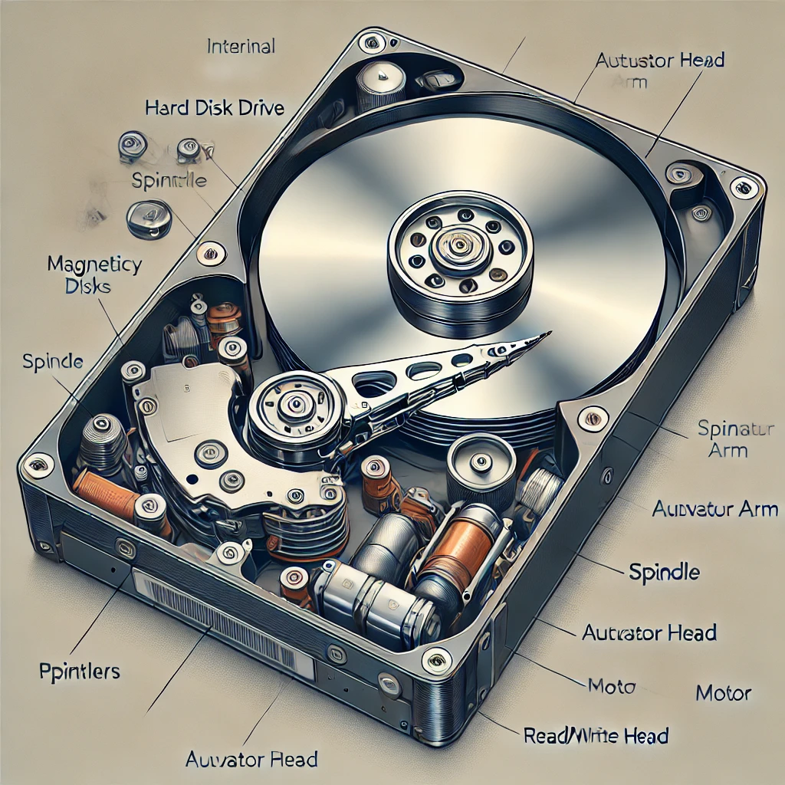
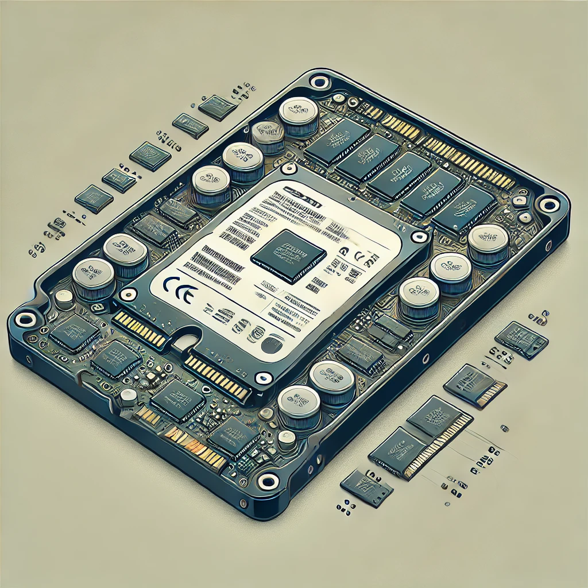
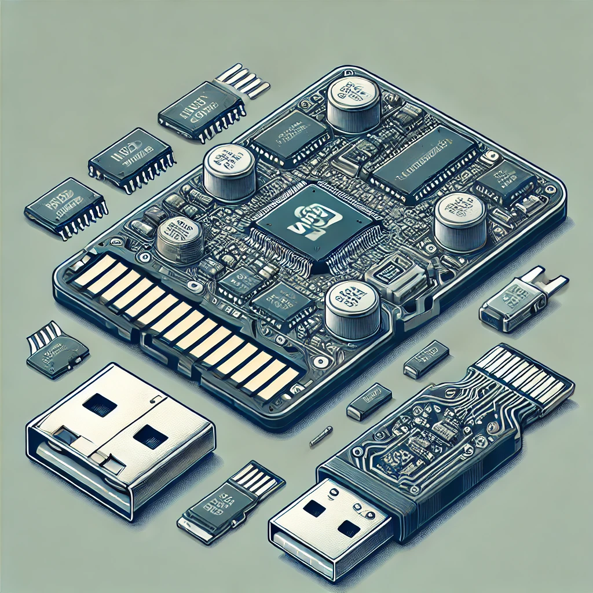

# Storage Terminilogies

## Storage devices

### HDD



Here is a detailed cross-sectional illustration of an internal Hard Disk Drive (HDD), showcasing its components like platters, spindle, actuator arm, read/write head, and motor.

### SSD



Here is a detailed cross-sectional illustration of an internal Solid State Drive (SSD), showing its key components like NAND flash memory chips, controller, and DRAM cache.

### USB and NAND Flash Memory



Here is a detailed cross-sectional illustration of a microSD card and a USB flash drive, showcasing their internal components like NAND flash memory, controller, PCB, and connector.

## **RAID (Redundant Array of Independent Disks)**

RAID is a data storage virtualization technology that combines multiple physical hard drives into a single logical unit for **redundancy**, **performance**, or both. Common RAID levels include:

- **RAID 0 (Striping)**: Distributes data across multiple disks for speed but offers no redundancy.
- **RAID 1 (Mirroring)**: Duplicates data across two or more disks for redundancy.
- **RAID 5**: Uses striping with distributed parity for a balance of performance and fault tolerance.
- **RAID 10 (1+0)**: Combines mirroring and striping for both speed and redundancy.

## **SCSI (Small Computer System Interface)**

SCSI is a **set of standards** for connecting and transferring data between computers and peripheral devices like hard drives, tape drives, and scanners. It supports **multiple devices on a single bus** and is known for reliability and high-speed data transfer in enterprise environments.

## **Difference Between SCSI HDD and Other HDDs**

#### **1. SCSI Hard Drive (Small Computer System Interface)**
- **Interface Type**: Uses the SCSI protocol for communication with computers.
- **Performance**: Typically faster with higher **RPMs** (10,000–15,000 RPM).
- **Usage**: Found in **enterprise environments**, such as servers and workstations.
- **Multiple Device Support**: Supports **daisy-chaining** multiple devices on a single SCSI bus.
- **Reliability**: Designed for 24/7 operation with better **error handling** and durability.
- **Cost**: More expensive than standard SATA HDDs.

#### **2. SATA Hard Drive (Serial ATA)**
- **Interface Type**: Uses the SATA interface.
- **Performance**: Standard RPMs are **5,400–7,200**, slower than SCSI.
- **Usage**: Found in **consumer PCs, laptops, and low-end servers**.
- **Reliability**: Less robust than SCSI but sufficient for everyday computing.
- **Cost**: Cheaper than SCSI drives.

#### **3. SAS Hard Drive (Serial Attached SCSI)**
- **Hybrid of SCSI and SATA**: Uses SCSI command sets but with a **point-to-point** connection like SATA.
- **Performance**: Higher speed, often **used in high-performance enterprise systems**.
- **Reliability**: More reliable than SATA, supports **hot-swapping**.

#### **Key Takeaways**
- **SCSI HDDs** are enterprise-grade, **faster, and more reliable**, making them ideal for servers.
- **SATA HDDs** are **cheaper** and used in consumer computers.
- **SAS HDDs** combine **SCSI's reliability** with **SATA's simplicity** for better enterprise storage solutions.

## **Linux commands to manage SCSI devices**

### **1. List SCSI Devices**

```bash
lsscsi
```
or
```bash
cat /proc/scsi/scsi
```
or
```bash
lsblk
```

### **2. Scan for New SCSI Devices**

```bash
echo "- - -" | sudo tee /sys/class/scsi_host/host0/scan
```

### **3. Remove a SCSI Device**

```bash
echo 1 | sudo tee /sys/block/sdX/device/delete
```
*(Replace `sdX` with the actual device name.)*

### **4. Get Detailed SCSI Device Information**

```bash
sudo sg_inq /dev/sdX
```

## Here are some **Linux commands to list SATA HDDs**

### **1. Using `lsblk` (List Block Devices)**

```bash
lsblk -o NAME,MODEL,SIZE,TYPE
```
- Shows all storage devices, including SATA HDDs.

### **2. Using `fdisk` (Check Disk Partitions)**

```bash
sudo fdisk -l | grep -i "sata"
```
- Lists all SATA drives detected by the system.

### **3. Using `lsscsi` (List SCSI & SATA Devices)**

```bash
lsscsi
```
- Displays SCSI and SATA drives.

### **4. Using `hdparm` (Check Drive Details)**

```bash
sudo hdparm -I /dev/sdX | grep -i "SATA"
```
*(Replace `/dev/sdX` with your actual device name, e.g., `/dev/sda`.)*

### **5. Using `dmesg` (Check Boot Messages)**
```bash
dmesg | grep -i "SATA"
```
- Displays SATA drive detection messages.

The following is info on my computers,

```shell
xiaofengli@xiaofenglx:~$ lsscsi
[0:0:0:0]    disk    ATA      WDC WD5001AALS-0 3B01  /dev/sda 
[1:0:0:0]    disk    ATA      TOSHIBA HDWR21C  0601  /dev/sdb 
[6:0:0:0]    cd/dvd  HL-DT-ST DVDRAM GH24NSC0  LK00  /dev/sr0
[8:0:0:0]    disk    Kingston DataTraveler 2.0 PMAP  /dev/sdc

xiaofengli@xiaofenglx:~$ sudo hdparm -I /dev/sda |grep -i  "SATA"
	Transport:          Serial, SATA 1.0a, SATA II Extensions, SATA Rev 2.5

xiaofengli@xiaofenglx:~$ sudo hdparm -I /dev/sdb |grep -i  "SATA"
	Transport:          Serial, ATA8-AST, SATA 1.0a, SATA II Extensions, SATA Rev 2.5, SATA Rev 2.6, SATA Rev 3.0

xiaofengli@xiaofenglx:~$ sudo hdparm -I /dev/sdc |grep -i  "SATA"
```

## LVM

### **What is LVM (Logical Volume Manager)?**

LVM is a **storage management** solution in Linux that provides a flexible way to manage disk space by abstracting physical storage devices into logical volumes. It allows users to dynamically resize, extend, and manage storage without directly modifying disk partitions.

### **Key Components of LVM:**

1. **Physical Volume (PV):** The actual physical disk or partition (e.g., `/dev/sdb`).
2. **Volume Group (VG):** A pool of storage created by combining multiple physical volumes.
3. **Logical Volume (LV):** Virtual partitions created from the volume group, which can be mounted like a regular partition.

### **LVM Example Commands:**
#### **1. Creating an LVM Setup**

```bash
sudo pvcreate /dev/sdb /dev/sdc  # Initialize physical volumes
sudo vgcreate my_vg /dev/sdb /dev/sdc  # Create a volume group
sudo lvcreate -L 10G -n my_lv my_vg  # Create a 10GB logical volume
sudo mkfs.ext4 /dev/my_vg/my_lv  # Format the logical volume
sudo mount /dev/my_vg/my_lv /mnt  # Mount the volume
```

#### **2. Extending an LVM Volume**

```bash
sudo lvextend -L +5G /dev/my_vg/my_lv  # Increase size by 5GB
sudo resize2fs /dev/my_vg/my_lv  # Resize the filesystem
```

LVM is particularly useful for **dynamic storage management** in servers, allowing **easy expansion, snapshots, and RAID integration**. 

### **LVM and RAID Management Examples Using Linux Commands**

#### **1. LVM (Logical Volume Manager) Example**
LVM allows dynamic partitioning and resizing of storage. Below is a practical example:

##### **Step 1: Initialize Physical Volumes**
```bash
sudo pvcreate /dev/sdb /dev/sdc
```

##### **Step 2: Create a Volume Group**
```bash
sudo vgcreate my_vg /dev/sdb /dev/sdc
```

##### **Step 3: Create a Logical Volume**
```bash
sudo lvcreate -L 10G -n my_lv my_vg
```

##### **Step 4: Format and Mount the Logical Volume**
```bash
sudo mkfs.ext4 /dev/my_vg/my_lv
sudo mount /dev/my_vg/my_lv /mnt
```

##### **Step 5: Resize the Logical Volume**
Expand the volume by 5GB:
```bash
sudo lvextend -L +5G /dev/my_vg/my_lv
sudo resize2fs /dev/my_vg/my_lv
```

---

#### **2. RAID (Redundant Array of Independent Disks) Example**
RAID provides redundancy and performance improvements.

##### **Step 1: Create a RAID 1 Array (Mirroring)**
```bash
sudo mdadm --create --verbose /dev/md0 --level=1 --raid-devices=2 /dev/sdb /dev/sdc
```

##### **Step 2: Check RAID Status**
```bash
cat /proc/mdstat
```

##### **Step 3: Format and Mount the RAID Array**
```bash
sudo mkfs.ext4 /dev/md0
sudo mount /dev/md0 /mnt
```

##### **Step 4: Save RAID Configuration**
```bash
sudo mdadm --detail --scan >> /etc/mdadm/mdadm.conf
```

## Automation

### LVM and RAID Automation

```
def create_lvm(volume_group, logical_volume, size, disk):
    subprocess.run(["sudo", "pvcreate", disk])
    subprocess.run(["sudo", "vgcreate", volume_group, disk])
    subprocess.run(["sudo", "lvcreate", "-L", size, "-n", logical_volume, volume_group])
    subprocess.run(["sudo", "mkfs.ext4", f"/dev/{volume_group}/{logical_volume}"])
    print("LVM setup complete!")

def create_raid(raid_level, raid_device, disks):
    subprocess.run(["sudo", "mdadm", "--create", "--verbose", raid_device, "--level", str(raid_level), "--raid-devices", str(len(disks))] + disks)
    subprocess.run(["sudo", "mkfs.ext4", raid_device])
    print("RAID setup complete!")

# Example LVM and RAID commands
# create_lvm("my_vg", "my_lv", "10G", "/dev/sdb")
# create_raid(1, "/dev/md0", ["/dev/sdb", "/dev/sdc"])

```
