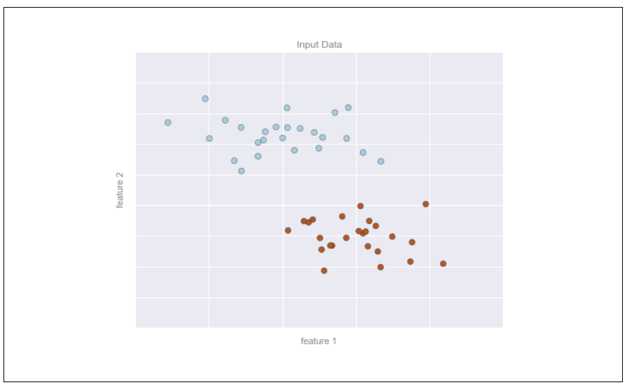
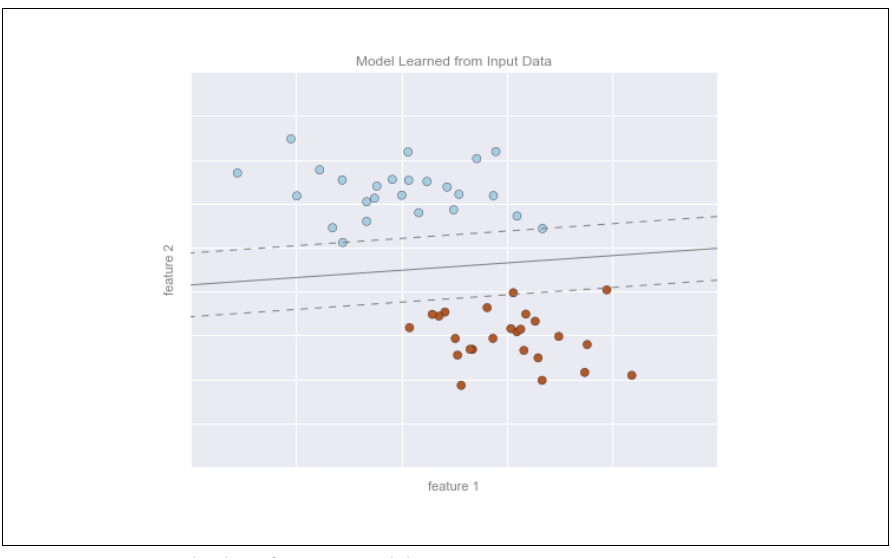
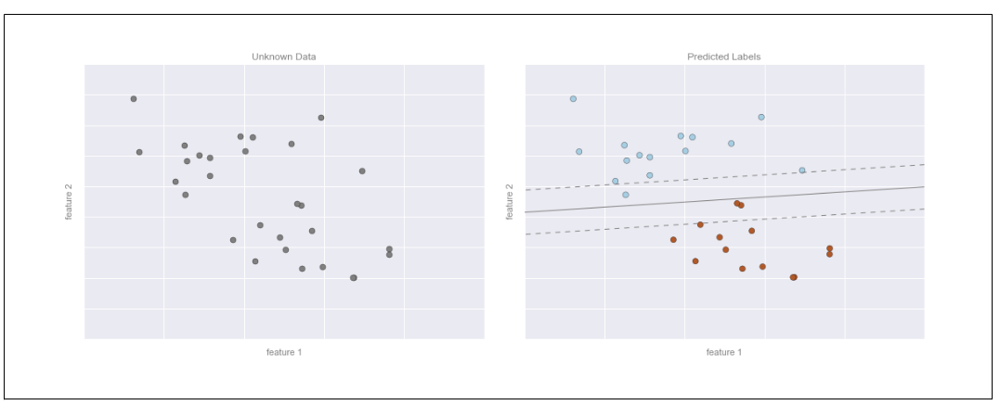

# Classic Machine Learning

## What is Machine Learning

Machine learning is often categorized as a subfield of artificial intelligence,it’s more helpful to think of machine learning as a means of building models of data.

* Build and choose a model

Fundamentally, machine learning involves building mathematical models to help understand data. “Learning” enters the fray when we give these models tunable parameters that can be adapted to observed data; in this way the program can be considered to be “learning” from the data.

* Prediction

Once these models have been fit to previously seen data, they can be used to predict and understand aspects of newly observed data.

Understanding the problem setting in machine learning is essential to using these tools effectively, and so we will start with some broad categorizations of the types of approaches we’ll discuss here.

## Categories of Machine Learning

The most fundamental categorization,

* supervised learning

Supervised learning involves somehow modeling the relationship between measured features of data and some label associated with the data; once this model is determined, it can be used to apply labels to new, unknown data.

    * classification
      
      In classification, the labels are discrete categories.
    
    * regression

      In regression, the labels are continuous quantities.

* unsupervised learning

Unsupervised learning involves modeling the features of a dataset without reference to any label, and is often described as “letting the dataset speak for itself.

     * clustering

     Clustering algorithms identify distinct groups of data

     * dimensionality reduction

     Dimensionality reduction algorithms search for more succinct representations of the data.

## Classification: Predicting discrete labels

Here we have two-dimensional data; that is, we have two features for each point, represented by the (x,y) positions of the points on the plane. In addition, we have one of two class labels for each point, here represented by the colors of the points. From these features and labels, we would like to create a model that will let us decide
whether a new point should be labeled “blue” or “red.”

Here the model is a quantitative version of the statement “a straight line separates the classes,” while the model param‐
eters are the particular numbers describing the location and orientation of that line for our data. The optimal values for these model parameters are learned from the data (this is the “learning” in machine learning), which is often called training the
model.

Then we apply the model to new data,

## classification application in real life

For example, this is similar to the task of automated spam detection for email; in this case, we might use the following features and labels:

* feature 1, feature 2, etc -> normalized counts of important words or phrases (“Viagra,” “Nigerian prince,” etc.)

* label -> “spam” or “not spam”.

Some important classification algorithms will be discussed in details.

* Naive Bayes Classification

* Support Vector Machines

* Decision tree random forest classification

## What Is Classical Machine Learning?

Classical ML uses models, or algorithms, to analyze massive data sets, identify patterns, and make predictions without human intervention. Organizations use ML-identified patterns and trends to make smarter, faster decisions that can improve business efficiency, improve security, and create new data-driven products and services tailored to customer behaviors. Common ML models include `linear regression`, `logistic regression`, `support vector machines`, `nearest neighbor similarity search`, and `decision trees`.

Classical ML models are often computationally lighter than deep learning neural networks. They rely heavily on the quality of the data they learn from and are considered explainable AI. `Explainable AI` gives organizations, decision-makers, and data scientists traceable insight into how an algorithm arrived at a specific result. With transparency into how the algorithm works, users can identify potential biases and discover how variables contribute to an outcome. Explainable AI is often required for regulated industries such as `financial services` and `government`.

## Classical Machine Learning Use Cases

Classical ML models are used for a variety of real-world applications across the **financial services**, **health and life sciences**, **retail**, **research**, and **manufacturing industries**. For example, financial institutions can build, train, and implement ML models to **identify and predict fraudulent credit card transactions** faster and more accurately, reducing the amount of money lost annually to fraud and better protecting sensitive customer information. Other popular ML use cases include **customized marketing**, **visual quality control in manufacturing**, **personalized medicine**, and **retail demand forecasting**.

## Classic Machine Learning Software

* [Scikit-learn](https://www.intel.com/content/www/us/en/developer/tools/oneapi/scikit-learn.html)

* [XGBoost](https://www.intel.com/content/www/us/en/developer/tools/oneapi/optimization-for-xgboost.html#gs.33zwtw)

### Other Intel optimized tools

[Intel® AI Quick Start Guide](https://cdrdv2.intel.com/v1/dl/getContent/767176)
[Intel® AI Analytics Toolkit (AI Kit)](https://www.intel.com/content/www/us/en/developer/tools/oneapi/ai-tools-selector.html)
[Intel AI Tools](https://www.intel.com/content/www/us/en/developer/topic-technology/artificial-intelligence/tools.html)
[AI Frameworks](https://www.intel.com/content/www/us/en/developer/tools/frameworks/overview.html#gs.33zj16)

## Classic Machine Learning Hardware [CPU without GPU]

With a broad hardware portfolio of processors and integrated accelerators, Intel makes it easier for you find a cost-effective solution or maximize the value of your existing CPUs to meet your project and budget needs—without requiring the purchase of an external GPU.

Getting more from your CPU also helps you get more from common tools for classical ML, including scikit-learn, which doesn’t support the use of GPUs or GPU acceleration.

Let’s look at some of the cost-effective Intel® solutions you can take advantage of.

* Intel® Xeon® Scalable Processors: Designed to handle the most demanding AI workloads, these CPUs offer a larger memory capacity for the large data sets required for classical machine learning. With integrated Intel® Accelerator Engines purpose-built to maximize performance and efficiency for the most demanding, compute-intensive workloads, you can extract more value from your investment without the need for additional specialized hardware purchases.

* Intel® Data Science Workstations: One machine that resides locally and combines large memory span, multiple expansion slots for more device connectivity. This system also includes a CPU designed to handle the demands of data science tasks and can be optimized, when needed, to avoid the purchase of an external GPU.Intel®-based data science workstations are offered in three platform options—mobile, mainstream, and expert. They are Intel® Core™ Processors, Intel® Xeon® W processors, or Intel® Xeon® Scalable processors and come in a variety of configurations and price ranges to align your performance needs with your budget. Intel® Data Science Workstations ship from our partners and manufacturers Dell, Z by HP, and Lenovo.

### Ref

- [Classic Machine Learning](https://www.intel.com/content/www/us/en/artificial-intelligence/classical-machine-learning.html?cid=sem&source=sa360&campid=2024_ao_cbu_us_gmocoma_gmocrbu_awa_text-link_generic_broad_cd_HQ-ai-solutions_3500231769_google_b2b_is_non-pbm_intel&ad_group=AI_Generic-AI-Solutions_Learning_Broad&intel_term=machine+learning&sa360id=43700079829772794&gad_source=1&gbraid=0AAAAA9YeOQQnG3wTH_iUIDwl2gqcEv_Zf&gclsrc=aw.ds)

- [Intel AI Software](https://www.intel.com/content/www/us/en/artificial-intelligence/software.html)

- [Intel AI Hardware](https://www.intel.com/content/www/us/en/artificial-intelligence/hardware.html)