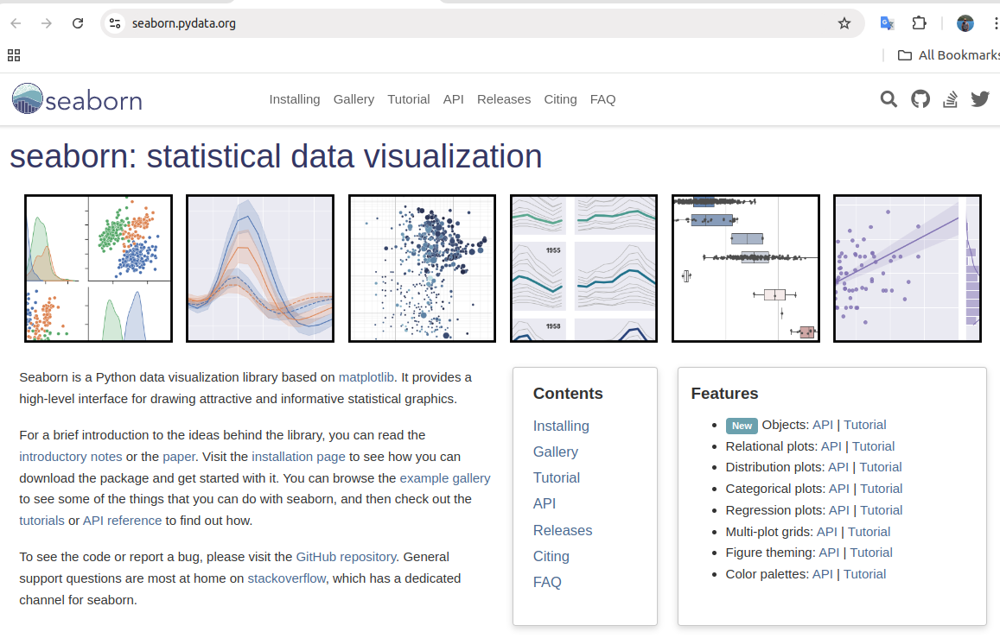
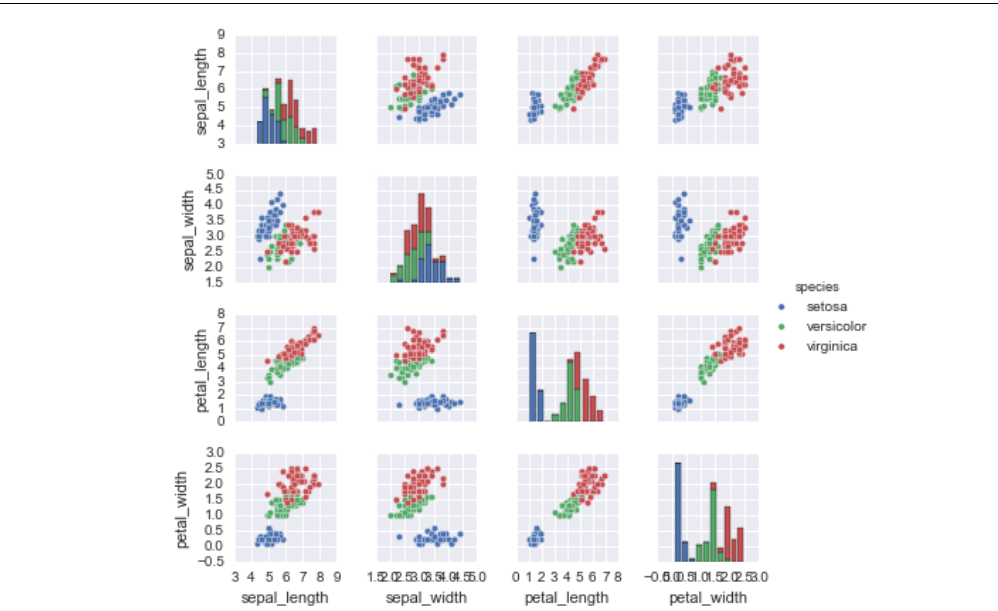
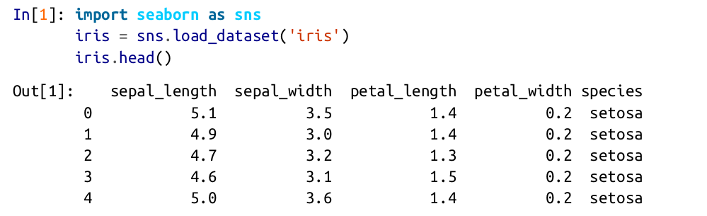
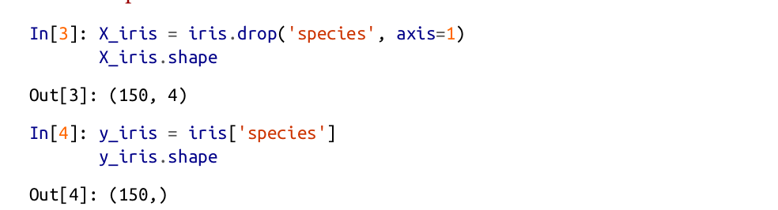
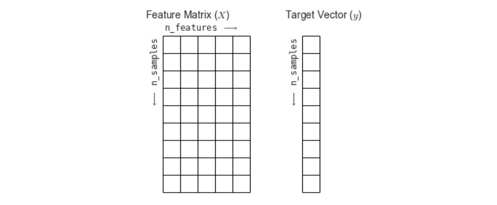
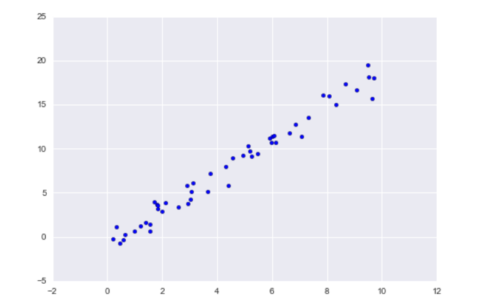
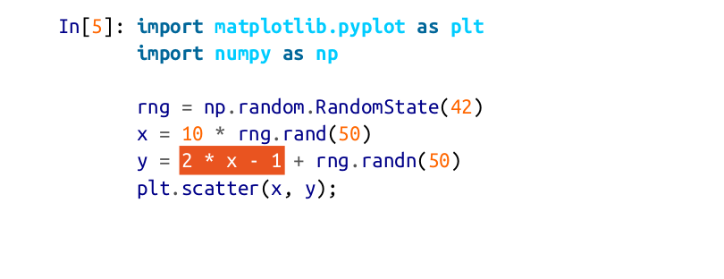
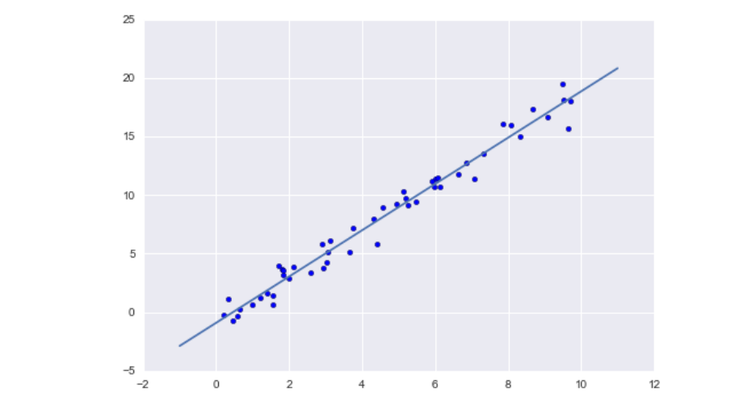
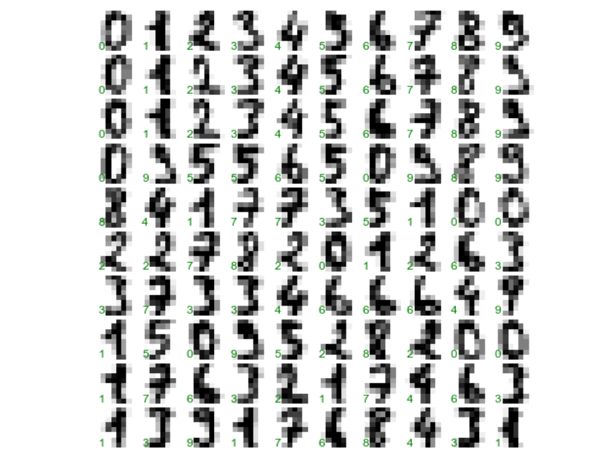
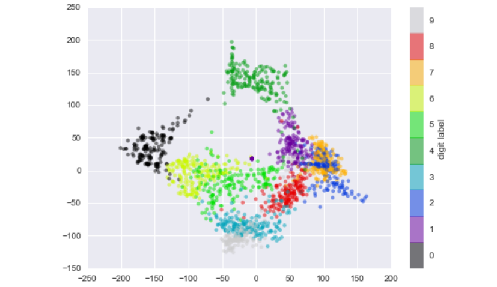

# Introduction to Scikit-learn

There are several Python libraries that provide solid implementations of a range of machine learning algorithms.

A benefit of this uniformity is that once you understand the basic use and syntax of Scikit-Learn for one type of model, switching to a new model or algorithm is very straightforward.

This section provides an overview of the Scikit-Learn API; a solid understanding of these API elements will form the foundation for understanding the deeper practical discussion of machine learning algorithms and approaches in the following chapters.

## Overview

* Data Representation in Scikit-Learn
* Scikit-Learn's Estimator API
* Application: Exploring Handwritten Digits

## Data Representation in Scikit-Learn

**Data as table**

For example, consider the Iris dataset, famously analyzed by Ronald
Fisher in 1936. We can download this dataset in the form of a Pandas DataFrame using the Seaborn library:

> Hint: https://seaborn.pydata.org/



```python
import seaborn as sns
iris = sns.load_dataset('iris')
iris.head()
```

*What is the data?*

Here each row of the data refers to a single observed flower, and the number of rows is the total number of flowers in the dataset.

*How to perceive the data?*

In general, we will refer to the rows of
the matrix as samples, and the number of rows as n_samples.

Likewise, each column of the data refers to a particular quantitative piece of information that describes each sample. In general, we will refer to the columns of the matrix as features, and the number of columns as n_features.

*Features matrix*

a two-dimensional numerical array or matrix, which we will call the features matrix. By convention, this features matrix is often stored in a variable named X.

The features matrix is assumed to be two-dimensional, with shape [n_samples, n_features], and is most often contained in a NumPy array or a Pandas DataFrame, though some Scikit-Learn models also accept SciPy sparse matrices.

* *Samples*

`Rows`

For example, the sample might be a flower, a person, a document, an image, a sound
file, a video, an astronomical object, or anything else you can describe with a set of quantitative measurements.

* *Features*

The features (i.e., columns) always refer to the distinct observations that describe
each sample in a quantitative manner.

Features are generally real-valued, but may be Boolean or discrete-valued in some cases.

* *Target array*

In addition to the feature matrix X,
we also generally work with a label or target array, which by convention we will usually call y.

> Hint: What is X and what is y?

The target array is usually one dimen‐
sional, with length n_samples, and is generally contained in a NumPy array or Pandas Series. The target array may have continuous numerical values, or discrete
classes/labels.

```python
%matplotlib inline
import seaborn as sns; sns.set()
sns.pairplot(iris, hue='species', size=1.5);
```



* How the target array works?*





*Data layout*



## Estimator API

Scikit-Learn is very easy to use, once the basic principles are understood. Every machine learning algorithm in Scikit-Learn is implemented via the Estimator API, which provides a consistent interface for a wide range of machine learning applications.

**Consistency**

All objects share a common interface drawn from a limited set of methods, with
consistent documentation.

**Inspection**

All specified parameter values are exposed as public attributes.

**Limited object hierarchy**

Only algorithms are represented by Python classes; datasets are represented in standard formats (NumPy arrays, Pandas DataFrames, SciPy sparse matrices) and
parameter names use standard Python strings.

**Composition**

Many machine learning tasks can be expressed as sequences of more fundamental algorithms, and Scikit-Learn makes use of this wherever possible.

**Sensible defaults**

When models require user-specified parameters, the library defines an appropri‐ate default value.

## How to use API and model?

The following are the steps that are used in Scikit-Learn but in deep learning it is also similar,

1. Choose a class of model by importing the appropriate estimator class from Scikit-Learn.

2. Choose model hyperparameters by instantiating this class with desired values.

3. Arrange data into a features matrix and target vector following the discussion from before.

4. Fit the model to your data by calling the fit() method of the model instance.

5. Apply the model to new data:

  • For supervised learning, often we predict labels for unknown data using the predict() method.

  • For unsupervised learning, we often transform or infer properties of the data using the transform() or predict() method.

**Supervised learning example: Simple linear regression**

Let’s consider a simple linear regression—that is, the common case of fitting a line to x, y data.

```python
import matplotlib.pyplot as plt
import numpy as np
rng = np.random.RandomState(42)
x = 10 * rng.rand(50)
y = 2 * x - 1 + rng.randn(50)
plt.scatter(x, y);
```



With this data in place, we can use the recipe outlined earlier. Let’s walk through the
process:

1. Choose a class of model.

In Scikit-Learn, every class of model is represented by a Python class. So, for
example, if we would like to compute a simple linear regression model, we can
import the linear regression class:

`In[6]: from sklearn.linear_model import LinearRegression`

Note that other, more general linear regression models exist as well; 
>sklearn.linear_model module documentation. 
>http://scikit-learn.org/stable/modules/linear_model.html

2. Choose model hyperparameters.

An important point is that a class of model is not the same as an instance of a
model.

Once we have decided on our model class, there are still some options open to us.
Depending on the model class we are working with, we might need to answer
one or more questions like the following:

• Would we like to fit for the offset (i.e., intercept)?
• Would we like the model to be normalized?
• Would we like to preprocess our features to add model flexibility?
• What degree of regularization would we like to use in our model?
• How many model components would we like to use?

These are examples of the important choices that must be made once the model
class is selected. These choices are often represented as hyperparameters, or
parameters that must be set before the model is fit to data. In Scikit-Learn, we
choose hyperparameters by passing values at model instantiation. 

For our linear regression example, we can instantiate the LinearRegression
class and specify that we would like to fit the intercept using the fit_inter
cept hyperparameter:

```python
In[7]: model = LinearRegression(fit_intercept=True)
model
Out[7]: LinearRegression(copy_X=True, fit_intercept=True, n_jobs=1,normalize=False)
```

>Note: Keep in mind that when the model is instantiated, the only action is the storing of these hyperparameter values. In particular, we have not yet applied the model to any data.

3. Arrange data into a features matrix and target vector.

Previously we detailed the Scikit-Learn data representation, which requires a two-dimensional features matrix and a one-dimensional target array. Here our target variable y is already in the correct form (a length-n_samples array), but we need to massage the data x to make it a matrix of size [n_samples, n_features].

In this case, this amounts to a simple reshaping of the one-dimensional array:

```python
In[8]: X = x[:, np.newaxis]
X.shape
Out[8]: (50, 1)
```

4. Fit the model to your data.

Now it is time to apply our model to data. This can be done with the fit() method of the model:

```python
In[9]: model.fit(X, y)
Out[9]:
LinearRegression(copy_X=True, fit_intercept=True, n_jobs=1, normalize=False)
```

This fit() command causes a number of model-dependent internal computations to take place, and the results of these computations are stored in model specific attributes that the user can explore. In Scikit-Learn, by convention all model parameters that were learned during the fit() process have trailing
underscores; for example, in this linear model, we have the following:

```python
In[10]: model.coef_
Out[10]: array([ 1.9776566])

In[11]: model.intercept_
Out[11]: -0.90331072553111635
```

These two parameters represent the slope and intercept of the simple linear fit to
the data. Comparing to the data definition, we see that they are very close to the
input slope of 2 and intercept of –1.



5. Predict labels for unknown data.

Once the model is trained, the main task of supervised machine learning is to
evaluate it based on what it says about new data that was not part of the training
set. In Scikit-Learn, we can do this using the predict() method. For the sake of
this example, our “new data” will be a grid of x values, and we will ask what y
values the model predicts:

`In[12]: xfit = np.linspace(-1, 11)`

As before, we need to coerce these x values into a [n_samples, n_features]
features matrix, after which we can feed it to the model:

```python
In[13]: Xfit = xfit[:, np.newaxis]
yfit = model.predict(Xfit)
```

Finally, let’s visualize the results by plotting first the raw data, and then this
model fit (Figure 5-15):

```python
In[14]: plt.scatter(x, y)
plt.plot(xfit, yfit);
```

Typically one evaluates the efficacy of the model by comparing its results to some
known baseline, as we will see in the next example.



***Takeaway***

Interpreting model parameters is much more a statistical modeling question than a machine learning
question. Machine learning rather focuses on what the model predicts.

>http://statsmodels.sourceforge.net/


**Supervised learning example: Iris classification**

Using the Iris dataset we discussed earlier.
Our question will be this: given a model trained on a portion of the Iris data, how well can we predict the remaining labels.

For this task, we will use an extremely simple generative model known as Gaussian naive Bayes, which proceeds by assuming each class is drawn from an axis-aligned Gaussian distribution.

Because it is so fast and has no hyperparameters to choose, Gaussian naive Bayes is often a good model to use as a baseline classification, before you explore whether improvements can be found through more sophisticated models.

> Gaussian naive Bayes

> Two builtin tools from the libraries,
  *  `train_test_split` utility
  * `accuracy_score` utility

We would like to evaluate the model on data it has not seen before, and so we will
split the data into a training set and a testing set. This could be done by hand, but it is
more convenient to use the `train_test_split` utility function:

```python
In[15]: from sklearn.cross_validation import train_test_split
Xtrain, Xtest, ytrain, ytest = train_test_split(X_iris, y_iris, random_state=1)
```

With the data arranged, we can follow our recipe to predict the labels:

```python
In[16]: from sklearn.naive_bayes import GaussianNB # 1. choose model class
model = GaussianNB()                               # 2. instantiate mode
model.fit(Xtrain, ytrain)                          # 3. fit model to data
y_model = model.predict(Xtest)                     # 4. predict on new data
```

Finally, we can use the `accuracy_score` utility to see the fraction of predicted labels
that match their true value:

```python
In[17]: from sklearn.metrics import accuracy_score
accuracy_score(ytest, y_model)
Out[17]: 0.97368421052631582
```

With an accuracy topping 97%, we see that even this very naive classification algo‐
rithm is effective for this particular dataset!

## Application: Exploring Handwritten Digits

**Loading and visualizing the digits data**

We’ll use Scikit-Learn’s data access interface and take a look at this data:

```python
In[22]: from sklearn.datasets import load_digits
digits = load_digits()
digits.images.shape
Out[22]: (1797, 8, 8)
```

The images data is a three-dimensional array: 1,797 samples, each consisting of an
8×8 grid of pixels. Let’s visualize the first hundred of these:

```python
In[23]: import matplotlib.pyplot as plt
fig, axes = plt.subplots(10, 10, figsize=(8, 8),
subplot_kw={'xticks':[], 'yticks':[]},
gridspec_kw=dict(hspace=0.1, wspace=0.1))
for i, ax in enumerate(axes.flat):
ax.imshow(digits.images[i], cmap='binary', interpolation='nearest')
ax.text(0.05, 0.05, str(digits.target[i]),
transform=ax.transAxes, color='green')
```



In order to work with this data within Scikit-Learn, we need a two-dimensional,
[n_samples, n_features] representation. We can accomplish this by treating each
pixel in the image as a feature—that is, by flattening out the pixel arrays so that we
have a length-64 array of pixel values representing each digit. Additionally, we need
the target array, which gives the previously determined label for each digit. These two
quantities are built into the digits dataset under the data and target attributes,
respectively:

```python
In[24]: X = digits.data
X.shape
Out[24]: (1797, 64)
In[25]: y = digits.target
y.shape
Out[25]: (1797,)
```

We see here that there are 1,797 samples and 64 features.

**Unsupervised learning: Dimensionality reduction**

We’d like to visualize our points within the 64-dimensional parameter space, but it’s
difficult to effectively visualize points in such a high-dimensional space. Instead we’ll
reduce the dimensions to 2, using an unsupervised method. Here, we’ll make use of a manifold learning algorithm called Isomap, and transform the data to two dimensions:

```python
In[26]: from sklearn.manifold import Isomap
iso = Isomap(n_components=2)
iso.fit(digits.data)
data_projected = iso.transform(digits.data)
data_projected.shape
Out[26]: (1797, 2)
```

We see that the projected data is now two-dimensional. Let’s plot this data to see if we
can learn anything from its structure (Figure 5-19):

```python
In[27]: plt.scatter(data_projected[:, 0], data_projected[:, 1], c=digits.target,
edgecolor='none', alpha=0.5,
cmap=plt.cm.get_cmap('spectral', 10))
plt.colorbar(label='digit label', ticks=range(10))
plt.clim(-0.5, 9.5);
```

