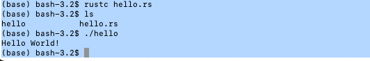

# Rust Programming Cheatsheet

## Basic Rust for Blockchain Development

Rust is known for its emphasis on speed, memory safety, and concurrency.

## Installation

`curl --proto '=https' --tlsv1.2 -sSf https://sh.rustup.rs | sh`

>hint: https://www.rust-lang.org/tools/install

* rustc, cargo, and rustup
* rustc --version

Check your $PATH for ~/.cargo/bin. There are a bunch of tools binaries in the dir.

## Comments

Single line and multiple-line comments are similar to C and Java.

## Macro and Print

A lot of thing are based on macro. And this has a little taste of c++.

### print

Printing is handled by a series of macros defined in std::fmt some of which are:

* format!: write formatted text to String
* print!: same as format! but the text is printed to the console (io::stdout).
* println!: same as print! but a newline is appended.
* eprint!: same as print! but the text is printed to the standard error (io::stderr).
* eprintln!: same as eprint! but a newline is appended.

**format**

`print_macro!("format", arguments...)`

* {} will be replaced by arguments

`println!("{} days", 31);`

* Positional arguments can be used.

println!("{0}, this is {1}. {1}, this is {0}", "Alice", "Bob");

Rust even checks to make sure the correct number of arguments are used.

```
println!("My name is {0}, {1} {0}", "Bond");
    // FIXME ^ Add the missing argument: "James"
```

* Different formatting can be invoked by specifying the format character after a `:`.
  
```buildoutcfg
println!("Base 10:               {}",   69420); // 69420
println!("Base 2 (binary):       {:b}", 69420); // 10000111100101100
println!("Base 8 (octal):        {:o}", 69420); // 207454
println!("Base 16 (hexadecimal): {:x}", 69420); // 10f2c
```

* Padding
```
  // You can right-justify text with a specified width. This will
    // output "    1". (Four white spaces and a "1", for a total width of 5.)
    println!("{number:>5}", number=1);

    // You can pad numbers with extra zeroes,
    println!("{number:0>5}", number=1); // 00001
    // and left-adjust by flipping the sign. This will output "10000".
    println!("{number:0<5}", number=1); // 10000

    // You can use named arguments in the format specifier by appending a `$`.
    println!("{number:0>width$}", number=1, width=5);
```

Only types that implement fmt::Display can be formatted with `{}`. 
User-defined types do not implement fmt::Display by default.

### Macro

The following is an attribute which only applies to the module after it.

```
// disable `dead_code` which warn against unused module
#[allow(dead_code)] 
```

std::fmt contains many traits which govern the display of text. The base form of two important ones are listed below:

* fmt::Debug: Uses the {:?} marker. Format text for debugging purposes.
* fmt::Display: Uses the {} marker. Format text in a more elegant, user-friendly fashion.

Here, we used fmt::Display because the std library provides implementations for these types. To print text for custom types, more steps are required.

## Statement

It ends with a semicolon.

## Run rust code with IntelliJ

### Example code

```
fn main() {
    // Statements here are executed when the compiled binary is called.

    // Print text to the console.
    println!("Hello World!");
}
```



## Primitives

### Scalar Types

* Signed integers: i8, i16, i32, i64, i128 and isize (pointer size)
* Unsigned integers: u8, u16, u32, u64, u128 and usize (pointer size)
* Floating point: f32, f64
* char Unicode scalar values like 'a', 'α' and '∞' (4 bytes each)
* bool either true or false
* The unit type (), whose only possible value is an empty tuple: ()

Despite the value of a unit type being a tuple, it is not considered a compound type because it does not contain multiple values.

### Compound Types

* Arrays like [1, 2, 3]
  
```
   // Array signature consists of Type T and length as [T; length].
    let my_array: [i32; 5] = [1, 2, 3, 4, 5];
```

* Tuples like (1, true)

```
    // Tuple is a collection of values of different types 
    // and is constructed using parentheses ().
    let my_tuple = (5u32, 1u8, true, -5.04f32);
```

Data types are immutable by default. keyword `mut` is needed once it is required.

Here are a few features,

* type inference
* type shadowing

eg:

```buildoutcfg
  // A type can also be inferred from context.
    let mut inferred_type = 12; // Type i64 is inferred from another line.
    inferred_type = 4294967296i64;

    // A mutable variable's value can be changed.
    let mut mutable = 12; // Mutable `i32`
    mutable = 21;

    // Error! The type of a variable can't be changed.
    mutable = true;

    // Variables can be overwritten with shadowing.
    let mutable = true;
```

Sample code skipped. See code/types.rs.

## Ref

- https://doc.rust-lang.org/rust-by-example/