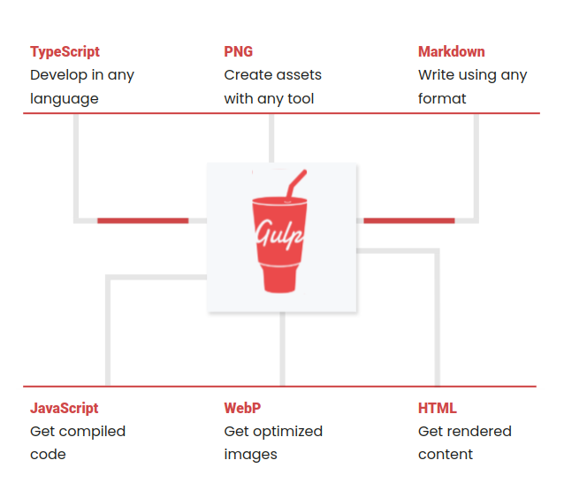
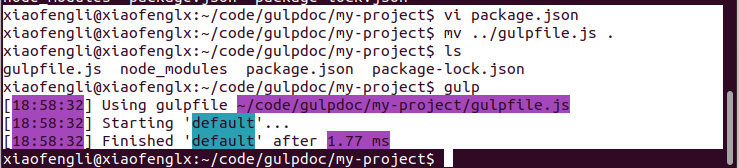
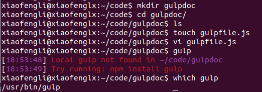

# Gulp

## Last updated: Jan 14 2025

## Takeaway

* Installation gulp
* Running gulp
* Write gulp config file(gulpfile.js) and naming schema
* Write gulp tasks
* Split gulp config file
* API
* Gulp plugins

## What is gulp?

Gulp allows you to use existing JavaScript knowledge to write gulpfiles or to use your experience with gulpfiles to write plain JavaScript. Although a few utilities are provided to simplify working with the filesystem and command line, everything else you write is pure JavaScript.



## Installation

* Have node, npm installed.

* If you had gulp installed before you can remove it `npm rm --global gulp`.

Do the following,

```shell
npx --version

# install gulp
npm install --global gulp-cli

# create a project
npx mkdirp my-project

cd my-project

# create package.json

npm init

# Install the gulp package in your devDependencies

npm install --save-dev gulp

# Verify your gulp versions

gulp --version

# Create a gulpfile

touch gulpfile.js


function defaultTask(cb) {
  // place code for your default task here
  cb();
}

exports.default = defaultTask

# test it

gulp
```

Sometimes, you will see this,



But if you do npm install properly it will work,



## Run multiple tasks

To run multiple tasks, you can use `gulp <task> <othertask>`.

## Gulpfile explained (js Makefile)

A gulpfile is a file in your project directory titled gulpfile.js (or capitalized as Gulpfile.js, like Makefile), that automatically loads when you run the gulp command. Within this file, you'll often see gulp APIs, like `src()`, `dest()`, `series()`, or `parallel()` but any vanilla JavaScript or Node modules can be used. Any exported functions will be registered into gulp's task system.

## Transpilation for supporting Typescript and Reactjs

You can write a gulpfile using a language that requires transpilation, like TypeScript or Babel, by changing the extension on your gulpfile.js to indicate the language and install the matching transpiler module.

For TypeScript, rename to gulpfile.ts and install the ts-node module.
For Babel, rename to gulpfile.babel.js and install the @babel/register module.

*Babel*: The transpiler.

>Hint:
>Most new versions of node support most features that TypeScript or Babel provide, except the import/export syntax. When only that syntax is desired, rename to gulpfile.esm.js and install the esm module.

## Splitting Gulpfile

Many users start by adding all logic to a gulpfile. If it ever grows too big, it can be refactored into separate files.

Each task can be split into its own file, then imported into your gulpfile for composition. Not only does this keep things organized, but it allows you to test each task independently or vary composition based on conditions.

Node's module resolution allows you to replace your gulpfile.js file with a directory named gulpfile.js that contains an index.js file which is treated as a gulpfile.js. This directory could then contain your individual modules for tasks. If you are using a transpiler, name the folder and file accordingly.

## Creating Tasks and Asynchrous

Each gulp task is an asynchronous JavaScript function - a function that accepts an error-first callback or returns a stream, promise, event emitter, child process, or observable (more on that later).

### Export (private and public)

* Tasks can be considered public or private.

* Anything being exported is public in Javascript for the scope management.


Public tasks are exported from your gulpfile, which allows them to be run by the gulp command.

Private tasks are made to be used internally, usually used as part of series() or parallel() composition.

**Example**

```shell
const { series } = require('gulp');

// The `clean` function is not exported so it can be considered a private task.
// It can still be used within the `series()` composition.
function clean(cb) {
  // body omitted
  cb();
}

// The `build` function is exported so it is public and can be run with the `gulp` command.
// It can also be used within the `series()` composition.
function build(cb) {
  // body omitted
  cb();
}

exports.build = build;
exports.default = series(clean, build);
```

>Hint: Legacy task()
>In the past, task() was used to register your functions as tasks. While that API is still available, exporting should be the primary registration mechanism, except in edge cases where exports won't work.

### series() and parallel()

Gulp provides two powerful composition methods, series() and parallel(), allowing individual tasks to be composed into larger operations. Both methods accept any number of task functions or composed operations. series() and parallel() can be nested within themselves or each other to any depth.

**Example**

To have your tasks execute in order, use the series() method.

```javascript
const { series } = require('gulp');

function transpile(cb) {
  // body omitted
  cb();
}

function bundle(cb) {
  // body omitted
  cb();
}

exports.build = series(transpile, bundle);
```

**Example**

For tasks to run at maximum concurrency, combine them with the parallel() method.

```javascript
const { parallel } = require('gulp');

function javascript(cb) {
  // body omitted
  cb();
}

function css(cb) {
  // body omitted
  cb();
}

exports.build = parallel(javascript, css);
```

**Example: Control logic outside of task**

```javascript

const { series } = require('gulp');

function minify(cb) {
  // body omitted
  cb();
}


function transpile(cb) {
  // body omitted
  cb();
}

function livereload(cb) {
  // body omitted
  cb();
}

if (process.env.NODE_ENV === 'production') {
  exports.build = series(transpile, minify);
} else {
  exports.build = series(transpile, livereload);
}

```

**Example: series() and parallel() can be nested to any arbitrary depth.**

```javascript
const { series, parallel } = require('gulp');

function clean(cb) {
  // body omitted
  cb();
}

function cssTranspile(cb) {
  // body omitted
  cb();
}

function cssMinify(cb) {
  // body omitted
  cb();
}

function jsTranspile(cb) {
  // body omitted
  cb();
}

function jsBundle(cb) {
  // body omitted
  cb();
}

function jsMinify(cb) {
  // body omitted
  cb();
}

function publish(cb) {
  // body omitted
  cb();
}

exports.build = series(
  clean,
  parallel(
    cssTranspile,
    series(jsTranspile, jsBundle)
  ),
  parallel(cssMinify, jsMinify),
  publish
);
```

**Example: Another example to show orderly call vs parallel call**

```javascript
// This is INCORRECT
const { series, parallel } = require('gulp');

const clean = function(cb) {
  // body omitted
  cb();
};

const css = series(clean, function(cb) {
  // body omitted
  cb();
});

const javascript = series(clean, function(cb) {
  // body omitted
  cb();
});

exports.build = parallel(css, javascript);
```

The above code can be migrated to the following,

```javascript
const { series, parallel } = require('gulp');

function clean(cb) {
  // body omitted
  cb();
}

function css(cb) {
  // body omitted
  cb();
}

function javascript(cb) {
  // body omitted
  cb();
}

exports.build = series(clean, parallel(css, javascript));
```

## Async Completion

Node libraries handle asynchronicity in a variety of ways. The most common pattern is error-first callbacks, but you might also encounter streams, promises, event emitters, child processes, or observables. Gulp tasks normalize all these types of asynchronicity.

### Signal task completion

When a stream, promise, event emitter, child process, or observable is returned from a task, the success or error informs gulp whether to continue or end. If a task errors, gulp will end immediately and show that error.

When composing tasks with series(), an error will end the composition and no further tasks will be executed. When composing tasks with parallel(), an error will end the composition but the other parallel tasks may or may not complete.

**Returning a stream**

```javascript
const { src, dest } = require('gulp');

function streamTask() {
  return src('*.js')
    .pipe(dest('output'));
}

exports.default = streamTask;
```

**Returning a promise**

```javascript
function promiseTask() {
  return Promise.resolve('the value is ignored');
}

exports.default = promiseTask;
```

**Returning an event emitter**

```javascript
const { EventEmitter } = require('events');

function eventEmitterTask() {
  const emitter = new EventEmitter();
  // Emit has to happen async otherwise gulp isn't listening yet
  setTimeout(() => emitter.emit('finish'), 250);
  return emitter;
}

exports.default = eventEmitterTask;
```

**Returning a child process**

```javascript
const { exec } = require('child_process');

function childProcessTask() {
  return exec('date');
}

exports.default = childProcessTask;
```

**Returning an observable**

```javascript
const { Observable } = require('rxjs');

function observableTask() {
  return Observable.of(1, 2, 3);
}

exports.default = observableTask;
```

**Using an error-first callback**

If nothing is returned from your task, you must use the error-first callback to signal completion. The callback will be passed to your task as the only argument - named cb() in the examples below.

```javascript
function callbackTask(cb) {
  // `cb()` should be called by some async work
  cb();
}

exports.default = callbackTask;
```

To indicate to gulp that an error occurred in a task using an error-first callback, call it with an Error as the only argument.

```javascript
function callbackError(cb) {
  // `cb()` should be called by some async work
  cb(new Error('kaboom'));
}

exports.default = callbackError;
```

However, you'll often pass this callback to another API instead of calling it yourself.

```javascript
const fs = require('fs');

function passingCallback(cb) {
  fs.access('gulpfile.js', cb);
}

exports.default = passingCallback;
```

**Using async/await**

When not using any of the previous options, you can define your task as an async function, which wraps your task in a promise. This allows you to work with promises synchronously using await and use other synchronous code.

```javascript
const fs = require('fs');

async function asyncAwaitTask() {
  const { version } = JSON.parse(fs.readFileSync('package.json', 'utf8'));
  console.log(version);
  await Promise.resolve('some result');
}

exports.default = asyncAwaitTask;
```

## Working with Files

* The src() and dest() methods are exposed by gulp to interact with files on your computer.

* The main API of a stream is the .pipe() method for chaining Transform or Writable streams.

* Most often plugins will be placed between src() and dest() using the .pipe() method and will transform the files within the stream.

* src() is given a glob to read from the file system and produces a Node stream. It locates all matching files and reads them into memory to pass through the stream.

* The stream produced by src() should be returned from a task to signal async completion, as mentioned in Creating Tasks.

* dest() is given an output directory string and also produces a Node stream which is generally used as a terminator stream. When it receives a file passed through the pipeline, it writes the contents and other details out to the filesystem at a given directory. The symlink() method is also available and operates like dest(), but creates links instead of files (see symlink() for details).

**Example1**

```javascript
const { src, dest } = require('gulp');

exports.default = function() {
  return src('src/*.js')
    .pipe(dest('output/'));
}
```

**Example 2**

```javascript
const { src, dest } = require('gulp');
const babel = require('gulp-babel');

exports.default = function() {
  return src('src/*.js')
    .pipe(babel())
    .pipe(dest('output/'));
}
```

### Adding files to the stream

src() can also be placed in the middle of a pipeline to add files to the stream based on the given globs. The additional files will only be available to transformations later in the stream. If globs overlap, the files will be added again

This can be useful for transpiling some files before adding plain JavaScript files to the pipeline and uglifying everything.

```javascript
const { src, dest } = require('gulp');
const babel = require('gulp-babel');
const uglify = require('gulp-uglify');

exports.default = function() {
  return src('src/*.js')
    .pipe(babel())
    .pipe(src('vendor/*.js'))
    .pipe(uglify())
    .pipe(dest('output/'));
}
```

### Output in phases

dest() can be used in the middle of a pipeline to write intermediate states to the filesystem. When a file is received, the current state is written out to the filesystem, the path is updated to represent the new location of the output file, then that file continues down the pipeline.

```javascript
const { src, dest } = require('gulp');
const babel = require('gulp-babel');
const uglify = require('gulp-uglify');
const rename = require('gulp-rename');

exports.default = function() {
  return src('src/*.js')
    .pipe(babel())
    .pipe(src('vendor/*.js'))
    .pipe(dest('output/'))
    .pipe(uglify())
    .pipe(rename({ extname: '.min.js' }))
    .pipe(dest('output/'));
}
```

### Modes: streaming, buffered, and empty

src() can operate in three modes: buffering, streaming, and empty. These are configured with the buffer and read options on src().

Buffering mode is the default and loads the file contents into memory. Plugins usually operate in buffering mode and many don't support streaming mode.

Streaming mode exists mainly to operate on large files that can't fit in memory, like giant images or movies. The contents are streamed from the filesystem in small chunks instead of loaded all at once. If you need to use streaming mode, look for a plugin that supports it or write your own.

Empty mode contains no contents and is useful when only working with file metadata.

## Explaining Globs

A glob is a string of literal and/or wildcard characters used to match filepaths. Globbing is the act of locating files on a filesystem using one or more globs.

The src() method expects a single glob string or an array of globs to determine which files your pipeline will operate on. At least one match must be found for your glob(s) otherwise src() will error. When an array of globs is used, any negative globs will remove matches from any positive glob.

* Special character: * (single-star)

` '*.js'`

* Special character: ** (double-star)

`'scripts/**/*.js'`

Here, the glob is appropriately restricted to the scripts/ directory. It will match files like scripts/index.js, scripts/nested/index.js, and scripts/nested/twice/index.js.

* Special character: ! (negative)

`['scripts/**/*.js', '!scripts/vendor/**']`

Here, the scripts/ directory will be traversed for all files ending in .js, but all files from the scripts/vendor/ directory will be excluded.

Negative globs can be used as an alternative for restricting double-star globs.

`['**/*.js', '!node_modules/**']`

### Ordered globs

Versions of gulp before v5 allowed "ordered globs"; however, that has been removed to align with most globbing libraries in the ecosystem.

If you need the "ordered glob" functionality, you can use the ordered-read-streams library to combine streams:

const order = require("ordered-read-streams");

```javascript
exports.default = function () {
  return order([
    gulp.src("input/jquery/dist/jquery.js"),
    gulp.src("input/detect_swipe/jquery.detect_swipe.js"),
  ]).pipe(gulp.dest('output/'));
}
```

## Using Plugins

Plugins from npm - using the "gulpplugin" and "gulpfriendly" keywords - can be browsed and searched on the plugin search page.


Each plugin should only do a small amount of work, so you can connect them like building blocks. You may need to combine a bunch of them to get the desired result.

```javascript
const { src, dest } = require('gulp');
const uglify = require('gulp-uglify');
const rename = require('gulp-rename');

exports.default = function() {
  return src('src/*.js')
    // The gulp-uglify plugin won't update the filename
    .pipe(uglify())
    // So use gulp-rename to change the extension
    .pipe(rename({ extname: '.min.js' }))
    .pipe(dest('output/'));
}
```

### Do you need a plugin?

Not everything in gulp should use plugins. They are a quick way to get started, but many operations are improved by using a module or library instead.

```javascript
const { rollup } = require('rollup');

// Rollup's promise API works great in an `async` task
exports.default = async function() {
  const bundle = await rollup({
    input: 'src/index.js'
  });

  return bundle.write({
    file: 'output/bundle.js',
    format: 'iife'
  });
}
```

Plugins should always transform files. Use a (non-plugin) Node module or library for any other operations.

```javascript
const del = require('delete');

exports.default = function(cb) {
  // Use the `delete` module directly, instead of using gulp-rimraf
  del(['output/*.js'], cb);
}
```

### Conditional plugins

Since plugin operations shouldn't be file-type-aware, you may need a plugin like gulp-if to transform subsets of files.

```javascript
const { src, dest } = require('gulp');
const gulpif = require('gulp-if');
const uglify = require('gulp-uglify');

function isJavaScript(file) {
  // Check if file extension is '.js'
  return file.extname === '.js';
}

exports.default = function() {
  // Include JavaScript and CSS files in a single pipeline
  return src(['src/*.js', 'src/*.css'])
    // Only apply gulp-uglify plugin to JavaScript files
    .pipe(gulpif(isJavaScript, uglify()))
    .pipe(dest('output/'));
}
```

### Inline plugins

Inline plugins are one-off Transform Streams you define inside your gulpfile by writing the desired behavior.

There are two situations where creating an inline plugin is helpful:

Instead of creating and maintaining your own plugin.
Instead of forking a plugin that exists to add a feature you want.

```javascript
const { src, dest } = require('gulp');
const uglify = require('uglify-js');
const through2 = require('through2');

exports.default = function() {
  return src('src/*.js')
    // Instead of using gulp-uglify, you can create an inline plugin
    .pipe(through2.obj(function(file, _, cb) {
      if (file.isBuffer()) {
        const code = uglify.minify(file.contents.toString())
        file.contents = Buffer.from(code.code)
      }
      cb(null, file);
    }))
    .pipe(dest('output/'));
}
```

## Ref

- https://gulpjs.com/docs/en/getting-started/creating-tasks