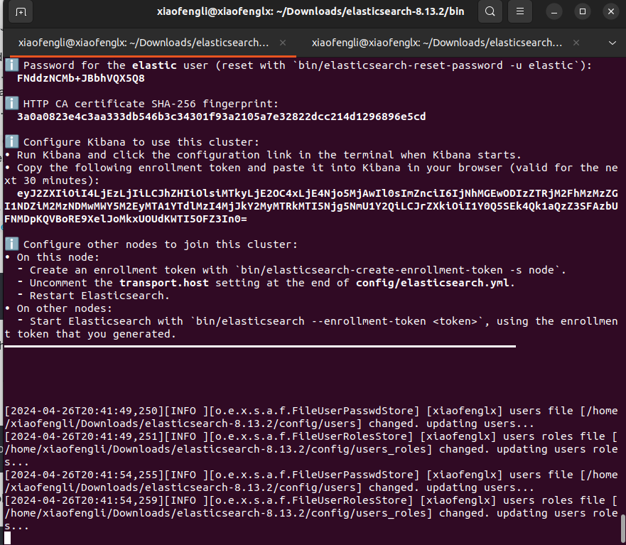
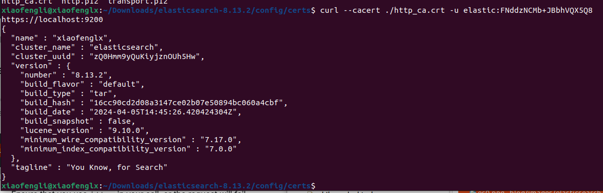
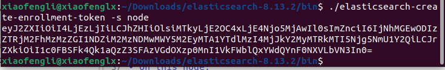
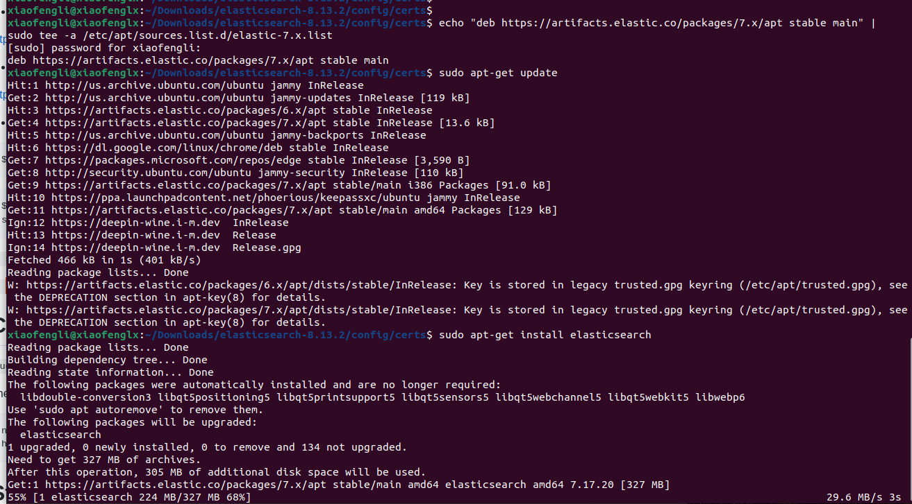
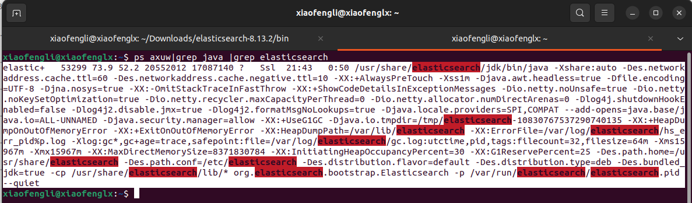
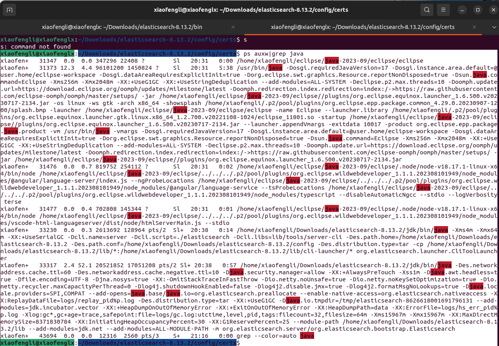

# Elastic Search

## Created: 04-26-2024

## What is Elasticsearch

* Elasticsearch is a distributed document store. 
Initially released in 2010, Elasticsearch (sometimes dubbed ES) is a modern search and analytics engine which is based on Apache Lucene. 
Its built with Java, Elasticsearch is a NoSQL database. That means it stores data in an unstructured way and that you cannot use SQL to query it. Elasticsearch is used together with the other components in the ELK Stack, Logstash and Kibana, and plays the role of data indexing and storage. 

* Elasticsearch is a web service. Instead of storing information as rows of columnar data, Elasticsearch stores complex data structures that have been serialized as JSON documents.

* Elasticsearch indexes and searches fast. Elasticsearch uses a data structure called an inverted index that supports very fast full-text searches. An inverted index lists every unique word that appears in any document and identifies all of the documents each word occurs in.

* Prior to Elasticsearch there are Apache Lucene, and Apache Solr for text indexing.

* Elasticsearch was no longer opensource from year 2021. And AWS's opensearch ...etc are based on Elasticsearch.

# History


# Installation in local

* To install the version 8.* in Linux

Please follow the following link,

https://www.elastic.co/guide/en/elasticsearch/reference/current/targz.html

```
 Elasticsearch security features have been automatically configured!
✅ Authentication is enabled and cluster connections are encrypted.

ℹ️  Password for the elastic user (reset with `bin/elasticsearch-reset-password -u elastic`):
  FNddzNCMb+JBbhVQX5Q8

ℹ️  HTTP CA certificate SHA-256 fingerprint:
  3a0a0823e4c3aa333db546b3c34301f93a2105a7e32822dcc214d1296896e5cd

ℹ️  Configure Kibana to use this cluster:
• Run Kibana and click the configuration link in the terminal when Kibana starts.
• Copy the following enrollment token and paste it into Kibana in your browser (valid for the next 30 minutes):
  eyJ2ZXIiOiI4LjEzLjIiLCJhZHIiOlsiMTkyLjE2OC4xLjE4Njo5MjAwIl0sImZnciI6IjNhMGEwODIzZTRjM2FhMzMzZGI1NDZiM2MzNDMwMWY5M2EyMTA1YTdlMzI4MjJkY2MyMTRkMTI5Njg5NmU1Y2QiLCJrZXkiOiI1Y0Q5SEk4Qk1aQzZ3SFAzbUFNMDpKQVBoRE9XelJoMkxUOUdKWTI5OFZ3In0=

ℹ️  Configure other nodes to join this cluster:
• On this node:
  ⁃ Create an enrollment token with `bin/elasticsearch-create-enrollment-token -s node`.
  ⁃ Uncomment the transport.host setting at the end of config/elasticsearch.yml.
  ⁃ Restart Elasticsearch.
• On other nodes:
  ⁃ Start Elasticsearch with `bin/elasticsearch --enrollment-token <token>`, using the enrollment token that you generated.

export ELASTIC_PASSWORD="your_password"
```


To test the service is running, try the following,

```
xiaofengli@xiaofenglx:~/Downloads/elasticsearch-8.13.2/config/certs$ curl --cacert ./http_ca.crt -u elastic:FNddzNCMb+JBbhVQX5Q8  https://localhost:9200 
{
  "name" : "xiaofenglx",
  "cluster_name" : "elasticsearch",
  "cluster_uuid" : "zQ0Hmm9yQuKiyjznOUh5Hw",
  "version" : {
    "number" : "8.13.2",
    "build_flavor" : "default",
    "build_type" : "tar",
    "build_hash" : "16cc90cd2d08a3147ce02b07e50894bc060a4cbf",
    "build_date" : "2024-04-05T14:45:26.420424304Z",
    "build_snapshot" : false,
    "lucene_version" : "9.10.0",
    "minimum_wire_compatibility_version" : "7.17.0",
    "minimum_index_compatibility_version" : "7.0.0"
  },
  "tagline" : "You Know, for Search"
}

```



To add new node, open another terminal and run the following,



* Mac installation

```
curl -O https://artifacts.elastic.co/downloads/elasticsearch/elasticsearch-8.13.2-darwin-x86_64.tar.gz
curl https://artifacts.elastic.co/downloads/elasticsearch/elasticsearch-8.13.2-darwin-x86_64.tar.gz.sha512 | shasum -a 512 -c - 
tar -xzf elasticsearch-8.13.2-darwin-x86_64.tar.gz
cd elasticsearch-8.13.2/ 
```

* Windows installation

https://www.elastic.co/guide/en/elasticsearch/reference/current/zip-windows.html

* Install Elasticsearch with Debian Package (debian core)

https://www.elastic.co/guide/en/elasticsearch/reference/current/deb.html#deb

* Install Elasticsearch with RPM (fedora core)

https://www.elastic.co/guide/en/elasticsearch/reference/current/rpm.html

* Install Elasticsearch with Docker

https://www.elastic.co/guide/en/elasticsearch/reference/current/docker.html#docker

* Install version 7 with apt (linux)

```
$ wget -qo - https://artifacts.elastic.co/GPG-KEY-elasticsearch | sudo apt-key add -
```

```
$ echo "deb https://artifacts.elastic.co/packages/7.x/apt stable main" |
sudo tee -a /etc/apt/sources.list.d/elastic-7.x.list
```

`$ sudo apt-get update`

`$ sudo apt-get install elasticsearch`

Once installation is started you will see the following,



Once the installation is done, type

`sudo service elasticsearch start`



# Configuration

`sudo vim /etc/elasticsearch/elasticsearch.yml`

Then turn on the followings,

```
network.host: "localhost"
http.port:9200
```

# Start the service in local

The following is the command in linux,

`sudo service elasticsearch start`

With older version without cert and https, you would open it `http://localhost:9200`,

```
{
  "name" : "33QdmXw",
  "cluster_name" : "elasticsearch",
  "cluster_uuid" : "mTkBe_AlSZGbX-vDIe_vZQ",
  "version" : {
    "number" : "6.1.2",
    "build_hash" : "5b1fea5",
    "build_date" : "2018-01-10T02:35:59.208Z",
    "build_snapshot" : false,
    "lucene_version" : "7.1.0",
    "minimum_wire_compatibility_version" : "5.6.0",
    "minimum_index_compatibility_version" : "5.0.0"
  },
  "tagline" : "You Know, for Search"
}
```

# Installation, config and log path

When we query the `java` process, we could easily figure out the config, log paths.




### References

* https://www.elastic.co/
* https://logz.io/blog/elasticsearch-tutorial/