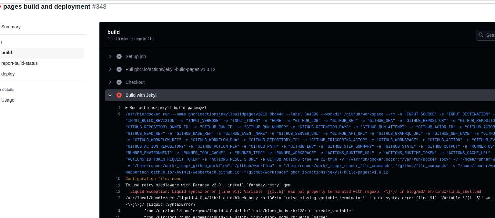

# Markdown in Github.io

This is an article I would like to write about to solve some syntax issue of markdown
that will fail the github.io build and deployment.

**issue**

* github.io is using jekyll lib, if you can figure out from the build error.
The syntax of the link is provided here,

https://jekyllrb.com/docs/liquid/tags/#code-snippet-highlighting

* Other standard markdown ref, you can follow this,

https://www.markdownguide.org/cheat-sheet/

