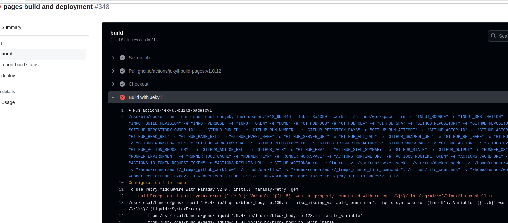

# Markdown in Github.io

This is an article I would like to write about to solve some syntax issue of markdown
that will fail the github.io build and deployment.

**issue**

* github.io is using jekyll lib, if you can figure out from the build error.
The syntax of the link is provided here,

https://jekyllrb.com/docs/liquid/tags/#code-snippet-highlighting

* Other standard markdown ref, you can follow this,

https://www.markdownguide.org/cheat-sheet/

<h2> markdown viewer </h2>
			Most files in my blog are written in markdown file.
			I do not have backend to convert markdown to html
			To better read the markdown file of my blog, please install Markdown viewer plugin in your broswer.

Here is a link of google chrome plugin,
			

https://github.com/simov/markdown-viewer#table-of-contents

			

			

Enable this plugin and show it in your browser tool bar, and configure advanced options.
Then it will look like the following,

