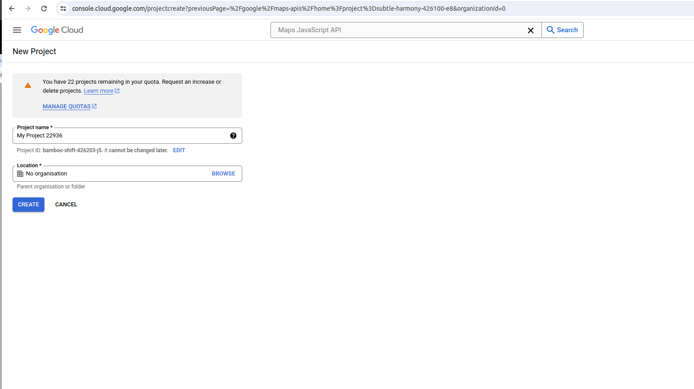
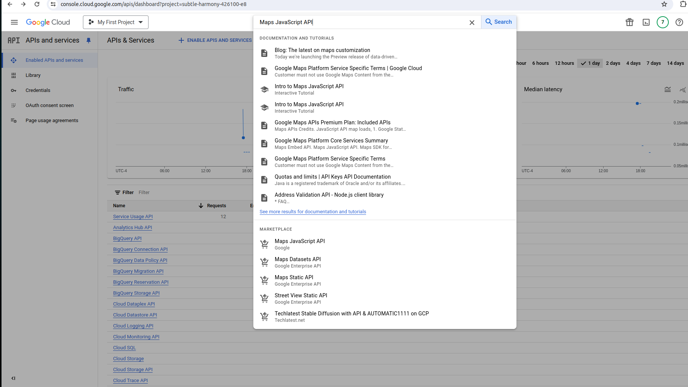
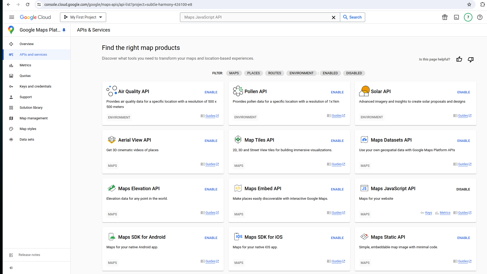
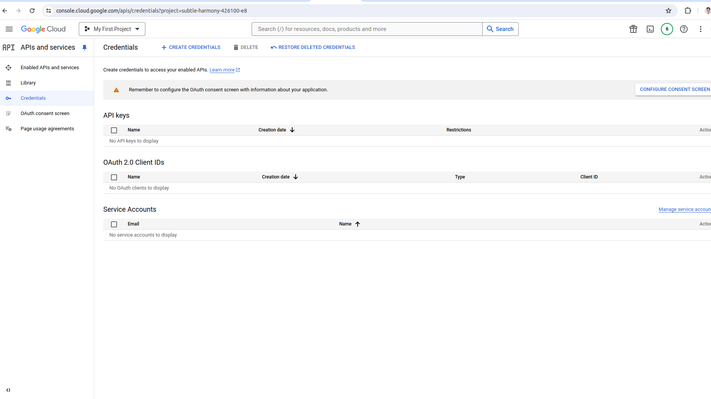
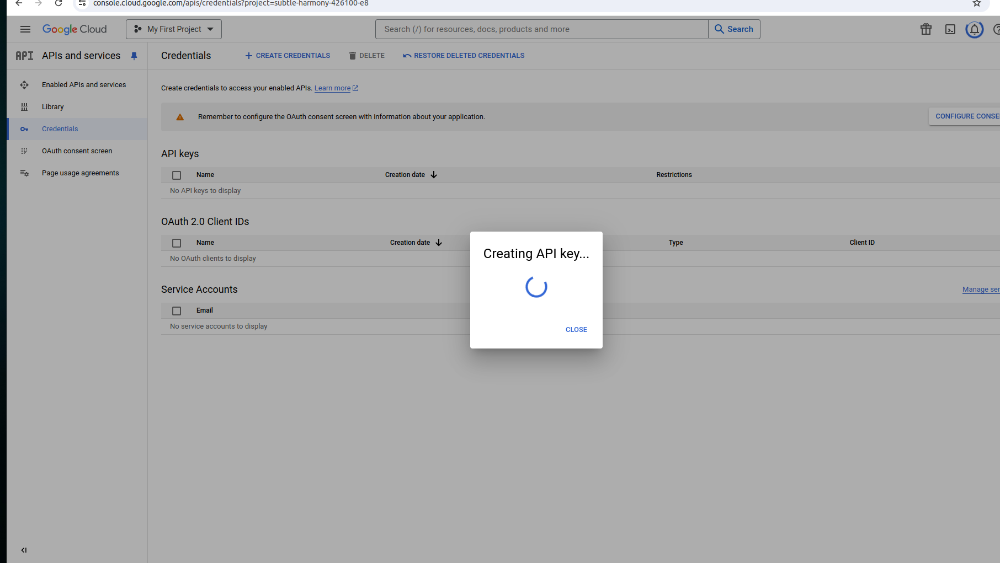

# Google MAP API

## Get a google map API key from google

## Check distance python example

**Step 1: Visit the GCP Console: Go to the Google Cloud Platform Console.**

Create a New Project:

Click on the project dropdown at the top of the page.
Click on the “New Project” button.
Enter a project name and select your billing account.
Click “Create.”

**Step 2: Enable the Google Maps APIs**
Navigate to the APIs & Services Dashboard:

From the GCP Console, click on the menu icon in the top left corner.
Navigate to “APIs & Services” > “Library.”
Enable APIs:

In the API Library, search for “Maps.”
Enable the following APIs by clicking on them and then clicking the “Enable” button:
Maps JavaScript API
Geocoding API
Directions API

**Step 3: Generate the API Key**
Navigate to Credentials:

In the APIs & Services dashboard, click on “Credentials” in the left sidebar.
Create Credentials:

Click on the “Create Credentials” button.
Select “API Key.”
Restrict the API Key (Recommended):

Click on the “Edit” icon next to your newly created API key.
Under “API restrictions,” select the APIs you enabled in Step 2.
Under “Application restrictions,” restrict the key to your IP addresses or HTTP referrers to prevent unauthorized use.
Copy the API Key: Your API key will be displayed on the screen. Copy this key, as you will need it for your Python script.

**Step 4: Write the Python Script**
import googlemaps
from datetime import datetime

# Initialize the Google Maps client with your API key
gmaps = googlemaps.Client(key='YOUR_API_KEY')

# List of colleges in New Jersey
colleges = [
    "Atlantic Cape Community College",
    "Bergen Community College",
    "Bloomfield College",
    "Brookdale Community College",
    "Caldwell University",
    "Camden County College",
    "Centenary University",
    "College of Saint Elizabeth",
    "County College of Morris",
    "Cumberland County College",
    "Drew University",
    "Essex County College",
    "Fairleigh Dickinson University",
    "Felician University",
    "Georgian Court University",
    "Hudson County Community College",
    "Kean University",
    "Middlesex County College",
    "Monmouth University",
    "Montclair State University",
    "New Jersey City University",
    "New Jersey Institute of Technology",
    "Ocean County College",
    "Passaic County Community College",
    "Princeton University",
    "Ramapo College of New Jersey",
    "Raritan Valley Community College",
    "Rider University",
    "Rowan College at Burlington County",
    "Rowan College of South Jersey",
    "Rowan University",
    "Rutgers University",
    "Saint Peter's University",
    "Salem Community College",
    "Seton Hall University",
    "Stevens Institute of Technology",
    "Stockton University",
    "Sussex County Community College",
    "The College of New Jersey",
    "Thomas Edison State University",
    "Union County College",
    "Warren County Community College",
    "William Paterson University"
]

# Address to calculate distances from
origin = "22 Sherwood Lane, NJ, 07980"

# Function to validate addresses using Geocoding API
def validate_address(address):
    geocode_result = gmaps.geocode(address)
    return geocode_result[0]['formatted_address'] if geocode_result else None

# Validate the origin address
validated_origin = validate_address(origin)
if not validated_origin:
    print(f"Origin address '{origin}' could not be validated.")
else:
    print(f"Validated Origin Address: {validated_origin}")

# Calculate distances
distances = {}
for college in colleges:
    validated_college = validate_address(college)
    if not validated_college:
        print(f"College address '{college}' could not be validated.")
        continue
    try:
        directions_result = gmaps.directions(validated_origin, validated_college, mode="driving")
        if directions_result:
            distance = directions_result[0]['legs'][0]['distance']['text']
            distances[college] = distance
        else:
            print(f"No directions found for {college}")
    except googlemaps.exceptions.ApiError as e:
        print(f"API error for {college}: {e}")
    except Exception as e:
        print(f"Error for {college}: {e}")

# Print the distances
for college, distance in distances.items():
    print(f"{college}: {distance}")

Save and Run the Script: Save the script and run it using Python:

**Conclusion**
By following these steps, you can easily generate a Google Maps API key and use it in your Python projects. This enables you to integrate powerful mapping and geolocation features into your applications.