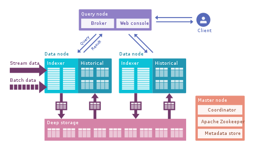

# Apache Druid

Druid is a column-oriented, open-source, distributed data store written in Java. Druid is designed to quickly ingest massive quantities of event data, and provide low-latency queries on top of the data. The name Druid comes from the shapeshifting Druid class in many role-playing games, to reflect that the architecture of the system can shift to solve different types of data problems.

Druid is commonly used in business intelligence-OLAP applications to analyze high volumes of real-time and historical data. Druid is used in production by technology companies such as Alibaba, Airbnb, Cisco, eBay, Lyft,Netflix, PayPal, Pinterest, Reddit, Twitter, Walmart, Wikimedia Foundation and Yahoo.

## Architecture

Fully deployed, Druid runs as a cluster of specialized processes (called nodes in Druid) to support a fault-tolerant architecture where data is stored redundantly, and there is no single point of failure. The cluster includes external dependencies for coordination (Apache ZooKeeper), metadata storage (e.g. MySQL, PostgreSQL, or Derby), and a deep storage facility (e.g. HDFS, or Amazon S3) for permanent data backup.

## Query Management

Client queries first hit broker nodes, which forward them to the appropriate data nodes (either historical or real-time). Since Druid segments may be partitioned, an incoming query can require data from multiple segments and partitions (or shards) stored on different nodes in the cluster. Brokers are able to learn which nodes have the required data, and also merge partial results before returning the aggregated result.

## Cluster management

Operations relating to data management in historical nodes are overseen by coordinator nodes. Apache ZooKeeper is used to register all nodes, manage certain aspects of internode communications, and provide for leader elections.

## Features

* Low latency (streaming) data ingestion.
* Arbitrary slice and dice data exploration.
* Sub-second analytic queries.
* Approximate and exact computations.

## Performance

In 2019, researchers compared the performance of Hive, Presto, and Druid using a denormalized Star Schema Benchmark based on the TPC-H standard. Druid was tested using both a “Druid Best” configuration using tables with hashed partitions and a “Druid Suboptimal” configuration which does not use hashed partitions.

Tests were conducted by running the 13 TPC-H queries using TPC-H Scale Factor 30 (a 30GB database), Scale Factor 100 (a 100GB database), and Scale Factor 300 (a 300GB database).

|Scale Factor	|Hive	|Presto	|Druid Best |	Druid Suboptimal|
|--------------|-------|-------|---------|-----------------|
|30|	256s|	33s|	2.09s|	3.21s|
|100|	424s|	90s|	6.12s|	8.08s|
|300|	982s|	452s|	7.60s|	20.02s|

Druid performance was measured as at least 98% faster than Hive and at least 90% faster than Presto in each scenario, even when using the Druid Suboptimized configuration.

## Installation and Usage

### Ref

- https://druid.apache.org/docs/latest/tutorials/

- https://en.wikipedia.org/wiki/List_of_column-oriented_DBMSes (A survey of database benchmarks) [TODO]