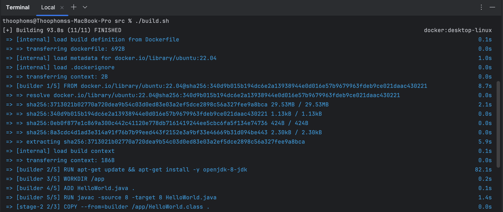
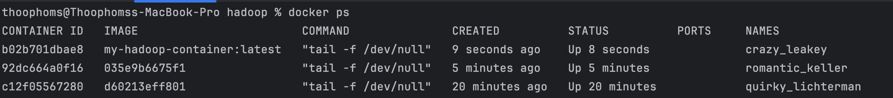

# Hadoop

### Step 1: Update Dockerfile

```dockerfile
# Dockerfile
FROM ubuntu:22.04 AS builder

# Install Java Development Kit
RUN apt-get update && apt-get install -y openjdk-8-jdk

# Set the working directory
WORKDIR /app

# Add HelloWorld.java to the working directory
ADD HelloWorld.java .

# Compile the Java program
RUN javac -source 8 -target 8 HelloWorld.java

# Use a smaller base image for the final image
FROM ubuntu:22.04

# Set the working directory
WORKDIR /

# Copy the compiled Java class from the builder stage
COPY --from=builder /app/HelloWorld.class .

# Keep the container running
CMD ["tail", "-f", "/dev/null"]

```


### Step 2: Build and Run the Docker Container

Let's break this down into a series of steps to get you started with Hadoop in a Docker container, followed by some basic HDFS commands. Here’s a detailed guide:

### Step 1: Setting Up Your Java Project and Dockerfile

1. **Create a Java project with `HelloWorld.java`**:
    ```java
    // HelloWorld.java
    public class HelloWorld {
        public static void main(String[] args) {
            System.out.println("Hello, World");
        }
    }
    ```

2. **Create the `Dockerfile`**:
    ```dockerfile
    # Dockerfile
    FROM ubuntu:22.04 AS builder
    RUN apt-get update && apt-get install -y openjdk-8-jdk
    WORKDIR /app
    ADD HelloWorld.java .
    RUN javac -source 8 -target 8 HelloWorld.java

    FROM ubuntu:22.04
    WORKDIR /
    COPY --from=builder /app/HelloWorld.class .
    CMD ["tail", "-f", "/dev/null"]
    ```

3. **Create a `build.sh` script**:
    ```bash
    #!/bin/bash
    docker build -t my-hadoop-container:latest .
    ```

4. **Directory Structure**:
    ```
    project_folder/
    ├── HelloWorld.java
    ├── Dockerfile
    └── build.sh (optional)
    ```

### Step 2: Build and Run the Docker Container

1. **Build the Docker image**:
    ```bash
    ./build.sh
    # Or manually
    docker build -t my-hadoop-container:latest .
    ```
   


2. **List Docker images to confirm the build**:
    ```bash
    docker images
    ```
   


3. **Run the Docker container**:
    ```bash
    docker run -it my-hadoop-container:latest
    ```
   


4. **Check running containers**:
   Open a new terminal window or tab and run:
   ```bash
   docker ps
   ```


5. **Enter the running container**:
    ```bash
    docker exec -it <container_id> /bin/bash
    ```


### Step 3: Verify the Java Program

1. **Check for the `HelloWorld.class` file**:
   ```bash
   ls /HelloWorld.class
   ```

2. **Run the Java Program**:
   ```bash
   java HelloWorld
   ```

You should see the output `Hello, World` as picture below


### Step 4: Hadoop HDFS Commands

1. **Navigate to Hadoop directory**:
    ```bash
    cd $HADOOP_PREFIX
    ```

2. **Check Hadoop directory**:
    ```bash
    echo $HADOOP_PREFIX
    ```

3. **Run MapReduce example (word count)**:
    ```bash
    bin/hadoop jar share/hadoop/mapreduce/hadoop-mapreduce-examples-2.7.0.jar wordcount input output
    ```

4. **Check the output**:
    ```bash
    bin/hdfs dfs -cat output/*
    ```

### Step 5: Basic HDFS Commands

1. **Create a directory in HDFS**:
    ```bash
    bin/hdfs dfs -mkdir /user/input
    bin/hdfs dfs -mkdir /user/output
    ```

2. **List files in HDFS directory**:
    ```bash
    bin/hdfs dfs -ls /user/input
    ```

3. **Upload a file to HDFS**:
    ```bash
    bin/hdfs dfs -put file.txt /user/input
    ```

4. **View file content in HDFS**:
    ```bash
    bin/hdfs dfs -cat /user/input/file.txt
    ```

5. **Remove a directory in HDFS**:
    ```bash
    bin/hadoop fs -rm -r /user/output
    ```

### Step 6: Shutting Down HDFS

1. **Shut down the HDFS**:
    ```bash
    stop-dfs.sh
    ```
___
