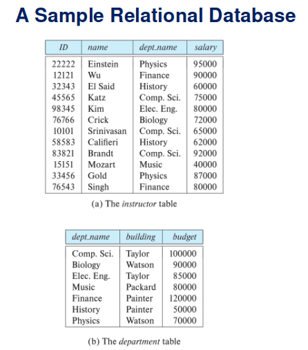
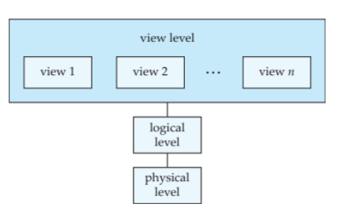
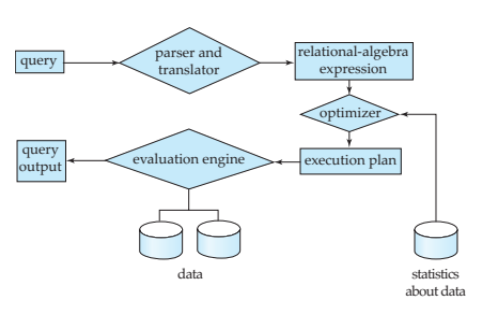
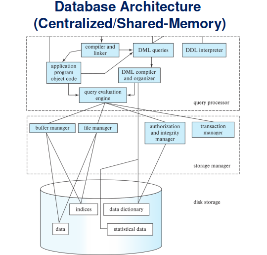
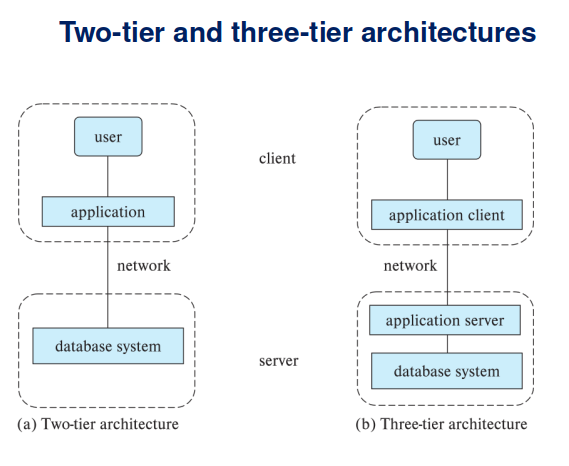
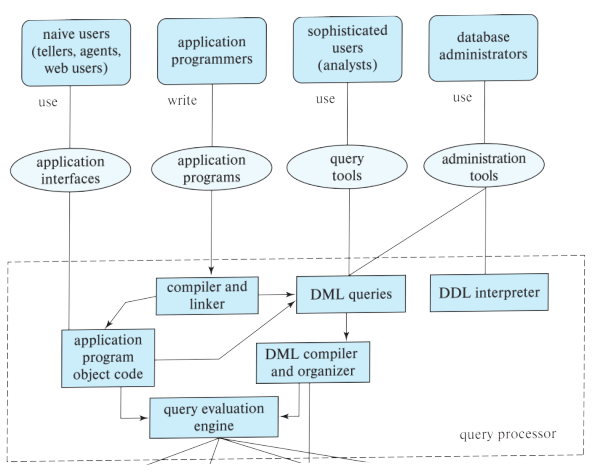

# Introduction to Database System

## Outline

The outline includes not only what will be included in today's class but throughout all the semester.

* History of Database Systems
* Purpose of Database Systems
* Database-System Applications
* View of Data
* Database Languages - SQL, NoSQL, and other query languages
* Database Design
* Database Engine
* Database Architecture
* Database Users and Administrators
* Other types of data stores, its query languages based on Restful APIs and distributed file systems.

## Glossary and Acronyms

* DBMS: Database Management System
* RDMS: Relational Database Management System
* Database System or Database or Databases

## Database System

**DBMS contains information about a particular enterprise**

* Collection of interrelated data
* Set of programs to access the data
* An environment that is both convenient and efficient to use

**Database systems are used to manage collections of data that are**

* Highly valuable
* Relatively large
* Accessed by multiple users and applications, often at the same time.

**A modern database system is a complex software system**

It is used for managing a large, complex collection of data.

**Databases touch all aspects of our lives**

## Database Applications Examples

**Enterprise Information**

* Sales: customers, products, purchases
* Accounting: payments, receipts, assets
* Human Resources: Information about employees, salaries, payroll taxes.
* Manufacturing: management of production, inventory, orders, supply chain.

**Banking and finance**

* `Customer information` accounts, loans, and banking transactions.
* `Credit card transactions`
* `Finance` sales and purchases of financial instruments (e.g., stocks and bonds; storing real-time market data
* `Universities` registration, grades
* `Stock trading`

**Airlines**

Reservations, schedules

**Telecommunication**

Records of calls, texts, and data usage, generating monthly bills, maintaining balances on prepaid calling cards

**Web-based services**

* Online retailers: order tracking, customized recommendations
* Online advertisements

**Document databases**

**Navigation systems**

For maintaining the locations of varies places of interest along with the exact routes of roads, train systems, buses, etc.

## Purpose of Database Systems

In the early days, people faced a lot of software issues by using file system,

**Data redundancy and inconsistency**

Data is stored  in multiple file formats resulting induplication of information in different files.

**Difficulty in accessing data**

Need to write a new program to carry out each new task

**Data isolation**

Multiple files and formats

**Integrity problems**

* Integrity constraints  (e.g., account balance > 0) become “buried” in program code rather than being stated explicitly

* Hard to add new constraints or change existing ones

**Atomicity of updates**

* Failures may leave database in an inconsistent state with partial updates carried out.

* Example: Transfer of funds from one account to another should either complete or not happen at all

**Concurrent access by multiple users**

* Concurrent access needed for performance
* Uncontrolled concurrent accesses can lead to inconsistencies
Ex: Two people reading a balance (say 100) and updating it by withdrawing money (say 50 each) at the same time.

**Security problems**

Hard to provide user access to some, but not all data.

## University Database Example

In this text we will be using a university database to illustrate all the concepts.

**Data consists of information about:**

* Students
* Instructors
* Classes

**Application program examples:**

* Add new students, instructors, and courses
* Register students for courses, and generate class rosters
* Assign grades to students, compute grade point averages (GPA) and generate 

## View of Data

A database system is a collection of interrelated data and a set of programs that allow users to access and modify these data.

A major purpose of a database system is to provide users with an abstract view of the data.

**Data models**

A collection of conceptual tools for describing data, data relationships, data semantics, and consistency constraints.

**Data abstraction**

Hide the complexity  of data structures to represent data in the database from users through several levels of data abstraction.

## Data Models

**A collection of tools**
for describing,

* Data
* Data relationships
* Data semantics
* Data constraints

**Relational model**

**Entity-Relationship data model (mainly for database design, or called ER diagram)**

**Object-based data models (Object-oriented and Object-relational, or called UML)**

**Semi-structured data model  (XML)**

**Other older models**

* Network model

* Hierarchical model

## Relational Model

All the data is stored in various tables.

Example of tabular data in the relational model,




## Levels of Abstraction

`Physical level`: describes how a record (e.g., instructor) is stored.

`Logical level`: describes data stored in database, and the relationships among the data.

This is the level you will write sql code,

```
	  type instructor = record
		                    ID : string; 
	                        name : string;
	                        dept_name : string;
	                        salary : integer;
                        end;
```

`View  level`: application programs hide details of data types. Views can also hide information (such as an employee’s salary) for security purposes.

## View of Data

An architecture for a database system.



## Schema

## Data Definition Language (DDL)

* Specification notation for defining the database schema.

Example:	

```SQL
create table instructor (
ID                char(5),
name           varchar(20),
dept_name  varchar(20),
salary           numeric(8,2))
```

* DDL compiler generates a set of table templates stored in a data dictionary

* Data dictionary contains metadata (i.e., data about data)
  * Database schema
  * Integrity constraints
  * Primary key (ID uniquely identifies instructors)
  * Authorization, Who can access what

## Data Manipulation Language (DML)

* Language for accessing and updating the data organized by the appropriate data model
DML also known as query language.

* There are basically two types of data-manipulation language,

  * Procedural DML --  require a user to specify what data are needed and how to get those data.
  * Declarative DML  -- require a user to specify what data are needed without specifying how to get those data.

* Declarative DMLs are usually easier to learn and use than are procedural DMLs.  
* Declarative DMLs are also referred to as non-procedural DMLs
The portion of a DML that involves information retrieval is called a query language.

## SQL Query Language

SQL  query language is nonprocedural. A query takes as input several tables (possibly only one) and always returns a single table.
Example to find all instructors in Comp. Sci. dept

```sql
select name
from instructor
where dept_name = 'Comp. Sci.'
```

* SQL is NOT a Turing machine equivalent language.

* To be able to compute complex functions SQL is usually embedded in some higher-level language

* Application programs generally access databases through one of
Language extensions to allow embedded SQL
Application program interface (e.g., ODBC/JDBC) which allow SQL queries to be sent to a database

## Database Access from Application Program

**Facts**

* Non-procedural query languages such as SQL are not as powerful as a universal Turing machine.    
* SQL does not support actions such as input from users, output to displays, or communication over the network.  
* Such computations and actions must be written in a host language, such as C/C++, Java or Python, with embedded SQL queries that access the data in the database.

**Application programs** -- are programs that are used to interact with the database in this fashion.  

## Database Design

The process of designing the general structure of the database:

* Logical Design –  Deciding on the database schema. Database design requires that we find a “good” collection of relation schemas.
    * Business decision – What attributes should we record in the database?
    * Computer Science decision –  What relation schemas should we have and how should the attributes be distributed among the various relation schemas?

* Physical Design – Deciding on the physical layout of the database                

## Database Engine

* A database system is partitioned into modules that deal with each of the responsibilities of the overall system. 

* The functional components of a database system can be divided into
  * The storage manager,
  * The  query processor component,
  * The transaction management component.

# Storage Manager

* A program module that provides the interface between the low-level data stored in the database and the application programs and queries submitted to the system.
* The storage manager is responsible to the following tasks:
    * Interaction with the OS file manager
    * Efficient storing, retrieving and updating of data
  
* The storage manager components include:
   * Authorization and integrity manager
   * Transaction manager
   * File manager
   * Buffer manager

* The storage manager implements several data structures as part of the physical system implementation:
  * Data files -- store the database itself
  * Data dictionary --  stores metadata about the structure of the database, in particular the schema of the database.
  * Indices --  can provide fast access to data items.  A database index provides pointers to those data items that hold a particular value.

## Query Processor

The query processor components include:

* DDL interpreter --  interprets DDL statements and records the definitions in the data dictionary.
* DML compiler -- translates DML statements in a query language into an evaluation plan consisting of low-level instructions that the query evaluation engine understands.
* The DML compiler performs query optimization; that is, it picks the lowest cost evaluation plan from among the various alternatives.
Query evaluation engine -- executes low-level instructions generated by the DML compiler.

## Query Processing

1.	Parsing and translation
2.	Optimization
3.	Evaluation



## Transaction Management

* A transaction is a collection of operations that performs a single logical function in a database application
* Transaction-management component ensures that the database remains in a consistent (correct) state despite system failures (e.g., power failures and operating system crashes) and transaction failures.
* Concurrency-control manager controls the interaction among the concurrent transactions, to ensure the consistency of the database. 

## Database Architecture

* Centralized databases
  * One to a few cores, shared memory

* Distributed databases
  * Geographical distribution
  * Schema/data heterogeneity
  


## Database Applications

Database applications are usually partitioned into two or three parts.

* Two-tier architecture --  the application resides at the client machine, where it invokes database system functionality at the server machine
* Three-tier architecture -- the client machine acts as a front end and does not contain any direct database calls.

  * The client end communicates with an application server, usually through a forms interface.  
  * The application server in turn communicates with a database system to access data.



Another diagram to give you a better idea where database system sits,



## Database Administrator

A person who has central control over the system is called a database administrator (DBA).  Functions of a DBA include:

* Schema definition
* Storage structure and access-method definition
* Schema and physical-organization modification
* Granting of authorization for data access
* Routine maintenance
* Periodically backing up the database
* Ensuring that enough free disk space is available for normal operations, and upgrading disk space as required
* Monitoring jobs running on the database

## History of Database Systems

**1950s and early 1960s*
* Data processing using magnetic tapes for storage
  * Tapes provided only sequential access
* Punched cards for input

**Late 1960s and 1970s**
* Hard disks allowed direct access to data
* Network and hierarchical data models in widespread use
* Ted Codd defines the relational data model
  * Would win the ACM Turing Award for this work
  * IBM Research begins System R prototype
  * UC Berkeley (Michael Stonebraker) begins Ingres prototype
  * Oracle releases first commercial relational database
* High-performance (for the era) transaction processing

**1980s**
* Research relational prototypes evolve into commercial systems
  * SQL becomes industrial standard
* Parallel and distributed database systems
  * Wisconsin, IBM, Teradata
* Object-oriented database systems

**1990s**
* Large decision support and data-mining applications
* Large multi-terabyte data warehouses
* Emergence of Web commerce

**2000s**
* Big data storage systems
  * Google BigTable, Yahoo PNuts, Amazon,
  * “NoSQL” systems.
* Big data analysis: beyond SQL
  * Map reduce and friends

**2010s**
* SQL reloaded
  * SQL front end to Map Reduce systems
  * Massively parallel database systems
  * Multi-core main-memory databases

## Databases Today

* IBM DB2 -- Used by JPMorgan and UnitedHealthCare...etc
* Oracle --- Used by JPMorgan...etc
* MySQL, MariaDB
* Postgresql
* Cassandra, AWS Dynamo, MongoDB
* Redshift
* SQLite

For dynamic database engine ranking, please check
[DB Ranking](https://db-engines.com/en/ranking)

