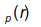
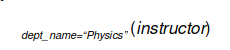
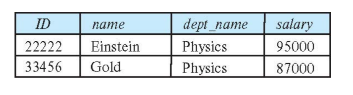
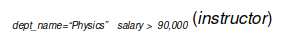

# Intro to Relational Model

## Outline
* Structure of Relational Databases
* Database Schema
* Keys
* Schema Diagrams
* Relational Query Languages
* The Relational Algebra

## Example of an Instructor Relation

Order of tuples is irrelevant (tuples may be stored in an arbitrary order)

## Relation Schema and Instance

* A1, A2, …, An are attributes
* R = (A1, A2, …, An ) is a relation schema

Example:
    `instructor  = (ID,  name, dept_name, salary)`

* A relation instance r defined over schema R is denoted  by r (R).
* The current values of a relation are specified by a table
* An element t of relation r is called a  tuple and is represented by a row in a table

## Attributes

* The set of allowed values for each attribute is called the domain of the attribute
* Attribute values are (normally) required to be atomic; that is, indivisible
* The special value `null` is a member of every domain. Indicated that the value is “unknown”
* The null value causes complications in the definition of many operations

## Database Schema

* Database schema -- is the logical structure of the database.
* Database instance -- is a snapshot of the data in the database at a given instant in time.

Example:
  * schema:   instructor (ID, name, dept_name, salary)
  * Instance

## Keys

* Let K , R
* K is a superkey of R if values for K are sufficient to identify a unique tuple of each possible relation r(R)
  * Example:  {ID} and {ID,name} are both superkeys of instructor.
* Superkey K is a candidate key if K is minimal
  * Example:  {ID} is a candidate key for Instructor
* One of the candidate keys is selected to be the primary key.
  Which one?
* Foreign key constraint: Value in one relation must appear in another
  * Referencing relation
  * Referenced relation

    Example: dept_name in instructor  is a foreign key from instructor referencing department

## Schema Diagram for University Database

## Relational Query Languages

* Procedural versus non-procedural, or declarative
* “Pure” languages:
  * Relational algebra
  * Tuple relational calculus
  * Domain relational calculus
* The above 3 pure languages are equivalent in computing power 
* We will concentrate in this chapter on relational algebra
  * Not Turing-machine equivalent
  * Consists of 6 basic operations

## Relational Algebra [TODO cross checking]

* A  procedural language consisting  of a set of operations that take one or two relations as input and produce a new relation as their result.
* Six basic operators
  * select: 
  * project: 
  * union: 
  * set difference: –
  * Cartesian product: x
  * rename: 

## Select Operation

The  select operation selects tuples that satisfy a given predicate.

Notation:   

p is called the selection predicate
Example: select those tuples of the instructor  relation where the instructor is in the “Physics” department.

**Query**

  

**Result**

We allow comparisons using
=,  >,  <

in the selection predicate.

We can combine several predicates into a larger predicate by using the connectives:

**(and), (or), (not)**

Example: Find the instructors in Physics with a salary greater $90,000, we write:

* The select predicate may  include comparisons between two attributes.
  
  Example, find all departments whose name is the same as their building name:

