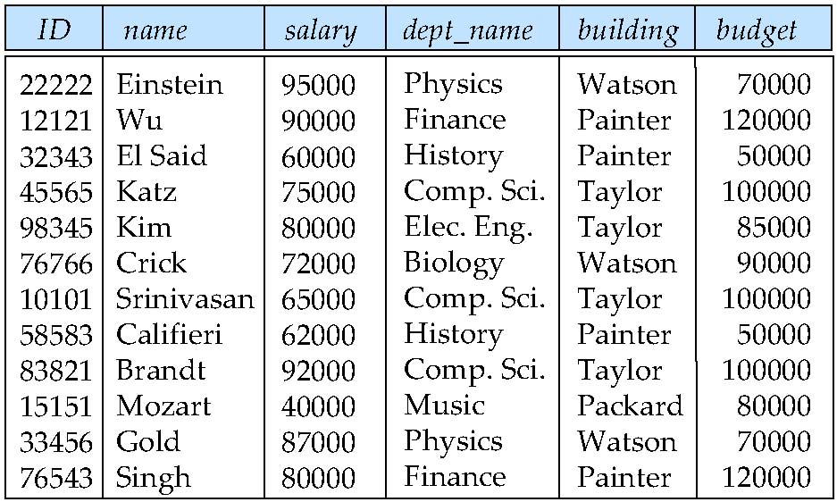
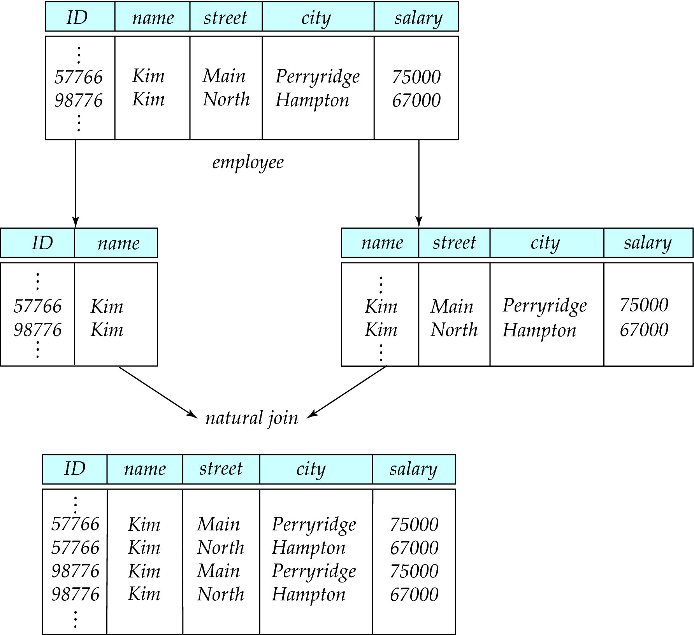
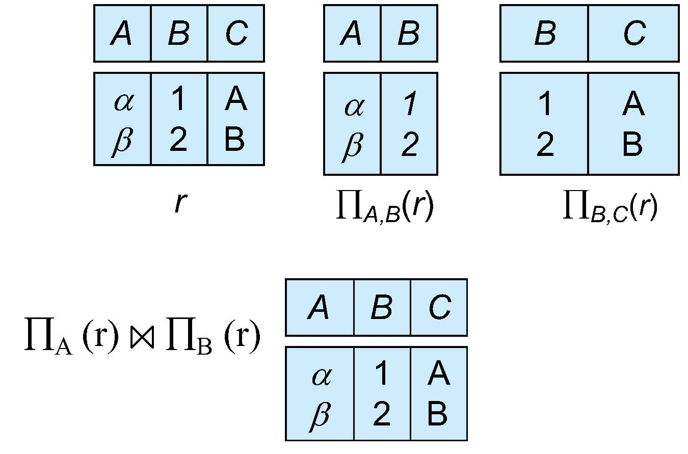

# Relational Database Normalization 

## Outline

* Features of Good Relational Design
* Decomposition Using Multivalued Dependencies
* Functional Dependencies
* Decomposition Using Functional Dependencies
* Normal Forms
* Functional Dependency Theory
* Algorithms for Decomposition using Functional
* Dependencies
* More Normal Form
* Atomic Domains and First Normal Form
* Database-Design Process
* Modeling Temporal Data

## Duplication of data (Bad Design)

Suppose we combine instructor and department into in_dep, which represents the natural join on the relations instructor and department

 

* There is repetition of information, for example note the "building" and "dept_name" columns in the above big table.
* Need to use null values (if we add a new department with no instructors). `null` is like holes in this big flat table.

while in the other case when we combine two tables into one, there is no repetition.

Not all combined schemas result in repetition of information,

* Consider combining relations
  * sec_class(sec_id, building, room_number) and
  * section(course_id, sec_id, semester, year)

   into one relation

  * section(course_id, sec_id, semester, year, building, room_number)
* No repetition in this case

## Decomposition

The only way to avoid the repetition-of-information problem in the in_dep schema is to decompose it into two schemas – instructor and department schemas.
Not all decompositions are good.  Suppose we decompose

`employee(ID, name, street, city, salary)`

 into

```sql
employee1 (ID, name)
employee2 (name, street, city, salary)
```

The problem arises when we have two employees with the same name.

The next slide shows how we lose information 

* -- we cannot reconstruct the original employee relation 
* -- and so, this is a **lossy decomposition**.


## A Lossy Decomposition

  

## Lossless Decomposition

* Let R be a relation schema and let R1 and R2 form a decomposition of R . That is R = R1  U R2
* We say that the decomposition is a lossless decomposition.
if there is no loss of information by replacing R with the two relation schemas R1 U R2. 

**Example of Lossless Decomposition** 

Decomposition of R = (A, B, C)
R1 = (A, B)	
R2 = (B, C)

Here the $\pi$ and $\Pi$ is the same symbol of projection.
? is the join|merge symbol.



## Normalization Theory

* Decide whether a particular relation R is in “good” form.
* In the case that a relation R is not in “good” form, decompose it into  set of relations {R1, R2, ..., Rn} such that
  * Each relation is in good form
  * The decomposition is a lossless decomposition
* Our theory is based on:
  * Functional dependencies
  * Multivalued dependencies