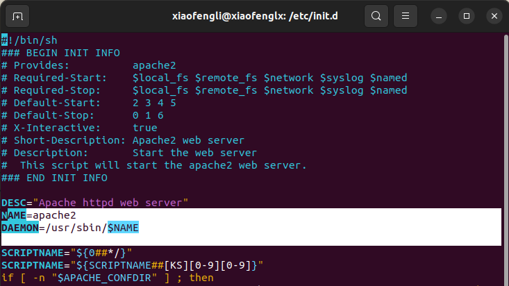

# Linux Tools Ref

In my example, I mostly use ubuntu 22 LTS when I wrote this article.
What have been covered in this articles are:

* Samba server
* SSH server

## Samba Server

### What is Samba?

Samba is a free, open-source software suite that provides file and print services to SMB/CIFS clients, allowing interoperability between Unix/Linux and Windows machines. Here are some key aspects of Samba:

File and Print Sharing: Samba allows Unix/Linux systems to share files and printers with Windows clients and vice versa. It uses the SMB (Server Message Block) protocol, which is also known as CIFS (Common Internet File System).

Interoperability: Samba makes it possible for Unix/Linux systems to appear as Windows servers on a network, allowing seamless file sharing between different operating systems.

Domain Controller: Samba can function as a Primary Domain Controller (PDC) or a Backup Domain Controller (BDC) in a Windows NT domain. It can also join Active Directory as a member.

Authentication and Authorization: Samba can handle user authentication and authorization, integrating with various backend systems such as LDAP, Active Directory, and local Unix/Linux password files.

Network Browsing: Samba allows Unix/Linux machines to participate in Windows network browsing, making them visible in the Network Neighborhood or My Network Places on Windows machines.

Key Components of Samba
smbd: The SMB/CIFS server daemon that provides file and print services to SMB/CIFS clients.

nmbd: The NetBIOS name server daemon that handles NetBIOS name resolution and browsing.

winbindd: This service allows for the integration of Unix/Linux systems with Windows NT-based systems, enabling domain authentication.

Common Use Cases
Home Networks: Sharing files and printers between different operating systems within a home network.
Office Networks: Centralized file and print services in mixed OS environments, often replacing or supplementing Windows servers.
Domain Services: Acting as a domain controller in small to medium-sized networks.

### Installation

To start a Samba server (also known as a Samba "driver") on a Linux system, you need to install the Samba package, configure it, and then start the Samba services. Here's a step-by-step guide:

```bash
sudo apt update
sudo apt install samba
```

### Configuration

Configure Samba:

Edit the Samba configuration file `/etc/samba/smb.conf` to define your shared directories and settings. For example:

```bash
[shared]
path = /srv/samba/shared
read only = no
browsable = yes
```

### Create the Shared Directory

```bash
sudo mkdir -p /srv/samba/shared
sudo chown nobody:nogroup /srv/samba/shared
sudo chmod 0775 /srv/samba/shared
```

### Add Samba Users

Add a user to Samba (the user must already exist on the system):

`sudo smbpasswd -a username`

### Start the Samba Services

```bash
sudo systemctl restart smbd
sudo systemctl enable smbd
sudo systemctl restart nmbd
sudo systemctl enable nmbd
```

### Verify the Samba Configuration

Check the Samba configuration for any syntax errors, `testparm`.

### Access the Share

From a Windows machine or another Samba client, you can access the share by navigating to
`\\hostname\shared` where hostname is the name of your Samba server.

for Example, from Mac, you can do this,

`smb://xiaofengli@192.168.0.105`

### Check logs

If you encounter any issues, checking the Samba logs can be helpful. They are usually located in
`/var/log/samba/`

## SSH Server

### What is SSH server

An SSH server allows remote access to a machine securely over an encrypted network connection. SSH (Secure Shell) is commonly used to manage servers, perform remote logins, and execute commands.

On most Linux distributions, the SSH server software is called OpenSSH. You can install it using the package manager for your distribution. Here’s how to install OpenSSH on some common Linux distributions.

### Installation

Debian/Ubuntu:

```bash
sudo apt update
sudo apt install openssh-server
```

CentOS/RHEL:

```bash
sudo yum install openssh-server
```

Fedora:

`sudo dnf install openssh-server`

### Starting the SSH Service

Debian/Ubuntu:

```bash
sudo systemctl start ssh
sudo systemctl enable ssh
```

CentOS/RHEL/Fedora:

```bash
sudo systemctl start sshd
sudo systemctl enable sshd
```

### Configuration

The main configuration file for OpenSSH is /etc/ssh/sshd_config. You can modify this file to change settings like the default port, authentication methods, and more.

* Change the SSH Port:

By default, SSH listens on port 22. You can change this to a different port for added security.

`Port 2222`

* Disable Root Login

`PermitRootLogin no`

* Allow Only Specific Users

`AllowUsers username1 username2`

### Connecting to the SSH Server

* Normal login to default port 22

`ssh username@server_ip_or_hostname`

* If you change your port,

`ssh -p username@server_ip_or_hostname`

* When your server is in private IP, then you will need to ssh to have a pem file,

`ssh -i pem_file username@server_ip_or_hostname`

### Security

* Use Public Key Authentication: Public key authentication is more secure than password-based authentication. You can set this up by generating an SSH key pair and adding the public key to the `~/.ssh/authorized_keys` file on the server

`ssh-keygen -t rsa -b 4096 -C "your_email@example.com"`

* Copy the public key to the server

`ssh-copy-id username@server_ip_or_hostname`

* Disable Password Authentication

`PasswordAuthentication no`

* Only allowed IP can access and use firewall

Use a Firewall: Ensure that only trusted IP addresses can access your SSH server. You can configure this using tools like ufw (Uncomplicated Firewall) or firewalld.


## Apache2

Apache2 is the http server.

`sudo service apache2 restart`

`sudo service apache2 reload`

Also to start/stop/reload/restart apache on Ubuntu, you can use:

```bash
sudo start apache2
sudo stop apache2
sudo reload apache2
sudo restart apache2
```

Check where it is installed,

```bash
xiaofengli@xiaofenglx:~/code/scanhub$ which apache2
/usr/sbin/apache2

xiaofengli@xiaofenglx:/etc/init.d$ ls -al apache2
-rwxr-xr-x 1 root root 8181 Dec  4  2023 apache2
```

Check the above startup script in `/etc/init.d` dir,




## SendMail

### Installation

`sudo apt update && sudo apt upgrade -y `

`sudo apt install -y sendmail sendmail-cf mailutils`

### Configure Sendmail

The main configuration file for Sendmail is /etc/mail/sendmail.cf. However, it is recommended to make changes to the .mc file (e.g., /etc/mail/sendmail.mc) and then generate the .cf file. This makes the configuration process easier and less error-prone.

To configure Sendmail, open the /etc/mail/sendmail.mc file using your preferred text editor:

`sudo nano /etc/mail/sendmail.mc`

Ensure the following lines are present and uncommented in the file:

```bash
define(`SMART_HOST', `your.smtp.server')dnl
define(`confAUTH_MECHANISMS', `EXTERNAL GSSAPI DIGEST-MD5 CRAM-MD5 LOGIN PLAIN')dnl
FEATURE(`authinfo',`hash -o /etc/mail/authinfo.db')dnl
```

### Set Up Authentication (Optional)

If your SMTP server requires authentication, create the /etc/mail/authinfo file with the following contents:

AuthInfo:your.smtp.server "U:your_username" "P:your_password" "M:PLAIN"

Replace your.smtp.server, your_username, and your_password with the appropriate values for your SMTP server.

To create the authentication database, run:

`sudo makemap hash /etc/mail/authinfo < /etc/mail/authinfo`
