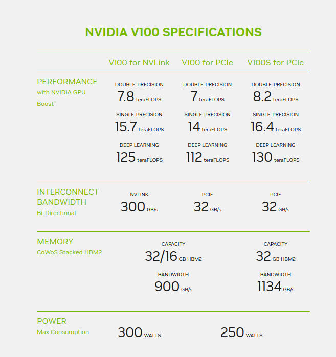
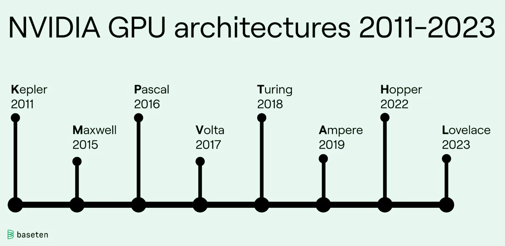
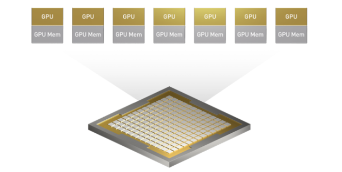
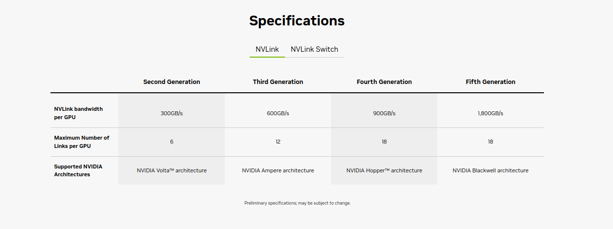
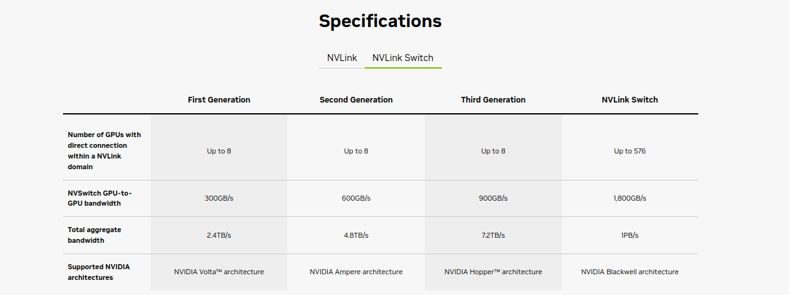

# Deep Learning

## Software and frameworks

* Tensorflow
* CUDA
* Keras is part of Tensorflow now
* Pytorch

## Hardware

The hardware is very important in Deep learning because it is going to use GPU.
There are a couple of manufactures of GPUs in the market now and it is very competitive.
Taking NVIDIA as example it has different types of GPUs, some are normal graphics cards with GPU and some are high-end graphic cards with GPUs, and some are GPUs dedicated for data center and ML/HPC computing. Also NVIDIA is building super chip that is using NVLink and NVLink Switch to interconnect CPUs and GPUs as a big rack for the new computing hub. Such an multi-CPUs and multi-GPUs infrastructure provides possibily to scale hardware from software requests and make computing more elastic.

In the following article, we will be surveying major data center GPUs and different manufactures just in case different cloud vendors such as AWS and GCP they would use different data center GPUs.

### NVIDIA GPU

`v100`: NVIDIA® V100 Tensor Core is the most advanced data center GPU ever built to accelerate AI, high performance computing (HPC), data science and graphics. It’s powered by NVIDIA Volta architecture, comes in 16 and 32GB configurations, and offers the performance of up to 32 CPUs in a single GPU.

V100 is engineered for the convergence of AI and HPC. It offers a platform for HPC systems to excel at both computational science for scientific simulation and data science for finding insights in data. By pairing NVIDIA CUDA® cores and Tensor Cores within a unified architecture, a single server with V100 GPUs can replace hundreds of commodity CPU-only servers for both traditional HPC and AI workloads. Every researcher and engineer can now afford an AI supercomputer to tackle their most challenging work.

* https://www.nvidia.com/en-us/data-center/v100/

**Data Center GPU**

A2, A10, A16, A30, A40, T4, L4, L40s, L40, H100, H200, GB200 NVL2, GB200 NVL72.

Others unverified: RTX A5000, RTX ADA 6000.

The following image shows how the NVidia GPU product is named.

The following is a release line of the NVidia GPU so from the name of the GPU you can see its capacity eassily,

Different tiers of GPUs are optimized for different compute workloads. Tiers from recent generations include:

* `4`: The smallest GPU of a generation, 4-tier cards have low energy consumption and are best for cost-effective invocation of moderately-sized models.

* `10`: A mid-range GPU optimized for AI inference.

* `40`: A high-end GPU best suited for virtual workstations, graphics, and rendering.

* `100`: The largest, most expensive, most powerful GPU of a generation. It has the highest core count and most VRAM and is designed for inference on large models as well as training and fine-tuning new models.

**NVIDIA Multi-Instance GPU**

Seven independent instances in a single GPU.

`Multi-Instance GPU (MIG)` expands the performance and value of NVIDIA Blackwell and Hopper™ generation GPUs. MIG can partition the GPU into as many as seven instances, each fully isolated with its own high-bandwidth memory, cache, and compute cores. This gives administrators the ability to support every workload, from the smallest to the largest, with guaranteed quality of service (QoS) and extending the reach of accelerated computing resources to every user.

Without MIG, different jobs running on the same GPU, such as different AI inference requests, compete for the same resources. A job consuming larger memory bandwidth starves others, resulting in several jobs missing their latency targets. With MIG, jobs run simultaneously on different instances, each with dedicated resources for compute, memory, and memory bandwidth, resulting in predictable performance with QoS and maximum GPU utilization.

* Provision and Configure Instances as Needed
* Run Workloads in Parallel, Securely

**Hopper™**

The NVIDIA Hopper architecture advances Tensor Core technology with the Transformer Engine, designed to accelerate the training of AI models. Hopper Tensor Cores have the capability to apply mixed FP8 and FP16 precisions to dramatically accelerate AI calculations for transformers. Hopper also triples the floating-point operations per second (FLOPS) for TF32, FP64, FP16, and INT8 precisions over the prior generation. Combined with Transformer Engine and fourth-generation NVIDIA® NVLink®, Hopper Tensor Cores power an order-of-magnitude speedup on HPC and AI workloads.

Built with over 80 billion transistors using a cutting edge TSMC 4N process, Hopper features five groundbreaking innovations that fuel the NVIDIA H200 and H100 Tensor Core GPUs and combine to deliver incredible speedups over the prior generation on generative AI training and inference.

DGX GH200 systems with NVLink Switch System support clusters of up to 256 connected H200s and deliver 57.6 terabytes per second (TB/s) of all-to-all bandwidth.

* https://www.nvidia.com/en-us/data-center/technologies/hopper-architecture/

**NVIDIA Blackwell**

NVIDIA Blackwell Architecture: the NVIDIA Blackwell architecture brings to generative AI and accelerated computing. It is an architecture to build AI superchip.

Blackwell-architecture GPUs pack 208 billion transistors and are manufactured using a custom-built TSMC 4NP process. All Blackwell products feature two reticle-limited dies connected by a 10 terabytes per second (TB/s) chip-to-chip interconnect in a unified single GPU.

The second-generation Transformer Engine uses custom Blackwell Tensor Core technology combined with NVIDIA® TensorRT™-LLM and NeMo™ Framework innovations to accelerate inference and training for large language models (LLMs) and Mixture-of-Experts (MoE) models.

Blackwell includes NVIDIA Confidential Computing, which protects sensitive data and AI models from unauthorized access with strong hardware-based security.

Unlocking the full potential of exascale computing and trillion-parameter AI models hinges on the need for swift, seamless communication among every GPU within a server cluster. The fifth-generation of `NVIDIA® NVLink®` interconnect can scale up to 576 GPUs to unleash accelerated performance for trillion- and multi-trillion parameter AI models.  

The `NVIDIA NVLink Switch Chip` enables 130TB/s of GPU bandwidth in one 72-GPU NVLink domain (NVL72) and delivers 4X bandwidth efficiency with NVIDIA Scalable Hierarchical Aggregation and Reduction Protocol (SHARP)™ FP8 support.

The `NVIDIA GB200 NVL72` connects 36 GB200 Grace Blackwell Superchips with 36 Grace CPUs and 72 Blackwell GPUs in a rack-scale design. The GB200 NVL72 is a liquid-cooled solution with a 72-GPU NVLink domain that acts as a single massive GPU—delivering 30X faster real-time inference for trillion-parameter large language models.

**NVIDIA NVLink** and **NVLink Switch**

`Fully Connect GPUs With NVIDIA NVLink and NVLink Switch`

NVLink is a 1.8TB/s bidirectional, direct GPU-to-GPU interconnect that scales multi-GPU input and output (IO) within a server. The NVIDIA NVLink Switch chips connect multiple NVLinks to provide all-to-all GPU communication at full NVLink speed within a single rack and between racks.

NVLink switch is like a switch or router to connect NVLink components.

To enable high-speed, collective operations, each NVLink Switch has engines for NVIDIA Scalable Hierarchical Aggregation and Reduction Protocol (SHARP)™ for in-network reductions and multicast acceleration.

* https://www.nvidia.com/en-us/data-center/technologies/blackwell-architecture/

**Other Nvidia GPUs**

* https://www.nvidia.com/en-us/studio/compare-gpus/

## AWS EC2 instance for HPC|ML computing

To quickly identify the Nvidia GPUs production line and timeline, remember the `V`, `T`, `A`, `H`, `L`.

The following are a list of the instance types with its configuration,

* `P3`: Amazon EC2 P3 instances deliver high performance compute in the cloud with up to 8 NVIDIA® V100 Tensor Core GPUs and up to 100 Gbps of networking throughput for machine learning and HPC applications.

* `P4`: You can easily scale from a few to thousands of NVIDIA A100 GPUs in the EC2 UltraClusters based on your ML or HPC project needs.These instances support 400 Gbps instance networking. P4d instances provide up to 60% lower cost to train ML models, including an average of 2.5x better performance for deep learning models compared to previous-generation P3 and P3dn instances.

* `P5`: Amazon Elastic Compute Cloud (Amazon EC2) P5 instances, powered by the latest NVIDIA H100 Tensor Core GPUs, deliver the highest performance in Amazon EC2 for deep learning (DL) and high performance computing (HPC) applications.

For other ML related instance, please check the following for `Accelerated Computing` types.

* https://aws.amazon.com/ec2/instance-types/
* https://aws.amazon.com/ec2/instance-types/p3/

## AMD GPUs

## GPU and graphics card ranking

* https://www.tomshardware.com/reviews/gpu-hierarchy,4388.html
