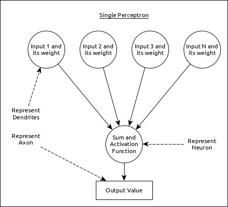
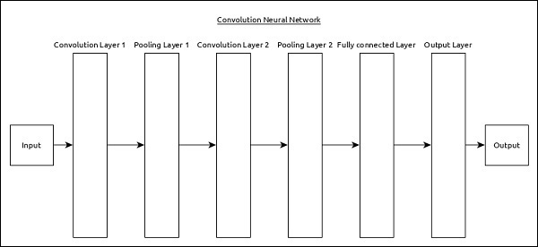
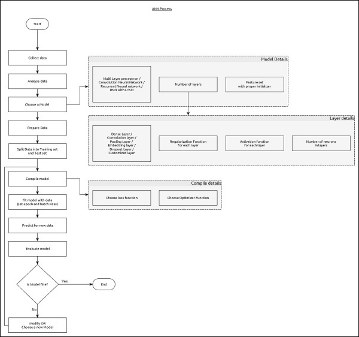

# Deep Learning

Deep learning is an evolving subfield of machine learning that analyzes the input in a layer-by-layer manner. Deep learning algorithms are also useful for the analysis of unstructured data.

## Artificial Neural Networks

Artificial Neural Networks (ANNs) are inspired by the model of the human brain. 

- **Human Brain Model**:
  - The human brain is made up of more than 90 billion tiny cells called **Neurons**.
  - Neurons are interconnected through nerve fibers called **Axons** and **Dendrites**.
    - The main role of **Axons** is to transmit information from one neuron to another to which it is connected.
    - The main role of **Dendrites** is to receive the information being transmitted by the axons of another neuron to which it is connected.

Based on this model, the first Artificial Neural Network (ANN) was invented by psychologist Frank Rosenblatt in 1958.

### Perceptron (Single Neuron)

A single neuron, also known as a perceptron in Artificial Neural Networks (ANNs), can be represented as below:

In this representation:

- **Multiple Inputs** along with **Weights** represent **Dendrites**.
- The **Sum of Inputs** along with the **Activation Function** represent the **Neuron**. The sum is the computed value of all inputs, and the activation function modifies this sum into a value of either 0, 1, or between 0 and 1.
- The **Actual Output** represents the **Axon**, and this output will be received by the neuron in the next layer.

## Multi-Layer Perceptron

The Multi-Layer Perceptron (MLP) is the simplest form of Artificial Neural Network (ANN). It consists of the following layers:

- **Input Layer**: The input layer represents one or more features of the input data.
- **Hidden Layers**: One or more hidden layers, each consisting of one or more neurons. These layers process various aspects of the input features and pass the processed information to the next hidden layer.
- **Output Layer**: The output layer receives data from the last hidden layer and produces the final output result.

## In Summary

- **Each layer** consists of a collection of perceptrons.
- **The input layer** feeds data into the hidden layers.
- **The hidden layers** perform computations and transfer processed data.
- **The output layer** provides the final result.

## Convolutional Neural Network (CNN)

- **Popular ANN** widely used in the fields of image and video recognition.
- **Similar to multi-layer perceptron** except it contains a series of convolution layers and pooling layers before the fully connected hidden neuron layer.

### It has three important layers:

1. **Convolution Layer**
   - It is the primary building block and performs computational tasks based on the convolution function.

2. **Pooling Layer**
   - Arranged next to the convolution layer, it is used to reduce the size of inputs by removing unnecessary information so computation can be performed faster.

3. **Fully Connected Layer**
   - Arranged next to the series of convolution and pooling layers, it classifies input into various categories.

## Simple CNN

- **2 series of Convolution and Pooling Layers** are used to receive and process the input (e.g., image).

- A **single Fully Connected Layer** is used to output the data (e.g., classification of the image).

## Recurrent Neural Network (RNN)

- **Useful to address the flaws in other ANN models**:
  - RNN stores past information, and all its decisions are made based on what it has learned from the past.
  
- **Mainly useful in image classification**.

## Workflow of ANN

1. **Collect Required Data**
   - Deep learning requires a lot of input data to successfully learn and predict the result. So, first collect as much data as possible.

2. **Analyze Data**
   - Analyze the data and acquire a good understanding of it to select the correct ANN algorithm.

3. **Choose an Algorithm (Model)**
   - The algorithm is represented by the Model in Keras. The algorithm includes one or more layers, and each layer in ANN can be represented by a Keras Layer in Keras.

4. **Prepare Data**
   - Process, filter, and select only the required information from the data.

5. **Split Data**
   - Split the data into training and test datasets. The test data will be used to evaluate the prediction of the algorithm/model (once the machine has learned) and to cross-check the efficiency of the learning process.

6. **Compile the Model**
   - Compile the algorithm/model so that it can be used further to learn by training and finally make predictions. This step requires choosing a loss function and an optimizer. The loss function and optimizer are used in the learning phase to find the error (deviation from the actual output) and perform optimization to minimize the error.

7. **Fit the Model**
   - The actual learning process will be done in this phase using the training dataset.

8. **Predict Result for Unknown Values**
   - Predict the output for unknown input data (other than existing training and test data).

9. **Evaluate Model**
   - Evaluate the model by predicting the output for test data and cross-comparing the prediction with the actual results of the test data.

10. **Freeze, Modify, or Choose New Algorithm**
    - Check whether the evaluation of the model is successful. If yes, save the algorithm for future prediction purposes. If not, modify or choose a new algorithm/model and then again train, predict, and evaluate the model. Repeat the process until the best algorithm (model) is found.

   The above steps can be represented using the flow chart below:

