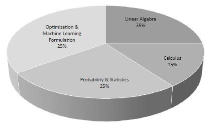

# Mathematics in Netural Network

The importance of mathematics topics for machine learning and data science is mentioned below −



## Vectors

Vector is considered to be array of numbers which is either continuous or discrete and the space which consists of vectors is called as vector space. The space dimensions of vectors can be either finite or infinite but it has been observed that machine learning and data science problems deal with fixed length vectors.

The vector representation is displayed as mentioned below −

```python
temp = torch.FloatTensor([23,24,24.5,26,27.2,23.0])
temp.size()
```

**Output**

`torch.Size([6])`

In machine learning, we deal with multidimensional data. So vectors become very crucial and are considered as input features for any prediction problem statement.

**Scalars**

Scalars are termed to have zero dimensions containing only one value. When it comes to PyTorch, it does not include a special tensor with zero dimensions; hence the declaration will be made as follows −

```python
x = torch.rand(10)
x.size()
```

**Output**

`torch.Size([10])`

## Matrices

Most of the structured data is usually represented in the form of tables or a specific matrix. We will use a dataset called Boston House Prices, which is readily available in the Python scikit-learn machine learning library.

```python
boston_tensor = torch.from_numpy(boston.data)
boston_tensor.size()
Output: torch.Size([506, 13])
boston_tensor[:2]
```

**Output**

```
Columns 0 to 7
0.0063 18.0000 2.3100 0.0000 0.5380 6.5750 65.2000 4.0900
0.0273 0.0000 7.0700 0.0000 0.4690 6.4210 78.9000 4.9671
Columns 8 to 12
1.0000 296.0000 15.3000 396.9000 4.9800
2.0000 242.0000 17.8000 396.9000 9.1400
```