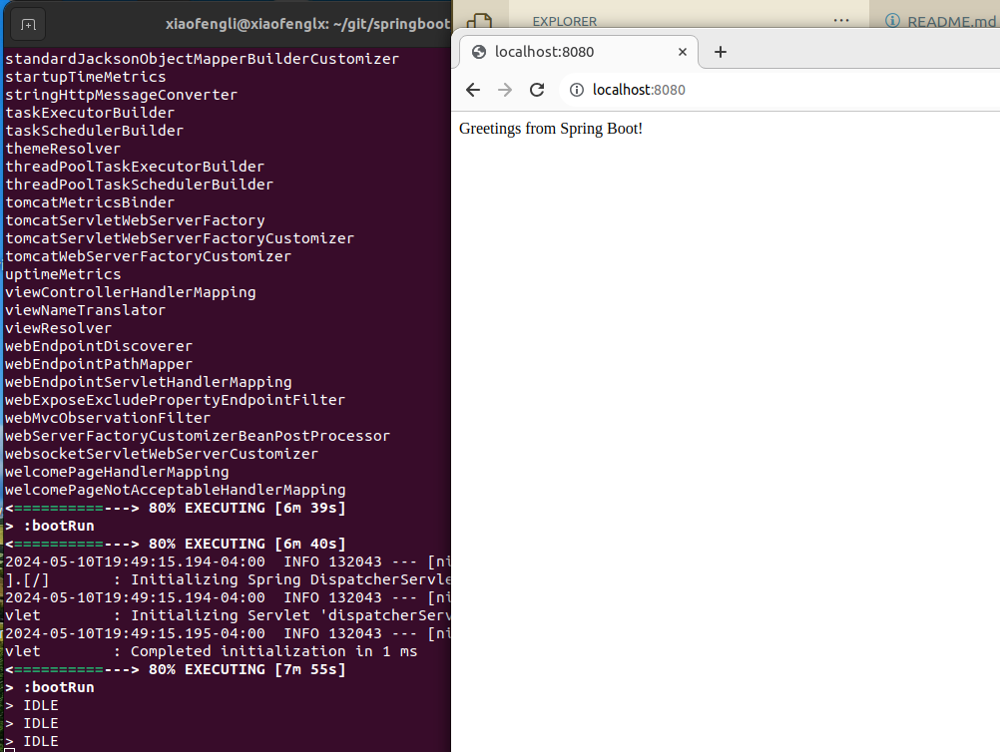
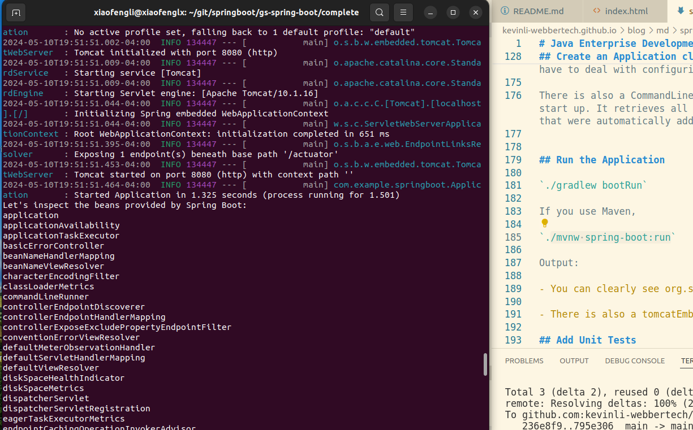

# Java Enterprise Development with Springboot - Bootstrap Microservice

This is a first class of Springboot MVC. We will learn a quick bootstrap way to get your microservice running.

Springboot framework has been evolving into two categories,

* MVC
* WebFlux using Java Stream

Our main focus right now is the MVC and we will briefly wade into WebFlux later on.

## Springboot History

Spring Boot is a popular Java-based framework used for building standalone, production-grade Spring-based applications. Here's a brief overview of its history:

- Introduction of Spring Framework: Spring Framework was initially introduced by Rod Johnson in 2002. It aimed to simplify Java development by providing comprehensive infrastructure support for developing Java applications.

- Spring Boot Inception: Spring Boot emerged as an extension of the Spring Framework, focusing on simplifying the bootstrapping and development of Spring applications. It was created to address the complexity involved in configuring Spring applications and to enable developers to quickly set up and run Spring-based projects.

- Initial Release (2014): Spring Boot was first released in 2014 by Pivotal Software (now part of VMware). Its primary goal was to provide a streamlined way to create standalone Spring applications with minimal configuration, enabling developers to focus more on writing business logic rather than boilerplate code.

- Rapid Adoption: Spring Boot gained rapid adoption within the Java community due to its convention-over-configuration approach, embedded server support, auto-configuration, and extensive ecosystem.

- Maturity and Feature Enhancements: Over the years, Spring Boot has matured with frequent releases introducing new features, improvements, and enhancements. These updates have included better integration with other Spring projects, enhanced dependency management, and improved developer experience.

- Community Contribution: Spring Boot has a vibrant community of developers who actively contribute to its development and ecosystem. This community involvement has been crucial in shaping the direction of the framework and ensuring its relevance in modern software development.

- Integration with Spring Ecosystem: Spring Boot seamlessly integrates with other Spring projects such as Spring Data, Spring Security, Spring Batch, and Spring Cloud, enabling developers to leverage the full power of the Spring ecosystem in their applications.

- Evolution with Java Ecosystem: Spring Boot has evolved alongside the Java ecosystem, incorporating support for newer Java versions, reactive programming models, microservices architecture, cloud-native development, and containerization technologies.

## Spring Framework History

- Founding (2002): The Spring Framework was created by Rod Johnson and was first released in 2002. Rod Johnson, a software developer, wrote the book "Expert One-on-One J2EE Design and Development," which served as a catalyst for the creation of the Spring Framework. The framework aimed to address the complexity and limitations of Enterprise JavaBeans (EJB) development by providing a more lightweight and flexible alternative.

- Spring 1.0 (2004): The first major release, Spring 1.0, introduced core features such as Dependency Injection (DI) and Aspect-Oriented Programming (AOP). These features allowed developers to build loosely coupled, modular applications, making it easier to manage complexity and promote good design practices.

- Expansion of Features: Subsequent releases of the Spring Framework introduced new features and enhancements, including support for transaction management, JDBC abstraction, integration with various enterprise technologies (such as Hibernate, JPA, JMS), and comprehensive support for web development (Spring MVC).

- Community Growth: The Spring Framework quickly gained popularity within the Java community due to its pragmatic approach, ease of use, and emphasis on best practices. A vibrant community of developers formed around the framework, contributing to its development, documentation, and ecosystem.

- Spring 2.0 (2006): The release of Spring 2.0 brought significant improvements, including support for Java 5 features such as annotations, which simplified configuration and reduced the need for XML-based configuration. Additionally, it introduced features like Spring AOP improvements, Java 5 concurrency support, and enhanced XML configuration options.

- Spring 3.0 (2009): This release marked another significant milestone for the framework. It introduced features such as the Spring Expression Language (SpEL), REST support, declarative transaction management improvements, and comprehensive support for Java EE 6 features.

- Spring 4.0 (2013): Spring 4.0 focused on providing support for the latest Java SE and EE versions, including Java 8. It introduced features such as WebSocket support, HTML5-friendly features in Spring MVC, and improved support for Groovy and other dynamic languages.

- Spring 5.0 (2017): The release of Spring 5.0 marked a major shift towards reactive programming. It introduced the Spring WebFlux framework for building reactive web applications, along with support for Java 9 and reactive programming features in Spring Data.

- Spring Framework Today: As of my last update in January 2022, the Spring Framework continues to evolve with regular releases, addressing the latest trends and challenges in enterprise Java development. It remains one of the most widely used frameworks for building Java applications, powering a vast array of enterprise systems, web applications, microservices, and more.

## Java Servlet History

Java Servlets are Java classes that dynamically process requests and responses as part of a web application. They run on the server side and handle HTTP requests from clients, typically web browsers, by generating dynamic content or interacting with databases.

Here's a brief overview of Java Servlets:

Introduction: Java Servlets were introduced as part of the Java Platform, Enterprise Edition (Java EE, now Jakarta EE) to provide a mechanism for developing server-side applications. They emerged as an alternative to traditional CGI (Common Gateway Interface) scripts for generating dynamic web content.

- Servlet API: Servlets are built on top of the Servlet API, which defines a set of interfaces and classes that servlets must implement or extend. The core interface is the javax.servlet.Servlet interface, which defines methods for initializing the servlet, processing requests, and destroying resources.

- Lifecycle: Servlets have a well-defined lifecycle that includes initialization, service, and destruction phases. When a servlet container (e.g., Apache Tomcat, Jetty) starts, it loads and initializes servlets. Each servlet instance handles multiple requests during its lifecycle. The init() method is called when a servlet is first loaded, the service() method is invoked to process requests, and the destroy() method is called when the servlet is unloaded.

- Request Handling: Servlets handle HTTP requests by implementing the doGet(), doPost(), doPut(), doDelete(), etc., methods corresponding to the HTTP methods they support. These methods receive HTTP request and response objects, allowing servlets to read request parameters, headers, and content, process requests, and generate dynamic responses.

- Session Management: Servlets support session management through the javax.servlet.http.HttpSession interface, which allows them to store and retrieve session attributes associated with a client's session. This enables stateful interactions with clients across multiple requests.

- Deployment: Servlets are packaged as Java archive (JAR) files or Web Application Archive (WAR) files and deployed to servlet containers such as Apache Tomcat, Jetty, or GlassFish. Servlet containers manage the execution of servlets and provide runtime environments for servlets to run in.

- Servlet Filters: Servlets can be augmented with filters (javax.servlet.Filter) that intercept and preprocess requests and responses. Filters are useful for tasks such as authentication, authorization, logging, compression, and input validation.

Advantages: Servlets offer several advantages, including platform independence (they run on any Java-enabled server), performance (they are compiled into bytecode), robustness, and scalability. They provide a powerful and flexible mechanism for building dynamic web applications in Java.

Overall, Java Servlets have been a foundational technology for server-side Java web development, forming the basis for more sophisticated web frameworks and technologies like JavaServer Pages (JSP), JavaServer Faces (JSF), and Spring MVC.

ref

- https://www.tutorialspoint.com/servlets/index.htm (Servlet)
 
- https://www.tutorialspoint.com/jsp/index.htm (JSP)

- https://www.tutorialspoint.com/jsp/jsp_standard_tag_library.htm (JSTL)


## Springboot Application Lab 1

## What You Need

- A favorite text editor or IDE, please get one of them installed

1. Spring Tool Suite (STS)
2. IntelliJ IDEA Community Version
3. VSCode

- Java 17 or later

- Gradle 7.5+ or Maven 3.5+

- Git

- You can also import the code straight into your IDE:

`git clone https://github.com/spring-guides/gs-spring-boot.git`

`cd into gs-spring-boot/initial`


## Create a Simple Web Application

Now you can create a web controller for a simple web application, as the following listing (from src/main/java/com/example/springboot/HelloController.java) shows:

```
package com.example.springboot;

import org.springframework.web.bind.annotation.GetMapping;
import org.springframework.web.bind.annotation.RestController;

@RestController
public class HelloController {

	@GetMapping("/")
	public String index() {
		return "Greetings from Spring Boot!";
	}

```

## Create an Application class

```
package com.example.springboot;

import java.util.Arrays;

import org.springframework.boot.CommandLineRunner;
import org.springframework.boot.SpringApplication;
import org.springframework.boot.autoconfigure.SpringBootApplication;
import org.springframework.context.ApplicationContext;
import org.springframework.context.annotation.Bean;

@SpringBootApplication
public class Application {

	public static void main(String[] args) {
		SpringApplication.run(Application.class, args);
	}

	@Bean
	public CommandLineRunner commandLineRunner(ApplicationContext ctx) {
		return args -> {

			System.out.println("Let's inspect the beans provided by Spring Boot:");

			String[] beanNames = ctx.getBeanDefinitionNames();
			Arrays.sort(beanNames);
			for (String beanName : beanNames) {
				System.out.println(beanName);
			}

		};
	}

}
```

@SpringBootApplication is a convenience annotation that adds all of the following:

@Configuration: Tags the class as a source of bean definitions for the application context.

@EnableAutoConfiguration: Tells Spring Boot to start adding beans based on classpath settings, other beans, and various property settings. For example, if spring-webmvc is on the classpath, this annotation flags the application as a web application and activates key behaviors, such as setting up a DispatcherServlet.

@ComponentScan: Tells Spring to look for other components, configurations, and services in the com/example package, letting it find the controllers.

The main() method uses Spring Boot’s SpringApplication.run() method to launch an application. Did you notice that there was not a single line of XML? There is no web.xml file, either. This web application is 100% pure Java and you did not have to deal with configuring any plumbing or infrastructure.

There is also a CommandLineRunner method marked as a @Bean, and this runs on start up. It retrieves all the beans that were created by your application or that were automatically added by Spring Boot. It sorts them and prints them out.


## Run the Application

`./gradlew bootRun`



If you use Maven,

`./mvnw spring-boot:run`



Output:

- You can clearly see org.springframework.boot.autoconfigure beans. 

- There is also a tomcatEmbeddedServletContainerFactory.

## Add Unit Tests

If you use Gradle, add the following dependency to your build.gradle file:

`testImplementation('org.springframework.boot:spring-boot-starter-test')`

If you use Maven, add the following to your pom.xml file:

```
<dependency>
	<groupId>org.springframework.boot</groupId>
	<artifactId>spring-boot-starter-test</artifactId>
	<scope>test</scope>
</dependency>
```

Write a simple test file like the following `src/test/java/com/example/springboot/HelloControllerTest.java`

```
package com.example.springboot;

import static org.hamcrest.Matchers.equalTo;
import static org.springframework.test.web.servlet.result.MockMvcResultMatchers.content;
import static org.springframework.test.web.servlet.result.MockMvcResultMatchers.status;

import org.junit.jupiter.api.Test;

import org.springframework.beans.factory.annotation.Autowired;
import org.springframework.boot.test.autoconfigure.web.servlet.AutoConfigureMockMvc;
import org.springframework.boot.test.context.SpringBootTest;
import org.springframework.http.MediaType;
import org.springframework.test.web.servlet.MockMvc;
import org.springframework.test.web.servlet.request.MockMvcRequestBuilders;

@SpringBootTest
@AutoConfigureMockMvc
public class HelloControllerTest {

	@Autowired
	private MockMvc mvc;

	@Test
	public void getHello() throws Exception {
		mvc.perform(MockMvcRequestBuilders.get("/").accept(MediaType.APPLICATION_JSON))
				.andExpect(status().isOk())
				.andExpect(content().string(equalTo("Greetings from Spring Boot!")));
	}
}
```

MockMvc comes from Spring Test and lets you, through a set of convenient builder classes, send HTTP requests into the DispatcherServlet and make assertions about the result. Note the use of `@AutoConfigureMockMvc` and `@SpringBootTest` to inject a MockMvc instance. Having used @SpringBootTest, we are asking for the whole application context to be created. An alternative would be to ask Spring Boot to create only the web layers of the context by using `@WebMvcTest`. In either case, Spring Boot automatically tries to locate the main application class of your application, but you can override it or narrow it down if you want to build something different.

As well as mocking the HTTP request cycle, you can also use Spring Boot to write a simple full-stack integration test. For example, instead of (or as well as) the mock test shown earlier, we could create the following test (from src/test/java/com/example/springboot/HelloControllerIT.java):

```
package com.example.springboot;

import org.junit.jupiter.api.Test;

import org.springframework.beans.factory.annotation.Autowired;
import org.springframework.boot.test.context.SpringBootTest;
import org.springframework.boot.test.web.client.TestRestTemplate;
import org.springframework.http.ResponseEntity;

import static org.assertj.core.api.Assertions.assertThat;

@SpringBootTest(webEnvironment = SpringBootTest.WebEnvironment.RANDOM_PORT)
public class HelloControllerIT {

	@Autowired
	private TestRestTemplate template;

    @Test
    public void getHello() throws Exception {
        ResponseEntity<String> response = template.getForEntity("/", String.class);
        assertThat(response.getBody()).isEqualTo("Greetings from Spring Boot!");
    }
}
```


## Lab 2 - Starting with Spring Initializr

You can use this pre-initialized project and click Generate to download a ZIP file. This project is configured to fit the examples in this tutorial.

To manually initialize the project:

Navigate to `https://start.spring.io`. This service pulls in all the dependencies you need for an application and does most of the setup for you.

Choose either Gradle or Maven and the language you want to use. This guide assumes that you chose Java.

Click `Dependencies` and select `Spring Web`.

Click `Generate`.

Download the resulting ZIP file, which is an archive of a web application that is configured with your choices.

If your IDE has the Spring Initializr integration, you can complete this process from your IDE.

You can also fork the project from Github and open it in your IDE or other editor.
For Spring 3.0 you need Java 17 or later, regardless of whether you use Spring Initializr.

```
Note: 
If your IDE has the Spring Initializr integration, you can complete this process from your IDE.
```


or 


Then you will see this,


## Production Services (actuator)

If you are building a web site for your business, you probably need to add some management services. Spring Boot provides several such services (such as health, audits, beans, and more) with its actuator module.

If you use Gradle, add the following dependency to your build.gradle file:

`implementation 'org.springframework.boot:spring-boot-starter-actuator'`

If you use Maven, add the following dependency to your pom.xml file:

```
<dependency>
	<groupId>org.springframework.boot</groupId>
	<artifactId>spring-boot-starter-actuator</artifactId>
</dependency>
```

Then restart the application. If you use Gradle, run the following command in a terminal window (in the complete directory):

`./gradlew bootRun`

If you use Maven, run the following command in a terminal window (in the complete directory):

`./mvnw spring-boot:run`

You should see that a new set of RESTful end points have been added to the application. These are management services provided by Spring Boot. The following listing shows typical output:

```
management.endpoint.configprops-org.springframework.boot.actuate.autoconfigure.context.properties.ConfigurationPropertiesReportEndpointProperties
management.endpoint.env-org.springframework.boot.actuate.autoconfigure.env.EnvironmentEndpointProperties
management.endpoint.health-org.springframework.boot.actuate.autoconfigure.health.HealthEndpointProperties
management.endpoint.logfile-org.springframework.boot.actuate.autoconfigure.logging.LogFileWebEndpointProperties
management.endpoints.jmx-org.springframework.boot.actuate.autoconfigure.endpoint.jmx.JmxEndpointProperties
management.endpoints.web-org.springframework.boot.actuate.autoconfigure.endpoint.web.WebEndpointProperties
management.endpoints.web.cors-org.springframework.boot.actuate.autoconfigure.endpoint.web.CorsEndpointProperties
management.health.diskspace-org.springframework.boot.actuate.autoconfigure.system.DiskSpaceHealthIndicatorProperties
management.info-org.springframework.boot.actuate.autoconfigure.info.InfoContributorProperties
management.metrics-org.springframework.boot.actuate.autoconfigure.metrics.MetricsProperties
management.metrics.export.simple-org.springframework.boot.actuate.autoconfigure.metrics.export.simple.SimpleProperties
management.server-org.springframework.boot.actuate.autoconfigure.web.server.ManagementServerProperties
```

The actuator exposes the following:

- actuator/health

- actuator

```

There is also an /actuator/shutdown endpoint, but, by default, it is visible only through JMX. To enable it as an HTTP endpoint, add management.endpoint.shutdown.enabled=true to your application.properties file and expose it with management.endpoints.web.exposure.include=health,info,shutdown. However, you probably should not enable the shutdown endpoint for a publicly available application.
```

You can check the health of the application by running the following command:

`$ curl http://localhost:8080/actuator/health`

You can try also to invoke shutdown through curl, to see what happens when you have not added the necessary line (shown in the preceding note) to application.properties:

`curl -X POST http://localhost:8080/actuator/shutdown`

## Deployment

The various guides demonstrate this dual support through the spring-boot-gradle-plugin and spring-boot-maven-plugin.

- WAR file
- JAR file (Fat jar or executable jar)

## Built-in server

- Jetty
- Tomcat

ref: https://spring.io/guides/gs/spring-boot