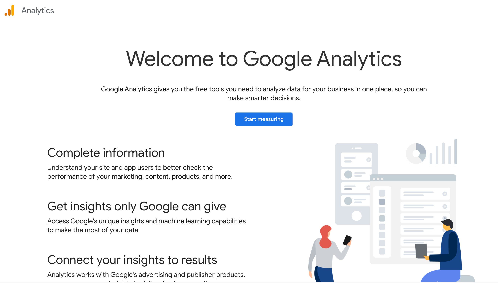
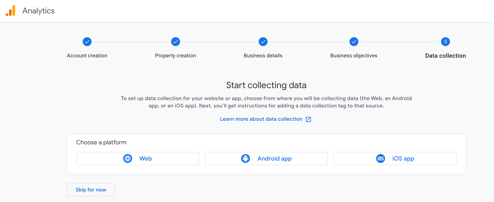

What is Google Analytics?
Google Analytics is a web analytics service that provides numerous analytical tools useful for insights on website performance and marketing campaigns. Google Analytics is a web analytics service that provides statistics and basic analytical tools for search engine optimization and marketing purposes. The service is part of the Google Marketing Platform and is available for free to anyone with a Google account, regardless of whether they are working with enterprises or small businesses.

Google Analytics is used to track website performance and collect visitor insights. It can help organizations determine top sources of user traffic, gauge the success of their marketing activities and campaigns, track goal completions (such as purchases, or adding products to carts), discover patterns and trends in user engagement, and obtain other visitor information such as demographics. Small and medium-sized retail websites often use Google Analytics to obtain and analyze various customer behavior analytics, which yield insight that can be the basis to improve marketing campaigns, drive website traffic and better retain visitors.

Google Analytics (also known simply as Analytics) provides a range of analytics tools that enable companies to capture customer insights across devices and platforms. By understanding how customers interact with the company's sites and apps throughout their lifecycle, the company's Google Analytics users can better understand the customer journey, identify opportunities for improving customer experiences and improve marketing ROI.

Google Analytics is easy to use. Besides powerful analytics capabilities, it includes built-in automation, provides a broad range of reporting options and can be integrated with other tools to become a single-measurement source of truth for customer data and insights. It also supports custom data analyses to fit the needs of different businesses. A business is on the path to a competitive advantage if it can analyze the broad span of customer journey touchpoints.

User acquisition data provides insight into how customers are arriving at a website. Customers may come from a variety of channels, such as paid search engine results, unpaid (organic) search engine results, social media links or directly typing in the URL. Understanding user acquisition data is critical for maximizing website traffic.

How to Set up Google Analytics:

1. Log into your personal account
2. Go to https://marketingplatform.google.com/info?authuser=0

3. Create new property for your platform: 
- Choose (Set up) in Analytics part

- Choose (Start measuring) in the Welcome to Google page. 
- Create an Account by filling your required information (Account details, Property, Business, Business Objectives)

- Choose your platform that data will be collected from (website, Android App, IOS App), in our case we chose the website as the measurement method by entering the URL, time zone and Currency.


4. A Measurement ID will be generated which will be used for further analysis. 

How to Add Google Analytics to your platform?

- Access your website's backend or CMS (e.g., WordPress, plain HTML, React).
- Insert the Google Analytics Global Site Tag (gtag.js) script into the <head> section of your website.

in html:

```
<script async src="https://www.googletagmanager.com/gtag/js?id=YOUR_MEASUREMENT_ID"></script>
<script>
  window.dataLayer = window.dataLayer || [];
  function gtag() {
    dataLayer.push(arguments);
  }
  gtag('js', new Date());
  gtag('config', 'YOUR_MEASUREMENT_ID');
</script>
```
- Replace YOUR_MEASUREMENT_ID with the Measurement ID you copied.

5. Verify Integration

- Log In:
Go to Google Analytics and sign in with your account.

- Open Your Property:
Navigate to the property you created for your website.

- Access Realtime Report:

* In the Google Analytics Dashboard, locate the left-hand menu.

* Click on Reports > Realtime.

- Visit Your Website:
* Open your website in an incognito/private browsing window (to ensure fresh data tracking).
* Navigate through a few pages on your website.

- Confirm Tracking
* Check the Realtime Report:
You should see your activity reflected in real time, including the number of users, their location, and the pages they’re viewing.


