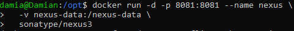

# Introduction to Nexus Repository Manager

## What is Nexus?

Nexus Repository Manager (often just called Nexus) is a powerful tool that helps developers and organizations store, manage, and distribute software artifacts.
Think of it as a "library" for your software components—whether they are Java JAR files, Python packages, Docker images, npm modules, or any other type of build dependency.

## Key Concepts You Should Know
1. What is a Repository?
A repository (or repo) is like a folder where Nexus stores different types of software:

- Proxy Repositories – Cache files from public sources (e.g., Maven Central).

- Hosted Repositories – Store your private/internal libraries.

- Group Repositories – Combine multiple repos into one for easier access.

2. What Are Artifacts?
An artifact is any file stored in Nexus—like a .jar (Java), .whl (Python), .tgz (npm), or .deb (Linux packages).

3. What is Docker’s Role Here?
Nexus can also store Docker images, making it a private alternative to Docker Hub.

## Why do you need Nexus?

1. Dependency Management – Instead of downloading libraries directly from the internet every time (which can be slow and unreliable), Nexus stores them locally for faster, more reliable builds.

2. Proxy & Caching – Nexus can act as a middleman between your team and public repositories (like Maven Central, npm, PyPI). It caches downloaded files so future requests are faster.

3. Private Repositories – You can host your own internal libraries securely, ensuring only authorized users can access them.

4. Build Consistency – By controlling which versions of dependencies are available, Nexus helps prevent unexpected breaks in your software.

5. Security & Compliance – Nexus can scan for vulnerabilities in dependencies and enforce policies (e.g., blocking unsafe versions).

## Types of Repositories in Nexus

- Nexus supports multiple repository formats, including:

- Maven (Java) – For JARs, WARs, and other Java artifacts.

- npm (JavaScript) – For Node.js packages.

- Docker – For container images.

- PyPI (Python) – For Python packages.

- Raw – For generic file storage (e.g., installers, scripts).

- And many more

# Installation Guide

## Step 1: Update System and Install Docker

### Commands Used:

- sudo apt update
- sudo apt install -y docker.io
- sudo systemctl enable docker
- sudo systemctl start docker

### Commands Explained:
- (sudo apt install -y docker.io) installs Docker from the default Ubuntu repositories. -y automatically says "yes" to prompts.

- (sudo systemctl enable docker) configures Docker to start automatically at boot.

- (sudo systemctl start docker) starts the Docker service right now so you can use it immediately.

## Step 2: Add Your User to Docker Group (avoid sudo every time)

### Commands Used:

- sudo usermod -aG docker $USER
- newgrp docker 

### Commands Explained:
- (sudo usermod -aG docker $USER) adds your user to the docker group so you can run Docker commands without sudo.

- (newgrp docker) applies the group change in your current terminal session immediately. Otherwise, you'd have to log out and back in.

## Step 3: Run Nexus Container

### Commands Used:

- docker run -d -p 8081:8081 --name nexus \
  -v nexus-data:/nexus-data \
  sonatype/nexus3

(This runs Nexus in a container and stores data in a persistent Docker volume nexus-data)

### Commands Explained:
- docker run: Tells Docker to start a new container.

- -d: Detached mode — runs in the background.

- -p 8081:8081: Maps port 8081 on your machine to port 8081 inside the container. This is how you access the Nexus UI in your browser.

- --name nexus: Names your container "nexus" so you can refer to it easily later.

- -v nexus-data:/nexus-data: Creates and mounts a Docker volume named nexus-data to persist Nexus data (like configuration, repos, etc.) even if the container is deleted.

- sonatype/nexus3: The Docker image from Docker Hub — this pulls the official open-source Nexus Repository Manager 3 image.

## Step 4: Access Nexus Web UI

Open a browser and go to :
http://localhost:8081

## Step 5: Get the Admin Password

### Commands Used:

- docker exec -it nexus cat /nexus-data/admin.password

### Commands Explained:
- docker exec: Runs a command inside a running container.

- -it: Interactive + TTY, lets you interact as if in a terminal.

- nexus: The name of the container.

- cat /nexus-data/admin.password: Outputs the initial password file generated by Nexus.

## Step 6: Log In to Nexus UI

### Remember:

- Username: admin
- Password: (paste the value you got from the step above)

You'll be prompted to change the password after you log in.

